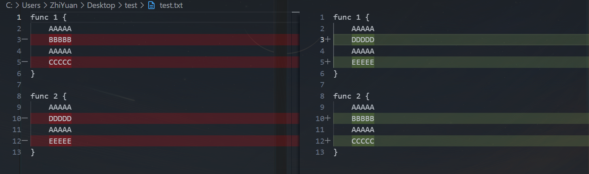

### 什么是git diff

比对代码差异的git命令，经常看到红红绿绿的那玩意
四种Diff算法，默认Myers

### 关于Myers

#### 为什么要有一个好的diff算法

给出两段字符，视作两段代码

```javascript
a = ABCABBA 
b = CBABAC
```

问：什么是“差异”
答：“差异”指的是如何对a字符串进行有限次的增删，删的元素只能来自a，增的元素只能来自b，把a转换成b

这玩意好像有个专业名词叫文本差分？

问：为什么要做“差异”
答：为了在通用场景下用最符合直觉的方式告诉用户哪里做了变动

问：为什么说是**最符合直觉的方式**
答：因为同样的两段代码你可以对“差异”有不同的理解，a="AB"，b="B"，你可以说把a串的A去掉得到b，也可以说把a串全删了再把b串全加进去，都可以叫做差异，因此我们应该用最符合直觉的方式，这样最方便

那么如何用一个简单高效的方式做这件事？你不可能在任何情况下都说

**“你好，要把a转换成b，只需要把a全删了然后把b插进去即可”**

如果我改了三个地方，但是只想要两个地方的改动那你不炸了吗

代码是模块化的，很多时候我们是从模块角度看待问题的，如果全都推导重来，会给review工作带来很大的工作量，你要一个个地去比对原来的模块，这样很麻烦，而一个好的diff算法应该尽可能地站在模块的角度去比对，尽可能让“差异”的代价变小，“差异”的代价小了，审核起来就方便

问：什么样的“差异”更“好”？
答：
- **删除和插入的操作尽可能少**
- **插入的部分在删除的部分后面**
- **成块的代码被增删而不是代码行交错增删**

#### 个人理解

git收到两份文件，审阅者希望通过git查看新文件增删改（其实改也可以视作增删）了哪些地方，即所谓的“差异”，如果审阅者不想要某个差异，可以还原它。git可以有很多种方法展示增删了什么地方，并且你不能说他是错的，比如全删全增。但是这是一种蹩脚的算法，因为用户要去全文比对增删的地方，有的时候明明大部分内容是用户想要的，但是有一个地方改错了，用户就得全盘否定这个差异。所以显而易见，一个优秀的差分算法应该尽可能地保留“共性”，在“共性”以外的地方去做增删改，在数学上可以基于LCS建模，采用诸如保留最长的公共子序列的方式去达成目的。

**但是需要注意的是，无论算法多么巧妙，也无法保障百分百复刻更改者的编辑路径，更改者实际的做的增删改和git diff展示出来的增删改并不总是一样，git只能尽可能地去降低审阅者评阅差异的复杂度**
#### 算法思想

> Myers 算法本质上是一个动态规划（Dynamic Programming，DP）算法，是一个“最短编辑距离（Minimum Edit Distance）”算法，也是一个“最长公共子序列（Longest Common Subsequence,LCS）”算法。


[Git三路合并算法完全指南：优雅处理复杂冲突摘要：本文深入探讨了Git的合并策略，从三路合并算法的基本原理出发，详细解析 - 掘金](https://juejin.cn/post/7456066191649259555)

我想要一个版本，代理人用一个他认为合理的编辑路径改动原文件让原文件变成了我想要的版本，我不知道代理人怎么改的我的版本

从直觉上看，编辑距离越短，我查看比对的耗时越少

从观感上有三种编辑距离
- 一大段一大段的删减
	这种属于比较好的
- 交错复杂的删减
	比如两个长得很像的函数，如果我把它俩的内容调换一个位置，那么报出来的diff会非常地难看
	举个例子
	
	其实我只是把func1的内容和func2做了对换，但是diff没法理解，它搞出来的这个解释会让人头晕
- 少数行的删减
	这种也属于比较好的


