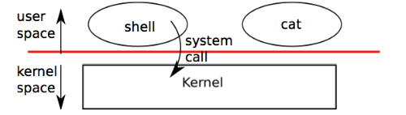
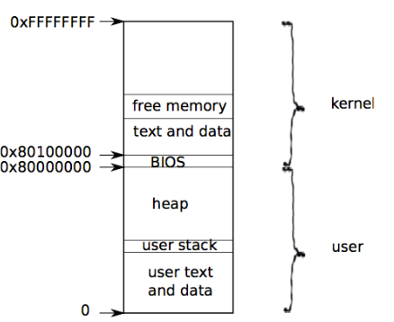
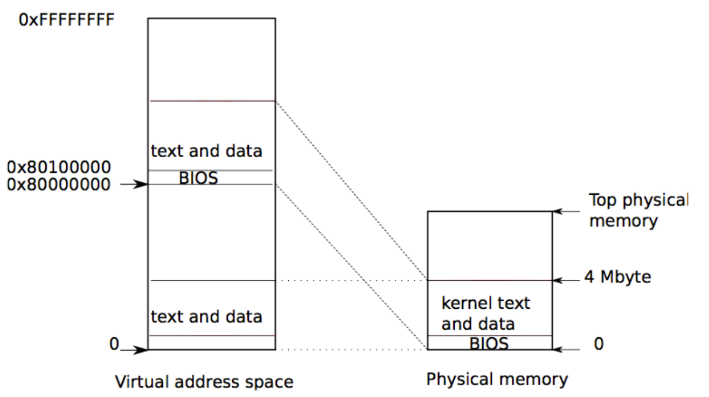

课程链接 [6.1810 / Fall 2025](https://pdos.csail.mit.edu/6.1810/2025/tools.html)
# Lec1:Introduction and examples

 视频资源

[4.3 MIT 6.1810 操作系统工程_哔哩哔哩_bilibili](https://www.bilibili.com/video/BV1tWF7enEH2/?vd_source=c25181bdc454f7ad86c8e3737daac0e2)

## 随笔

### 内核模型




进程=用户内存空间+进程状态（内核可见）

xv6在cpu不断切换进程（分时），决定哪一个进程被执行，对不执行的进程xv6保存其信息到cpu寄存器，等待下次执行时读取
（干活的是cpu，指示cpu的是xv6，系统与基于系统的用户程序是自洽的）

每个进程有自己的pid，内核通过pid来识别进程

>用户程序和内核程序从程序编译运行的角度看地位相同，但是从权限角度看有分层​

### fork

```c
int pid;
pid = fork();
if(pid > 0){
    printf("parent: child=%d\n", pid);
    pid = wait();
    printf("child %d is done\n", pid);
} else if(pid == 0){
    printf("child: exiting\n");
    exit();
} else {
    printf("fork error\n");
}
```

- fork以后创建一模一样的子进程，执行相同的代码，从调用行开始（包含）往下执行
进程间内存和寄存器独立

### exec

```c
char *argv[3];
argv[0] = "echo";
argv[1] = "hello";
argv[2] = 0;
exec("/bin/echo", argv);
printf("exec error\n");
```

exec 将某文件（通常是可执行文件）从硬盘读取到内存镜像，然后执行它，文件必须遵守文件规范（哪部分是数据？哪部分是指令？哪里是指令的开始？）

### shell

```c
/* sh.c 主函数 */
int
main(void)
{
  static char buf[100];
  int fd;
  // Ensure that three file descriptors are open.
  while((fd = open("console", O_RDWR)) >= 0){
    if(fd >= 3){
      close(fd);
      break;
    }
  }
  // Read and run input commands.
  while(getcmd(buf, sizeof(buf)) >= 0){
    char *cmd = buf;
    while (*cmd == ' ' || *cmd == '\t')
      cmd++;
    if (*cmd == '\n') // is a blank command
      continue;
    if(cmd[0] == 'c' && cmd[1] == 'd' && cmd[2] == ' '){
      // Chdir must be called by the parent, not the child.
      cmd[strlen(cmd)-1] = 0;  // chop \n
      if(chdir(cmd+3) < 0)
        fprintf(2, "cannot cd %s\n", cmd+3);
    } else {
      if(fork1() == 0)
        runcmd(parsecmd(cmd));
      wait(0);
    }
  }
  exit(0);
}
```

shell 调用fork创建其子进程，子进程执行用户命令，父进程执行wait


### IO/文件描述符

>Linux 里万物（与冯诺依曼架构无关的万物？）皆文件，输入输出？终端设备？网络连接？键盘？在内核视角均视作文件，内核给他们分配一个整数用来代表它们，即文件描述符，文件描述符和一个偏移量关联

每个进程都有一张表，而 xv6 内核就以文件描述符作为这张表的索引，所以每个进程都有一个从0开始的文件描述符空间。

```c
/* cat */
void
cat(int fd)
{
  int n;
  while((n = read(fd, buf, sizeof(buf))) > 0) {
    if (write(1, buf, n) != n) {
      fprintf(2, "cat: write error\n");
      exit(1);
    }
  }
  if(n < 0){
    fprintf(2, "cat: read error\n");
    exit(1);
  }
}
```

用户程序cat并不知道文件描述符的背后是文件还是控制台还是管道，它只知道从这个地方来读取数据，但是内核知道

重定向：将文件描述符重新分配给不同的接口

shell里fork和exec分开，防止exec取代shell进程（exec不返回）

```plainText
exec() 前：
┌─────────────────────────────────┐
│  shell 进程                     │
│  - 代码: shell 代码             │
│  - 数据: shell 变量             │
│  - 堆栈: shell 的              │
└─────────────────────────────────┘
              ↓ exec("cat")
              ↓
┌─────────────────────────────────┐
│  同一个进程！                    │
│  - 代码: cat 代码              │ ← 被替换
│  - 数据: cat 的数据            │ ← 被替换
│  - 堆栈: cat 的堆栈           │ ← 被替换
└─────────────────────────────────┘
```

父子进程间共享io的文件偏移，文件偏移存在文件对象里

```c
if(fork() == 0) {
    write(1, "hello ", 6);
    exit();
} else {
    wait();
    write(1, "world\n", 6);
}
```

子进程写完hello以后父进程会继续写world

dup复制以后的文件描述符和原文件描述符共享偏移

```c
fd = dup(1);
write(1, "hello", 6);
write(fd, "world\n", 6);
```

```
┌─────────────────────────────────────────────┐
│  进程的文件描述符表 (proc->ofile[])         │
├─────────────────────────────────────────────┤
│  ofile[0]  →  stdin  (标准输入)            │
│  ofile[1]  →  stdout (标准输出)            │
│  ofile[2]  →  stderr (标准错误)           │
│  ofile[3]  →  (可用的)                     │
│  ...                                        │
└─────────────────────────────────────────────┘
      ↑
      │
   write(fd, ...) 中的 fd 就是这个数组的下标
```

### 管道

>管道是一个小的内核缓冲区，它以文件描述符对的形式提供给进程，一个用于写操作，一个用于读操作。从管道的一端写的数据可以从管道的另一端读取。**管道提供了一种进程间交互的方式。**

管道允许同步：两个进程可以使用一对管道来进行二者之间的信息传递，每一个读操作都阻塞调用进程，直到另一个进程用 `write` 完成数据的发送

### 文件系统（普通文件，不包含设备文件）

- 文件：简单的字节数组
- 目录：一种特殊的文件，指向文件和其它目录的引用，逻辑结构是一棵树
- stat和file不一样，前者存硬盘里，后者是文件打开是在内存里创建的文件对象

## 作业

> Throughout this semester, we expect that you will read the entire implementation of the [xv6 kernel](https://github.com/mit-pdos/xv6-riscv/tree/riscv/kernel), accompanied by the [xv6 book](https://pdos.csail.mit.edu/6.1810/2025/xv6/book-riscv-rev5.pdf), which explains the rationale and design underlying the kernel's implementation. (The source code is also available as a [Lions-style PDF](https://pdos.csail.mit.edu/6.1810/2025/xv6/xv6-src-booklet-rev5.pdf))
> 
> For this lecture, read the xv6 implementation of a simple Unix program, cat, available [here](https://github.com/mit-pdos/xv6-riscv/blob/riscv/user/cat.c). How does the system keep track of the connection between the string filename argv[i] passed to open(), and the resulting integer file descriptor fd? What does the integer file descriptor number refer to?
> 
> You might find it helpful to read chapter 1 of the xv6 book, which provides an overview of a Unix-like operating system. For your amusement, you can also watch a [historic AT&T film about Unix](https://www.youtube.com/watch?v=tc4ROCJYbm0).
> 
> Submit your answer in an ASCII text file named homework.txt to the corresponding "Lecture N" assignment on Gradescope.


### 系统如何知道传递给 open() 的字符串文件名 argv[i] 与生成的整数文件描述符 fd 之间的关系？

fd是文件标识符数组的下标，文件标识符指向一个具体的file结构体，file结构体里存着指向innode的指针，于是可以找到对应的硬盘文件。
open时内核解析文件名找到对应的硬盘文件，创建file对象，然后分配fd，fd返回给调用open的进程

### fd指向什么

fd (整数) → 进程的文件描述符表 ofile[fd] → file 结构体 → inode/pipe/device → 硬件

## 实验环境配置

>you'll need the RISC-V versions of QEMU 7.2+, GDB 8.3+, GCC, and Binutils.
>QEMU是RISC-V硬件架构模拟器

wsl2 安装所需软件
```bash
$ sudo apt-get update && sudo apt-get upgradec # 升级包管理工具
$ sudo apt-get install git build-essential gdb-multiarch qemu-system-misc gcc-riscv64-linux-gnu binutils-riscv64-linux-gnu
```

验证安装
```bash
qemu-system-riscv64 --version
# 以下三条任意一条生效即可
riscv64-linux-gnu-gcc --version
riscv64-unknown-elf-gcc --version
riscv64-unknown-linux-gnu-gcc --version
```


# Lec2: C in XV6 and Examples

## 随笔

### C 在 xv6 中的内存布局

```
┌─────────────┐ 高地址
│    stack    │ ← 函数局部变量
├─────────────┤
│             │
│    heap     │ ← 动态内存 (sbrk, malloc/free)
│             │
├─────────────┤
│    data     │ ← 全局 C 变量
├─────────────┤
│    text     │ ← 代码、只读数据
└─────────────┘ 低地址
```

虚拟地址，并非映射到硬件上的物理地址

Q1：操作系统本身也是c程序，那么系统程序所看到的内存分布也是虚拟的吗？
A1：不一定，取决于操作系统设计。
```
	xv6 内核的地址视图：
┌─────────────────────────────────────────────────────────────┐
│                   虚拟地址 = 物理地址 + 0x80000000           │
├─────────────────────────────────────────────────────────────┤
│                                                             │
│  虚拟地址 0x80000000  ──────────────────►  物理地址 0x00000000  │
│  虚拟地址 0x80001000  ──────────────────►  物理地址 0x00001000  │
│  虚拟地址 0x88000000  ──────────────────►  物理地址 0x08000000  │
│                                                             │
│  简单说：虚拟地址 = 物理地址 + KERNBASE (0x80000000)        │
│                                                             │
└─────────────────────────────────────────────────────────────┘
```

Q2：操作系统是一个单纯的c程序运行在裸机上，那么对这个程序来说，内存空间不就是机器的物理内存空间吗？因为没有更底层的软件给他提供虚拟内存空间服务了啊？​
A2：内核确实是这样

```
┌─────────────────────────────────────────────────────────────┐
│                      裸机 (Bare Metal)                      │
│                                                              │
│    ┌─────────────────────────────────────────────────┐     │
│    │              操作系统 (OS)                        │     │
│    │                                                  │     │
│    │   这是第一个运行的软件！                          │     │
│    │   看到的就是物理内存                              │     │
│    │                                                  │     │
│    └─────────────────────────────────────────────────┘     │
│                           │                                  │
│                           ▼                                  │
│    ┌─────────────────────────────────────────────────┐     │
│    │              物理硬件 (Physical Hardware)        │     │
│    │   • CPU (含MMU)                                 │     │
│    │   • 内存条 (RAM)                                 │     │
│    │   • 磁盘                                         │     │
│    └─────────────────────────────────────────────────┘     │
└─────────────────────────────────────────────────────────────┘
```
- **没有更底层的软件**为操作系统提供虚拟内存
- 操作系统内核**直接运行在物理内存**上

**MMU (Memory Management Unit)**

```
CPU 内部结构：
┌─────────────────────────────┐
│         CPU                 │
│  ┌───────────────────────┐  │
│  │      MMU              │  │
│  │  (内存管理单元)        │  │
│  │                       │  │
│  │  虚拟地址 ──► 物理地址  │  │
│  │  (Translation)        │  │
│  └───────────────────────┘  │
│           │                  │
│           ▼                  │
│      物理内存                 │
└─────────────────────────────┘
```
- MMU 是**硬件**，不是软件
- CPU 通电就自带 MMU
- 操作系统**利用** MMU 来建立虚拟内存

**启动过程**

```
1. 开机通电
   │
   ▼
2. CPU 复位 (MMU 默认禁用)
   │
   ▼
3. Bootloader / BIOS 运行
   │  这个时候还没有虚拟内存！
   │  只能访问物理地址
   ▼
4. 操作系统内核加载到物理内存 0x80000000
   │
   ▼
5. 操作系统内核初始化
   │  - 设置页表
   │  - 启用 MMU
   │  - 虚拟内存系统建立！
   ▼
6. 操作系统正常运行
   现在有虚拟内存了
```

Q3：所以对于内核来说，它直接与物理内存打交道，直接使用物理硬件，而用户程序则基于内核使用它提供的虚拟内存对吗​
A3：
- **用户程序** → 使用内核提供的**虚拟内存**
- **内核** → 直接操作**物理硬件**（内存、磁盘等）
- **内核** 是用户程序和硬件之间的**中介者/管理者**

> **总结**：
> 
> 内核是第一个运行的软件，**直接使用物理内存**。虚拟内存是通过 CPU 硬件（MMU）实现的，操作系统只是**配置和使用**这个硬件，而不是依赖更底层的软件


### 一些有趣的链表设计

- **单向链表**：kernel/kalloc.c（内存分配器）
- **双向链表**：kernel/bio.c（LRU 缓冲区缓存）
> 了解即可
### 关于进程

进程让程序可以假设它独占一台机器，为程序提供看上去私有的地址空间（虚拟），以及一颗看上去仅执行该程序的CPU

xv6使用 页表（硬件实现）为每个进程提供其独有的地址空间，页表将虚拟地址映射到物理地址



内核的指令和数据也会被映射到每个进程的地址空间中
Q4：映射的形式是什么？存的是data还是实际物理地址？
A4：


|            | 物理                          | 进程的虚拟视图                                                                             |
| ---------- | --------------------------- | ----------------------------------------------------------------------------------- |
| ​**内核实体**​ | 物理内存中只有**唯一一份**操作系统内核的代码和数据 | 每个进程都“觉得”整个内核（代码、数据、内核栈）就放在自己4GB地址空间的顶部                                             |
| ​**页表映射**​ | 存在一个**内核主页表**​              | 每个进程都有自己的**独立页表**。当新进程创建时，内核会从主页表中复制内核空间的映射关系到新进程的页表对应位置。因此，所有进程页表中关于内核部分的映射关系都完全相同 |


编译阶段，编译器会认为内核运行在假定的链接地址上，内核一些依赖固定地址的代码也会承认这个链接地址
但是boot loader将内核装载在其它位置，于是内核的`entry` 的代码设置了临时页表，将 0x80000000开始的虚拟地址映射到物理地址 0x0 处，这样后面内核就有了自己的页表，可以认为自己在链接地址上工作

- ​**内核映射**​：将高虚拟地址（`0x80000000`，即内核的链接地址）映射到物理地址`0x0`开始的区域。这是为了满足内核代码的预期。
- **恒等映射**​：将低虚拟地址（`0x0`）也映射到物理地址`0x0`开始的同一区域。这是为了保证在开启分页机制后，正在低地址执行的、负责设置页表的代码本身能够被连续执行，不会“迷路”

Q5：什么是恒等映射，它服务于什么场景？
A5：
由于现代CPU的流水线预取机制，在执行“开启MMU”这条指令的瞬间，下一条指令的地址（一个物理地址）可能已经被预取。如果没有恒等映射，MMU会把这个物理地址当作虚拟地址去页表中查找，很可能因为找不到映射或映射错误而导致系统崩溃
恒等映射通过建立`虚拟地址 = 物理地址`的规则，让MMU对这个地址的转换结果就是其本身，使得CPU能无缝衔接，继续执行下去
恒等映射**只服务于内核自身启动的几行关键汇编代码**。一旦内核通过它成功跳转到高地址的正式虚拟地址空间运行，它的使命就基本完成了。保留它会占用宝贵的虚拟地址空间，却不再提供实际价值，反而可能带来安全风险

## 作业

Consider the following fragment of C code, on a 32-bit system:

```c
struct f {
  int a;
  char b[32];
};

struct g {
  char *c;
  int d[4];
};

struct h {
  struct f *f;
  struct g g;
};

struct h *h;
```

Suppose that the value of h is 0x1000. Figure out the values of the following expressions, or explain why it's not possible to figure them out:

1. &h->g.d[2]
2. &h->f->a
3. &h->g.c
4. &h->g.c[10]

考虑到结构体内存对齐
可计算得到

| 题目            | 答案                           |
| ------------- | ---------------------------- |
| `&h->g.d[2]`  | `0x1010`                     |
| `&h->f->a`    | 无法确定，因为 `h->f`是指针，其值未知       |
| `&h->g.c`     | `0x1004`                     |
| `&h->g.c[10]` | 无法确定，因为 `h->g.c`是指针，其指向的地址未知 |
