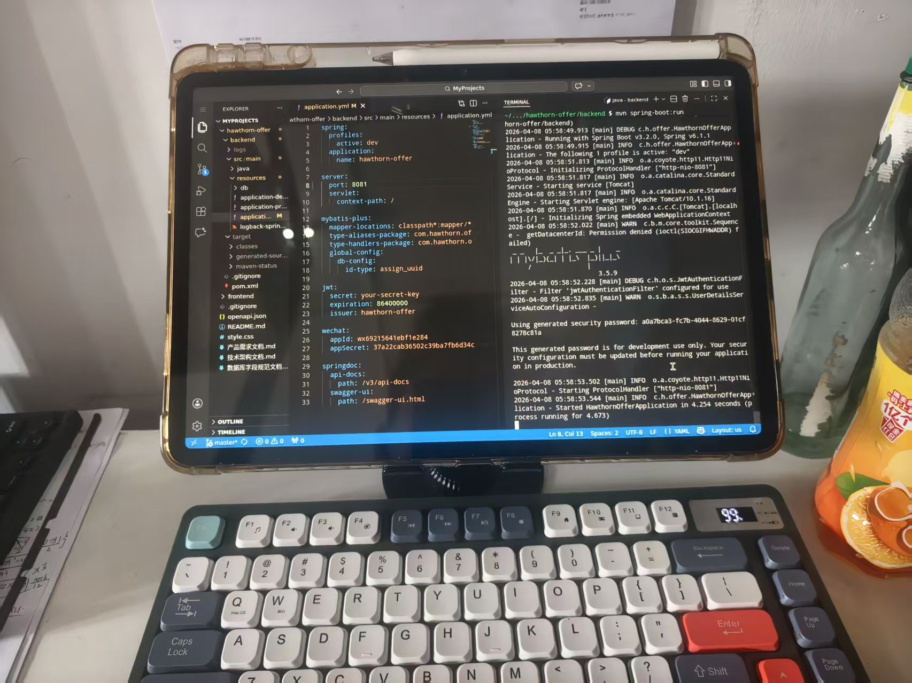
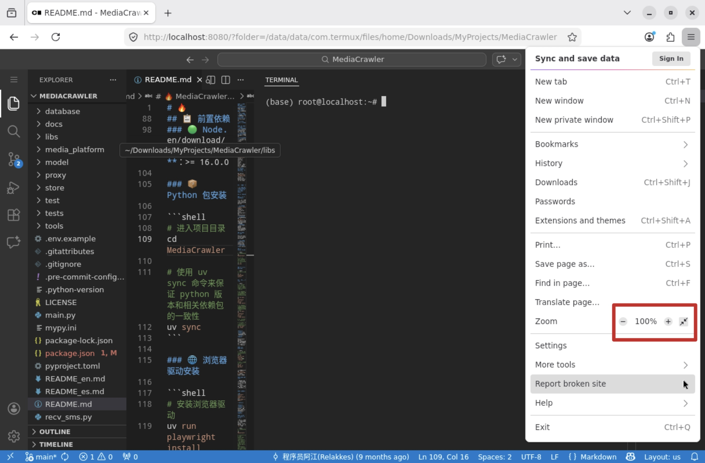

>感谢开源，给所有的开源贡献者磕一个两个三个四个五个六个七个八个九个

最近我的电脑又双叒虚焊了，于是在把电脑送回厦门维修的同时，我琢磨着能不能给平板装个虚拟机。经过两天的尝试和配置，成功在平板实现了如下功能/环境配置：
- git
- vscode（阉割版，具体下面说）
- obsidian
- maven
- nodejs
- jdk
- python
- postgresql
- redis
- 未完待续

经过我实际测试，能够跑起来一个demo级别的springboot项目



下面介绍一下如何在平板配置vscode和obsidian（解决写代码和写博客的需求）

## 安装 termux

termux项目github地址 https://github.com/termux/termux-app
进入release页面下载带universal字段的apk，然后安装即可

>上不去github就上f-droid.org然后搜索termux也可以获得下载链接，但还是建议学一下怎么上github，本文是写给因为特殊原因离开电脑的开发者的，作为开发者上github应该要轻车熟路才对

## 配置 termux

可参考这个up的视频 https://b23.tv/Tuvx6kQ
配置部分我也是跟他学的，下面展示的是我个人用的省流版本

打开 termux 以后进入其命令行界面
按照顺序输入以下命令
```bash
# (可选) termux 换源,空格选中后回车
termux-change-repo
# 更新软件包信息
apt update
# 下载 x11 软件仓库
apt install x11-repo
# 安装xfec桌面
apt install xfce4
# 安装x11服务器
apt install termux-x11-nightly
# 启动 x11 服务器
termux-x11 :0 &>/dev/null &
# 配置DISPLAY环境变了
export DISPLAY=:0
# 启动桌面
startxfce4
```

## 安装 ternux-x11

到此为止，虽然成功跑起来了桌面服务程序，但是没有装客户端，桌面服务程序就没法可视化，因此需要安装termux-x11实现可视化

github链接 https://github.com/termux/termux-x11

同样去release里下载apk

下载完以后启动，应该就可以看到桌面了（但是先别使用桌面，不出意外此时会闪退）
## 启动脚本

如果不写脚本，每次运行时都要输入以下命令
```bash
# 启动 x11 服务器
termux-x11 :0 &>/dev/null &
# 配置DISPLAY环境变了
export DISPLAY=:0
# 启动桌面
startxfce4
```

很麻烦，所以可以写一个脚本解决这个问题

在`$PATH`导航下的文件夹里创建一个`startx11`脚本
输入以下内容
```bash
#!/bin/bash

export DISPLAY=:0
termux-x11 :0 &>/dev/null &
sleep 3 # 确保服务已经启动
startxfce4 &>/dev/null &
```
这样之后就可以在termux的cli里直接一句`startx11`启动桌面

## 解除幽灵进程限制

termux作为一个linux模拟器，会在后台创建幽灵进程
安卓12以后的系统会对后台的幽灵进程做数量限制，导致进入桌面以后时不时闪退
一般来说可以在开发者选项里关闭后台进程限制
华为平板没有这个选项，只能通过adb调整幽灵进程设置
- 准备一个usb数据线
- adb下载地址[Android Platform Tools](https://developer.android.com/studio/releases/platform-tools)
输入以下命令
```bash
# 连接设备
adb devices
# 将幽灵进程上限提高到系统允许的最大值
adb shell device_config put activity_manager max_phantom_processes 1000

# 或者用下面这个命令也行

# 设置后台进程限制为无限制
adb shell settings put global background_process_limit -1

```

## 安装必要的软件

进入x11桌面以后
此时桌面只有文件管理工具，和一个命令框能用，因此需要输入以下命令以安装软件
```bash
# 安装软件
apt update
apt upgrade
apt install firefox
apt install git
apt install code-server
# 配置开发环境
apt install maven
apt install nodejs
apt install jdk-21 # 版本自己选
```

## 利用 code-server 模拟 VSCode 开发环境

在 Xfce 桌面中，我们已通过 `apt install code-server` 安装了 code-server。它是一个在浏览器中运行的 VSCode 服务。

### 启动与配置 code-server

在 Termux 的命令行中，启动 code-server 服务：

```bash
# 首次启动会生成配置文件，并提示设置访问密码
code-server
```

首次运行会在 `~/.config/code-server/config.yaml` 生成配置文件。你可以按 `Ctrl+C` 停止服务，然后编辑此文件以进行基本配置（如绑定地址、端口）：

```bash
# 编辑配置文件
nano ~/.config/code-server/config.yaml
```

关键配置项示例：

```yaml
bind-addr: 127.0.0.1:8080
auth: password
password: your_secure_password_here # 替换为你的密码
cert: false
```

在浏览器打开`localhost:8080`，输入密码后即可打开code-server

### 网页全屏与“应用化”

火狐浏览器可以全屏化，点击这里即可
不要相信AI的脑残建议

    
## Obsidian 同步 Git 解决方案

下载一个平板端的obsidian先
### 打通 Termux 访问安卓 Shared 文件夹的权限

默认情况下，Termux 无法直接访问平板的共享存储空间（如 `Documents`, `Download` 等）。我们需要建立符号链接。 

在 Termux 中执行：

```bash
# 请求存储权限
termux-setup-storage
```

执行后，会弹出权限申请，点击允许。这会在 Termux 的 home 目录下创建一个 `~/storage` 文件夹，里面链接了平板的各个共享目录。

### 在共享文件夹中初始化 Git 仓库

将 Obsidian 笔记库放在共享文件夹中，例如 `Documents/ObsidianVault`。

在 Termux 中：

```bash
cd ~/storage/shared/Documents/ObsidianVault
git init
git remote add origin <your-git-remote-url>
# 进行初始的 pull/push 等操作
```

然后你就可以在安卓端编辑，在termux里使用git上传了
obsidain自己的git插件和git的安卓客户端软件也可以自行去尝试，我嫌麻烦没有搞