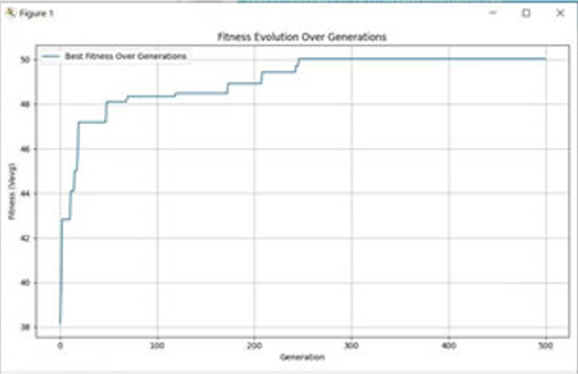
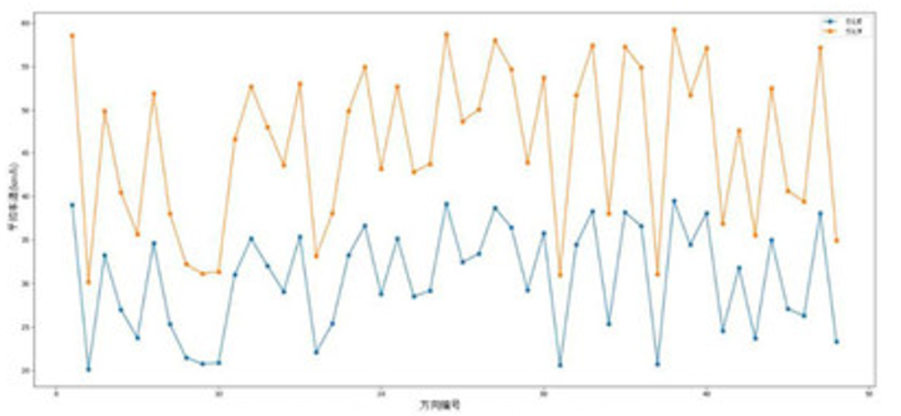

根据假设，车辆平均速度和“绿灯时长和周期时长的比值成反比”
$$
V_{i,j}=v_{free}
\times\ \frac{t_{green~i,j}}{T_{cycle~i}}
$$
其中：$V_{i,j}$ 为交叉口` i `在第` j `个相位的平均车速；$v_{free}$ 为自由流状态车速；$T_{cycle,i}$ 为交叉口` i `信号周期时长；$t_{green,i,j}$ 为交叉口` i `第 j 个相位的绿灯时长

#### 模型优化目标
$$
MAX~V_{avg}=\frac{\sum^n_{i=1}\sum^m_{j=1}v_{i,j}\times Q_{i,j}}{\sum^n_{i=1}\sum^m_{j=1}Q_{i,j}}
$$
>n和m分别代表交叉口数量和交叉口相位数量

#### 模型约束条件

$$
\begin{cases}
\sum_{j=1}^{m}(t_{green}+t_{red~i,j}+t_{yellow~i,j})=T_{cycle,i} \\
\\
Q_{i,j}\leq S_{i,j}\times t_{green~i.j} \\
\\
0\leq t_{green,i,j}
\end{cases}
$$

#### 模型求解

- 编码方案：将每个交叉口的各个相位绿灯时长编码为一个个体
- 初始种群：随机生成一组信号等配置作为初始种群
- 适应度函数：使用平均车速作为适应度函数，评估每个个体优劣
- 选择：根据适应度选择出优良个体用于交叉和变异
- 交叉和编译：对选中个体进行交叉和变异操作（随机调整绿灯时长）
- 迭代更新直至适应度收敛或达到预定迭代次数
- 设置适应度函数
$$
	Fitness=V_{avg}=\frac{\sum^n_{i=1}\sum^m_{j=1}v_{i,j}\times Q_{i,j}}{\sum^n_{i=1}\sum^m_{j=1}Q_{i,j}}
$$

