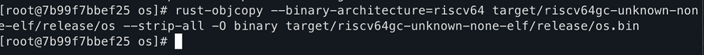
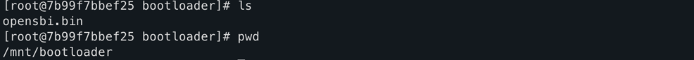
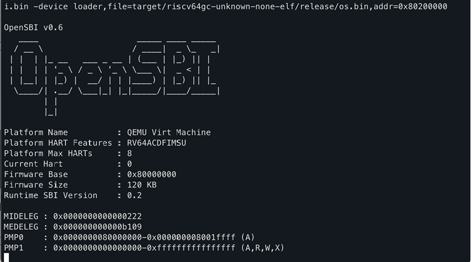
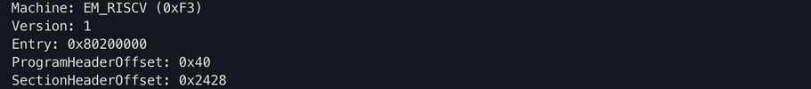
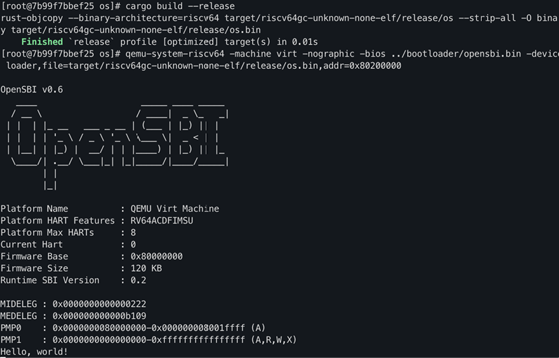
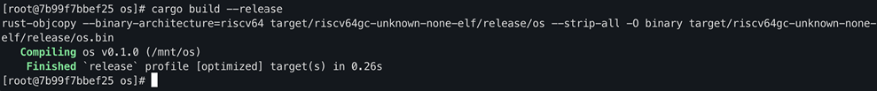
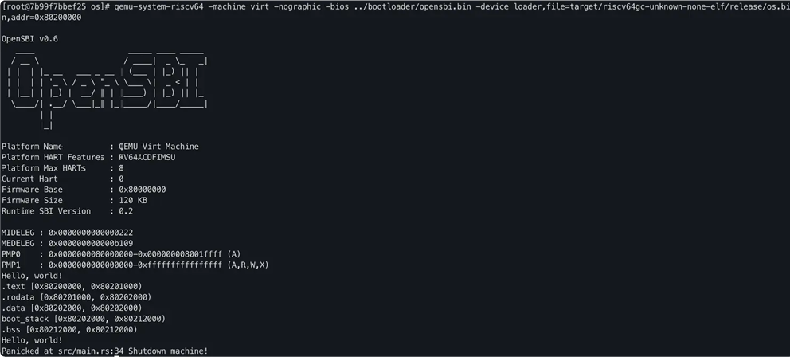
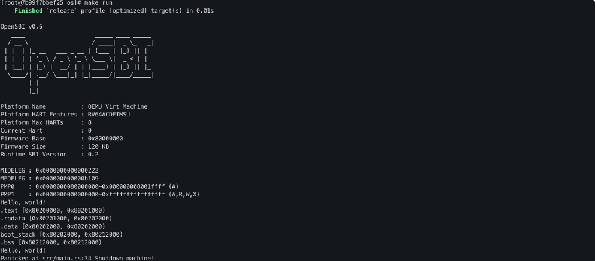
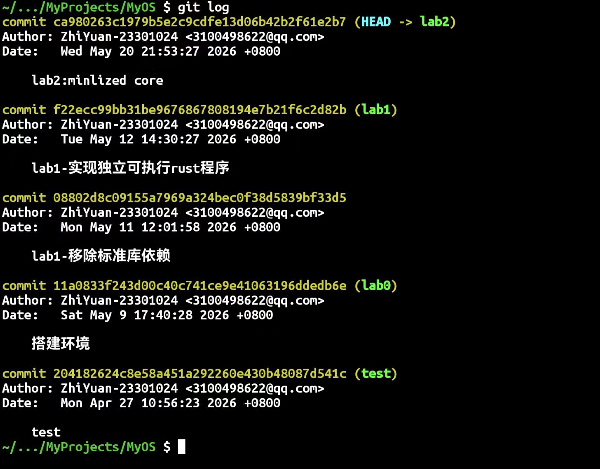

[本实验的主要目的是实现裸机上的执行环境以及一个最小化的操作系统内核。

### 编译生成内核镜像

进入os目录，然后执行如下命令进行编译：

```bash
cargo build --release
```

然后，再把编译生成的ELF执行文件转成binary文件：

```bash
rust-objcopy --binary-architecture=riscv64 target/riscv64gc-unknown-none-elf/release/os --strip-all -O binary 
target/riscv64gc-unknown-none-elf/release/os.bin
```



在运行之前，还需要在os目录的同级目录下创建bootloader目录，并将opensbi.bin放在bootloader目录下。opensbi.bin可以通过github下载

==注意：请使用老师给的opensbi.bin，因为版本的不同会造成潜在的问题。==



接着，加载运行生成的二进制文件

```bash
qemu-system-riscv64 -machine virt -nographic -bios ../bootloader/opensbi.bin -device loader,file=target/riscv64gc-unknown-none-elf/release/os.bin,addr=0x80200000
```



这时候运行会进入死循环，原因是操作系统的入口地址不对！对于os ELF执行程序，通过rust-readobj分析，看到的入口地址不是约定的 0x80200000。

注意：退出qemu可以通过Docker Desktop里的容器的命令行杀死qemu的进程。

具体分析命令如下：

```bash
rust-readobj -h target/riscv64gc-unknown-none-elf/release/os
```

因此，我们还需要修改 os ELF执行程序的内存布局。

### 指定内存布局

通过链接文件linker.ld可以实现指定可执行文件的内存布局。同时，我们还需要修改Cargo的配置文件来使用我们的链接脚本而不是默认的内存布局。

首先，修改os/.cargo/config.toml，增加如下内容：

```rust
[target.riscv64gc-unknown-none-elf]
rustflags = [
    "-C", "link-arg=-Tsrc/linker.ld",
]

```

链接脚本文件os/src/linker.ld的内容如下：

```rust
OUTPUT_ARCH(riscv)
ENTRY(_start)
BASE_ADDRESS = 0x80200000;

SECTIONS
{
    . = BASE_ADDRESS;
    skernel = .;

    stext = .;
    .text : {
        *(.text.entry)
        *(.text .text.*)
    }

    . = ALIGN(4K);
    etext = .;
    srodata = .;
    .rodata : {
        *(.rodata .rodata.*)
        *(.srodata .srodata.*)
    }

    . = ALIGN(4K);
    erodata = .;
    sdata = .;
    .data : {
        *(.data .data.*)
        *(.sdata .sdata.*)
    }

    . = ALIGN(4K);
    edata = .;
    .bss : {
        *(.bss.stack)
        sbss = .;
        *(.bss .bss.*)
        *(.sbss .sbss.*)
    }

    . = ALIGN(4K);
    ebss = .;
    ekernel = .;

    /DISCARD/ : {
        *(.eh_frame)
    }
}
```

```
### 配置栈空间布局

为了程序能够正确的执行，我们还需要设置正确的栈空间。

栈空间的通过汇编entry.asm来建立，文件目录为：os/src/entry.asm。
文件内容具体如下：
```rust

```rust

```rust

    .section .text.entry
    .globl _start
_start:
    la sp, boot_stack_top
    call rust_main

    .section .bss.stack
    .globl boot_stack
boot_stack:
    .space 4096 * 16
    .globl boot_stack_top
boot_stack_top:
```

然后，我们还需要在 main.rs 中嵌入这些汇编代码并声明应用入口 rust_main。

use core::arch::global_asm;

global_asm!(include_str!("entry.asm"));

#[no_mangle]
pub fn rust_main() -> ! {
    loop{};
}
```

运行代码查看，内存布局设置成功


### 清空bss段

为了保证内存的正确性，我们还需要撰写代码清空.bss段。在main.rs中增加如下代码：

```rust
fn clear_bss() {
    extern "C" {
        fn sbss();
        fn ebss();
    }
    (sbss as usize..ebss as usize).for_each(|a| unsafe { (a as *mut u8).write_volatile(0) });
}
```

### 实现裸机打印输出信息

为了实现在裸机上能够打印信息，我们需要把之前的系统调用改成sbi调用即可实现。同时，我们还可以调用sbi提供的接口实现关机的功能。

os/src/sbi.rs具体内容如下：

```rust
#![allow(unused)]

use core::arch::asm;

const SBI_SET_TIMER: usize = 0;
const SBI_CONSOLE_PUTCHAR: usize = 1;
const SBI_CONSOLE_GETCHAR: usize = 2;
const SBI_CLEAR_IPI: usize = 3;
const SBI_SEND_IPI: usize = 4;
const SBI_REMOTE_FENCE_I: usize = 5;
const SBI_REMOTE_SFENCE_VMA: usize = 6;
const SBI_REMOTE_SFENCE_VMA_ASID: usize = 7;
const SBI_SHUTDOWN: usize = 8;

#[inline(always)]
fn sbi_call(which: usize, arg0: usize, arg1: usize, arg2: usize) -> usize {
    let mut ret;
    unsafe {
        asm!("ecall",
             in("x10") arg0,
             in("x11") arg1,
             in("x12") arg2,
             in("x17") which,
             lateout("x10") ret
        );
    }
    ret
}

pub fn console_putchar(c: usize) {
    sbi_call(SBI_CONSOLE_PUTCHAR, c, 0, 0);
}

pub fn console_getchar() -> usize {
    sbi_call(SBI_CONSOLE_GETCHAR, 0, 0, 0)
}

pub fn shutdown() -> ! {
    sbi_call(SBI_SHUTDOWN, 0, 0, 0);
    panic!("It should shutdown!");
}
```

在sbi.rs提供接口的基础上，根据前一节print函数的实现，实现裸机上的print函数。

具体在os/src/console.rs中，其内容具体如下：

```rust
use crate::sbi::console_putchar;
use core::fmt::{self, Write};
struct Stdout;
impl Write for Stdout {
    fn write_str(&mut self, s: &str) -> fmt::Result {
        for c in s.chars() {
            console_putchar(c as usize);
        }
        Ok(())
    }
}
pub fn print(args: fmt::Arguments) {
    Stdout.write_fmt(args).unwrap();
}
#[macro_export]
macro_rules! print {
    ($fmt: literal $(, $($arg: tt)+)?) => {
        $crate::console::print(format_args!($fmt $(, $($arg)+)?));
    }
}
#[macro_export]
macro_rules! println {
    ($fmt: literal $(, $($arg: tt)+)?) => {
        $crate::console::print(format_args!(concat!($fmt, "\n") $(, $($arg)+)?));
    }
}
```

修改完上述代码后，注意需要删除main.rs中的内容，只保留最开始的头部的内容，其他的内容都删除了即可。同时，增加调用sbi和console两个模块。

运行QENU，验证裸机下SBI可以打出Hello world


### 给异常处理增加输出信息

最后，再给异常处理函数panic增加输出显示，以便我们更好的了解程序的执行情况。
实现os/src/lang_items.rs，其内容如下：

```rust
use crate::sbi::shutdown;
use core::panic::PanicInfo;

#[panic_handler]
fn panic(info: &PanicInfo) -> ! {
    let msg = info.message().as_str().unwrap_or("(no message)");

    if let Some(location) = info.location() {
        println!(
            "Panicked at {}:{} {}",
            location.file(),
            location.line(),
            msg
        );
    } else {
        println!("Panicked: {}", msg);
    }

    shutdown()
}

```


### 修改main.rs输出测试信息

修改main.rs为如下内容：

```rust
#![no_std]
#![no_main]
#![feature(panic_info_message)]
#[macro_use]

mod console;
mod lang_items;
mod sbi;

use core::arch::global_asm;

global_asm!(include_str!("entry.asm"));
fn clear_bss() {
    extern "C" {
        fn sbss();
        fn ebss();
    }
    (sbss as usize..ebss as usize).for_each(|a| unsafe { (a as *mut u8).write_volatile(0) });
}

#[no_mangle]
pub fn rust_main() -> ! {
    extern "C" {
        fn stext();
        fn etext();
        fn srodata();
        fn erodata();
        fn sdata();
        fn edata();
        fn sbss();
        fn ebss();
        fn boot_stack();
        fn boot_stack_top();
    }
    clear_bss();
    println!("Hello, world!");
    println!(".text [{:#x}, {:#x})", stext as usize, etext as usize);
    println!(".rodata [{:#x}, {:#x})", srodata as usize, erodata as usize);
    println!(".data [{:#x}, {:#x})", sdata as usize, edata as usize);
    println!(
        "boot_stack [{:#x}, {:#x})",
        boot_stack as usize, boot_stack_top as usize
    );
    println!(".bss [{:#x}, {:#x})", sbss as usize, ebss as usize);
    println!("Hello, world!");
    panic!("Shutdown machine!");
}
```

然后，重新编译以及生成二进制文件。具体步骤为：

```shell
# 编译
cargo build --release

# 生成二进制文件
rust-objcopy --binary-architecture=riscv64 target/riscv64gc-unknown-none-elf/release/os --strip-all -O binary target/riscv64gc-unknown-none-elf/release/os.bin

# 运行
qemu-system-riscv64 -machine virt -nographic -bios ../bootloader/opensbi.bin -device loader,file=target/riscv64gc-unknown-none-elf/release/os.bin,addr=0x80200000
```





同时，为了更加方便地编译运行，还可以编写一个Makefile文件，Makefile文件放在os目录下。具体可以参考如下Makefile代码

```bash

# Building
TARGET := riscv64gc-unknown-none-elf
MODE := release
KERNEL_ELF := target/$(TARGET)/$(MODE)/os
KERNEL_BIN := $(KERNEL_ELF).bin
DISASM_TMP := target/$(TARGET)/$(MODE)/asm

# BOARD
SBI ?= rustsbi
BOOTLOADER := ../bootloader/$(SBI).bin

# KERNEL ENTRY
KERNEL_ENTRY_PA := 0x80200000

# Binutils
OBJDUMP := rust-objdump --arch-name=riscv64
OBJCOPY := rust-objcopy --binary-architecture=riscv64

# Disassembly
DISASM ?= -x

build: $(KERNEL_BIN)

env:
    (rustup target list | grep "riscv64gc-unknown-none-elf (installed)") || rustup target add $(TARGET)
    cargo install cargo-binutils
    rustup component add rust-src
    rustup component add llvm-tools-preview

$(KERNEL_BIN): kernel
    @$(OBJCOPY) $(KERNEL_ELF) --strip-all -O binary $@

kernel:
    @cargo build --release

clean:
    @cargo clean

disasm: kernel
    @$(OBJDUMP) $(DISASM) $(KERNEL_ELF) | less

disasm-vim: kernel
    @$(OBJDUMP) $(DISASM) $(KERNEL_ELF) > $(DISASM_TMP)
    @vim $(DISASM_TMP)
    @rm $(DISASM_TMP)

run: build
    @qemu-system-riscv64 \
        -machine virt \
        -nographic \
        -bios $(BOOTLOADER) \
        -device loader,file=$(KERNEL_BIN),addr=$(KERNEL_ENTRY_PA)

debug: build
    @tmux new-session -d \
        "qemu-system-riscv64 -machine virt -nographic -bios $(BOOTLOADER) -device loader,file=$(KERNEL_BIN),addr=$(KERNEL_ENTRY_PA) -s -S" && \
        tmux split-window -h "riscv64-unknown-elf-gdb -ex 'file $(KERNEL_ELF)' -ex 'set arch riscv:rv64' -ex 'target remote localhost:1234'" && \
        tmux -2 attach-session -d

.PHONY: build env kernel clean disasm disasm-vim run

```

配置完成Makefile文件后，直接执行make run操作就可以运行自己实现的系统了



## 思考并回答问题

### `linker.ld`和 `entry.asm`的功能分析

### `linker.ld`（链接脚本）

**核心作用：规定内核在内存中的布局，并指定入口地址。**

具体包括：

- **指定目标架构**
    
    - 面向 RISC‑V 裸机环境（`riscv64`）。
        
    
- **设定程序入口**
    
    ```
    ENTRY(_start)
    ```
    
    告诉链接器：内核从 `_start`开始执行。
    
- **固定内核加载地址**
    
    ```
    . = 0x80200000;
    ```
    
    - OpenSBI 约定内核从 `0x80200000`启动；
        
    - 保证 QEMU 能正确跳转到内核。
        
    
- **合理安排各段位置**
    
    - `.text`：代码段
        
    - `.rodata`：只读数据
        
    - `.data`：已初始化全局变量
        
    - `.bss`：未初始化全局变量
        
    
- **保证入口代码在最前**
    
    ```
    .text : {
        *(.text.entry)
    }
    ```
    
    - 确保 `entry.asm`中的启动代码最先执行。
        

> `linker.ld`决定“内核放在内存的哪里、从哪里开始执行”。


### `entry.asm`（启动汇编）

**核心作用：建立最早的执行环境，为 Rust 代码运行做准备。**

主要工作：

- **定义内核入口 `_start`**
    
    - 与 `linker.ld`中的 `ENTRY(_start)`对应。
        
    
- **分配并初始化栈**
    
    ```
    la sp, boot_stack_top
    ```
    
    - 在 `.bss`中预留 64KB 栈空间；
        
    - 设置栈指针 `sp`，否则 Rust 代码无法运行。
        
    
- **跳转到 Rust 入口**
    
    ```
    call rust_main
    ```
    
    - 把控制权交给 Rust 的 `rust_main`。

> `entry.asm`负责“CPU 上电后最先执行的代码，搭好栈并进入 Rust”。

## `sbi`模块和 `lang_items`模块的功能分析

### `sbi.rs`（OpenSBI 接口封装）

**核心作用：在裸机环境下使用 OpenSBI 提供的服务。**

功能点：

- **通过 `ecall`陷入 SBI**
    
    ```
    fn sbi_call(...) {
        asm!("ecall", ...);
    }
    ```
    
    - RISC‑V 中，`ecall`用于向 SBI（类似 BIOS）请求服务。
        
    
- **字符输出**
    
    ```
    pub fn console_putchar(c: usize)
    ```
    
    - 实现裸机下的 `print!`/ `println!`。
        
    
- **关机功能**
    
    ```
    pub fn shutdown() -> !
    ```
    
    - 让 QEMU 正常退出，而不是死循环。

> `sbi.rs`是内核与硬件之间的“系统调用层”，提供输出和关机能力。

---

### `lang_items.rs`（Panic 处理）

**核心作用：在 `#![no_std]`环境下实现必需的 panic 处理。**

功能点：

- **定义 panic 处理函数**
    
    ```
    #[panic_handler]
    fn panic(info: &PanicInfo) -> ! { ... }
    ```
    
    - 当内核触发 `panic!`时，程序会进入这里。
        
    
- **输出 panic 信息**
    
    ```
    println!("Panicked at {}", info);
    ```
    
    - 打印出错位置和原因，便于调试。
        
    
- **安全关机**
    
    ```
    shutdown();
    ```
    
    - panic 后不再返回，直接调用 SBI 关机。

> `lang_items.rs`保证内核在崩溃时能“打印错误信息并优雅关机”。

## Git 截图

