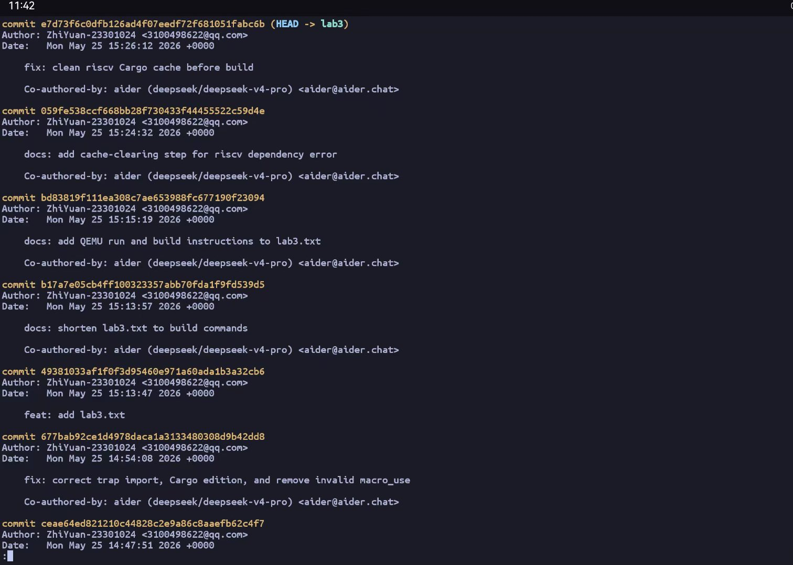
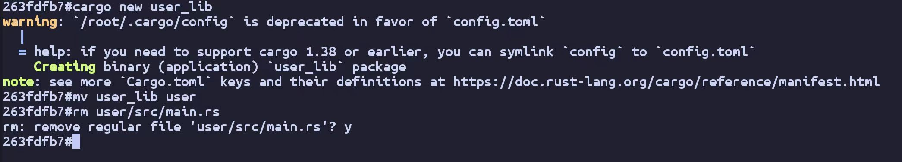
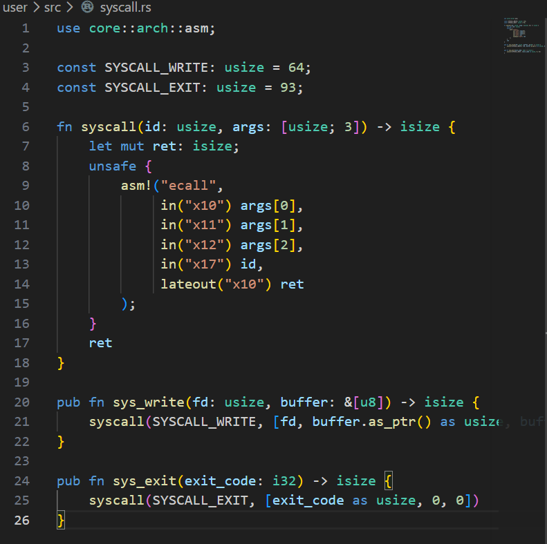
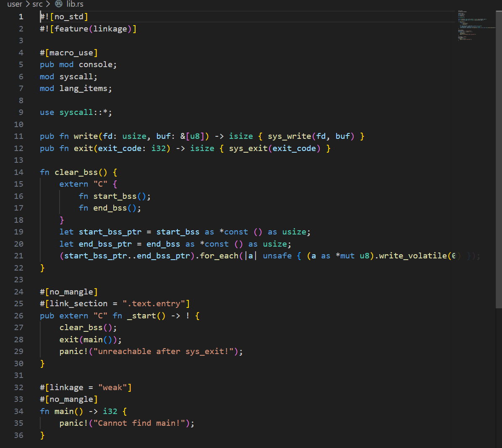
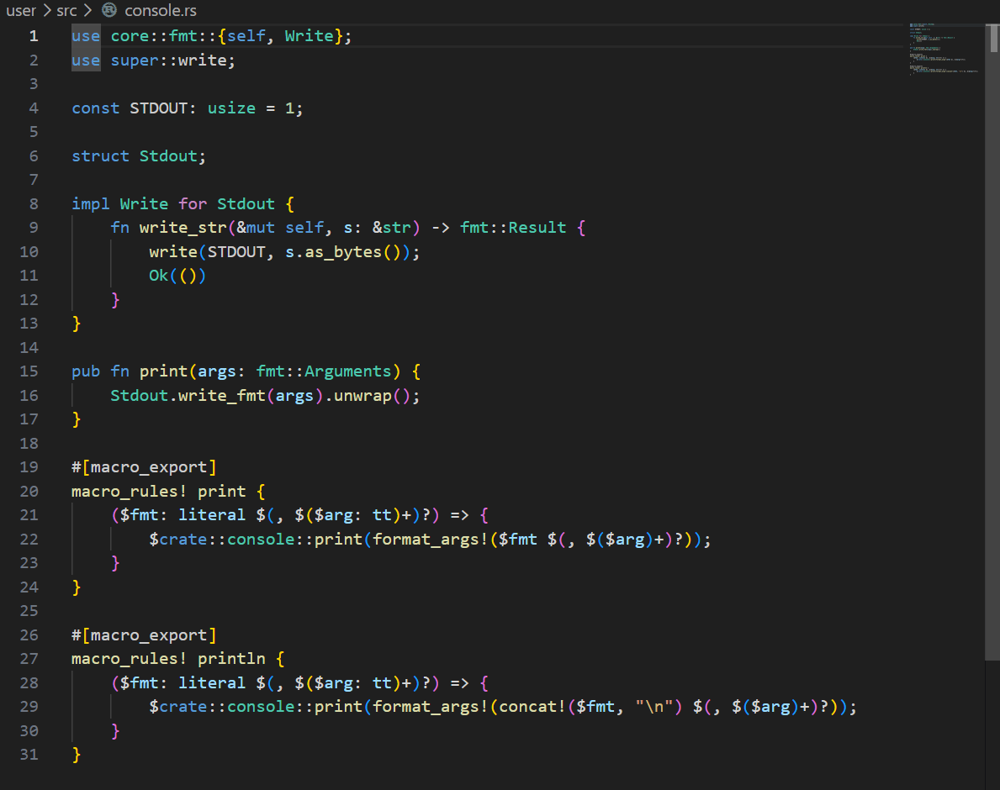
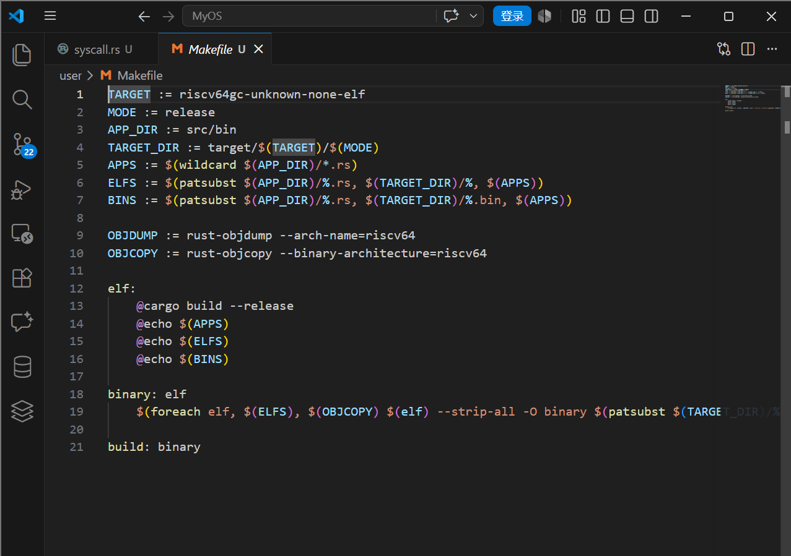
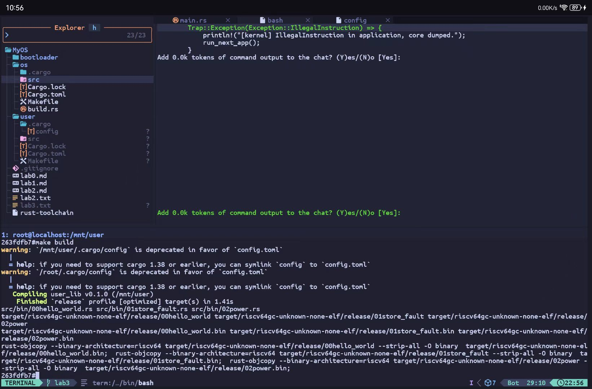
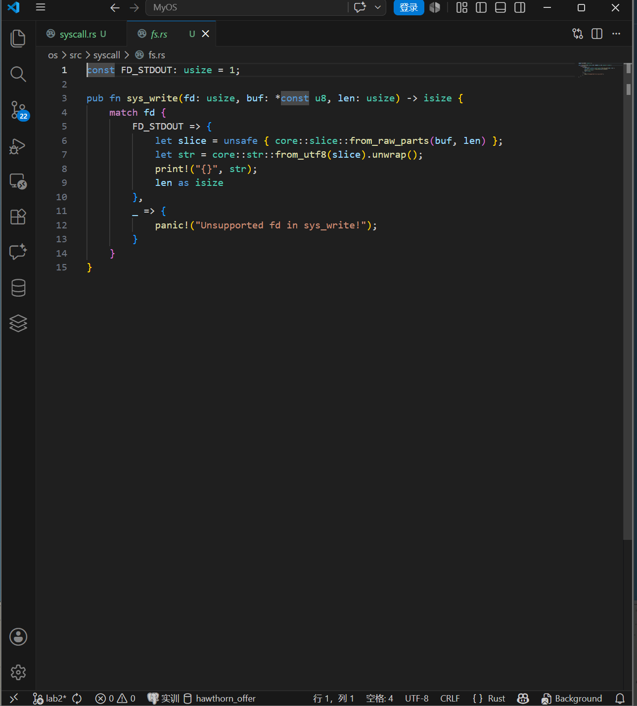
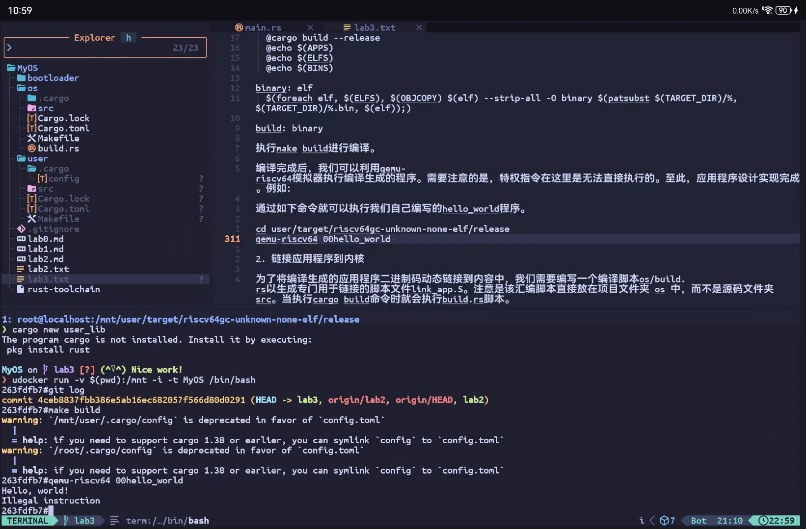

**本报告不对代码书写的内容做过多图片赘述，如需查询具体代码，可访问本项目github仓库github.com/ZhiYuan-23301024/MyOS**

**PS：我发现实验模板要求每步都记录，故而保留了代码图片，我使用的技术栈是termux+vscode，termux作为主机，vscode是前端，通过git同步，因此会出现vscode和nvim的截图，属于正常现象**

## git日志截图


本实验的主要目的是实现一个简单的批处理操作系统并理解特权级的概念。

## 设计和实现应用程序

实现一个简单的批处理操作系统，需要先实现应用程序，要求应用程序在用户态下运行。应用程序及其对应的库文件放置在工作目录下的user目录下，也即和os同一级目录。这部分的实现与上一节裸机环境和最小化内核部分有很多相同的实现。

注意，通过如下命令创建user目录：

```shell
cargo new user_lib
mv user_lib user
rm user/src/main.rs
```


### 首先实现应用程序与系统约定的两个系统调用sys_write和sys_exit

具体代码在user/src/syscall.rs中，具体内容如下：

```rust
use core::arch::asm;

const SYSCALL_WRITE: usize = 64;
const SYSCALL_EXIT: usize = 93;

fn syscall(id: usize, args: [usize; 3]) -> isize {
    let mut ret: isize;
    unsafe {
        asm!("ecall",
             in("x10") args[0],
             in("x11") args[1],
             in("x12") args[2],
             in("x17") id,
             lateout("x10") ret
        );
    }
    ret
}

pub fn sys_write(fd: usize, buffer: &[u8]) -> isize {
    syscall(SYSCALL_WRITE, [fd, buffer.as_ptr() as usize, buffer.len()])
}

pub fn sys_exit(exit_code: i32) -> isize {
    syscall(SYSCALL_EXIT, [exit_code as usize, 0, 0])
}
```



同时，还需要在lib.rs实现进一步的封装。
在user/src/lib.rs中增加如下内容：

```rust
#![no_std]

use syscall::*;

pub fn write(fd: usize, buf: &[u8]) -> isize { sys_write(fd, buf) }
pub fn exit(exit_code: i32) -> isize { sys_exit(exit_code) }
```



### 实现格式化输出

为了实现格式化输出，我们还需要把 Stdout::write_str 改成基于 write 的实现，且传入的 fd 参数设置为 1，它代表标准输出， 也就是输出到屏幕。
具体代码在user/src/console.rs中，具体内容如下：
 
```rust
use core::fmt::{self, Write};
use super::write;

const STDOUT: usize = 1;

struct Stdout;

impl Write for Stdout {
    fn write_str(&mut self, s: &str) -> fmt::Result {
        write(STDOUT, s.as_bytes());
        Ok(())
    }
}

pub fn print(args: fmt::Arguments) {
    Stdout.write_fmt(args).unwrap();
}

#[macro_export]
macro_rules! print {
    ($fmt: literal $(, $($arg: tt)+)?) => {
        $crate::console::print(format_args!($fmt $(, $($arg)+)?));
    }
}

#[macro_export]
macro_rules! println {
    ($fmt: literal $(, $($arg: tt)+)?) => {
        $crate::console::print(format_args!(concat!($fmt, "\n") $(, $($arg)+)?));
    }
}
```


### 实现语义支持

此外，还需要实现对panic的处理。具体代码在user/src/lang_items.rs。

```rust
use core::panic::PanicInfo;

#[panic_handler]
fn panic_handler(panic_info: &PanicInfo) -> ! {
    let msg = panic_info.message().as_str().unwrap_or("(no message)");

    if let Some(location) = panic_info.location() {
        println!(
            "Panicked at {}:{}, {}",
            location.file(),
            location.line(),
            msg
        );
    } else {
        println!("Panicked: {}", msg);
    }
    loop {}
}
```


### 应用程序内存布局

我们还需要将应用程序的起始物理地址调整为 0x80400000，这样应用程序都会被加载到这个物理地址上运行，从而进入用户库的入口点，并会在初始化之后跳转到应用程序主逻辑。实现方式类似前一节的linker.ld。

具体代码在user/src/linker.ld，具体内容如下：

```ld
OUTPUT_ARCH(riscv)
ENTRY(_start)

BASE_ADDRESS = 0x80400000;

SECTIONS
{
    . = BASE_ADDRESS;
    .text : {
        *(.text.entry)
        *(.text .text.*)
    }
    .rodata : {
        *(.rodata .rodata.*)
        *(.srodata .srodata.*)
    }
    .data : {
        *(.data .data.*)
        *(.sdata .sdata.*)
    }
    .bss : {
        start_bss = .;
        *(.bss .bss.*)
        *(.sbss .sbss.*)
        end_bss = .;
    }
    /DISCARD/ : {
        *(.eh_frame)
        *(.debug*)
    }
}
```
同时，注意增加配置文件使用linker.ld文件，user/.cargo/config配置文件的内容如下：

```config
[build]
target = "riscv64gc-unknown-none-elf"

[target.riscv64gc-unknown-none-elf]
rustflags = [
    "-Clink-args=-Tsrc/linker.ld",
]
```


定义用户库的入口点 _start，_start这段代码编译后会存放在.text.entry代码段中，这在前面内存布局中已经定义了。此外，通过#[linkage = "weak"]确保lib.rs和bin下同时存在main的编译能够通过。在lib.rs增加的代码如下：
注意：最开始的两行代码需要放在 #![no_std]的下面，放在后面会出现错误。

```rust
#![feature(linkage)]

#[macro_use]
pub mod console;
mod syscall;
mod lang_items;

fn clear_bss() {
    extern "C" {
        fn start_bss();
        fn end_bss();
    }
    let start_bss_ptr = start_bss as *const () as usize;
    let end_bss_ptr = end_bss as *const () as usize;
    (start_bss_ptr..end_bss_ptr).for_each(|a| unsafe { (a as *mut u8).write_volatile(0) });
}

#[no_mangle]
#[link_section = ".text.entry"]
pub extern "C" fn _start() -> ! {
    clear_bss();
    exit(main());
    panic!("unreachable after sys_exit!");
}

#[linkage = "weak"]
#[no_mangle]
fn main() -> i32 {
    panic!("Cannot find main!");
}
```
### 应用程序模板

应用程序都存放在user/src/bin下，模板如下。这段模板代码引入了外部库，就是lib.rs定义以及它所引用的子模块。
注意：下面的模板代码不需创建，只是作为后续创建应用程序的参考。

```rust
#![no_std]
#![no_main]

#[macro_use]
extern crate user_lib;

#[no_mangle]
fn main() -> i32 {
    0
}

```

### 实现多个不同的应用程序

基于上述模板，我们可以在bin下实现多个不同的应用程序。
其中user/src/bin/00hello_world.rs内容具体如下：

```rust
#![no_std]
#![no_main]

use core::arch::asm;

#[macro_use]
extern crate user_lib;

#[no_mangle]
fn main() -> i32 {
    println!("Hello, world!");
    unsafe {
        asm!("sret");
    }
    0
}
```
/user/src/bin/01store_fault.rs内容具体如下：

```rust
#![no_std]
#![no_main]
#[macro_use]
extern crate user_lib;
#[no_mangle]
fn main() -> i32 {
    println!("Into Test store_fault, we will insert an invalid store operation...");
    println!("Kernel should kill this application!");
    unsafe { (0x0 as *mut u8).write_volatile(0); }
    0
}
```
/user/src/bin/02power.rs内容具体如下：

```rust
#![no_std]
#![no_main]
#[macro_use]
extern crate user_lib;
const SIZE: usize = 10;
const P: u32 = 3;
const STEP: usize = 100000;
const MOD: u32 = 10007;
#[no_mangle]
fn main() -> i32 {
    let mut pow = [0u32; SIZE];
    let mut index: usize = 0;
    pow[index] = 1;
    for i in 1..=STEP {
        let last = pow[index];
        index = (index + 1) % SIZE;
        pow[index] = last * P % MOD;
        if i % 10000 == 0 {
            println!("{}^{}={}", P, i, pow[index]);
        }
    }
    println!("Test power OK!");
    0
}
```
### 编译生成应用程序二进制码

编写Makefile文件，user/Makefile内容如下：

```Makefile
TARGET := riscv64gc-unknown-none-elf
MODE := release
APP_DIR := src/bin
TARGET_DIR := target/$(TARGET)/$(MODE)
APPS := $(wildcard $(APP_DIR)/*.rs)
ELFS := $(patsubst $(APP_DIR)/%.rs, $(TARGET_DIR)/%, $(APPS))
BINS := $(patsubst $(APP_DIR)/%.rs, $(TARGET_DIR)/%.bin, $(APPS))

OBJDUMP := rust-objdump --arch-name=riscv64
OBJCOPY := rust-objcopy --binary-architecture=riscv64

elf:
	@cargo build --release
	@echo $(APPS)
	@echo $(ELFS)
	@echo $(BINS)

binary: elf
	$(foreach elf, $(ELFS), $(OBJCOPY) $(elf) --strip-all -O binary $(patsubst $(TARGET_DIR)/%, $(TARGET_DIR)/%.bin, $(elf));)

build: binary
```


执行make build进行编译


编译完成后，我们可以利用qemu-riscv64模拟器执行编译生成的程序。需要注意的是，特权指令在这里是无法直接执行的。至此，应用程序设计实现完成。例如：

通过如下命令就可以执行我们自己编写的hello_world程序。

```shell
cd user/target/riscv64gc-unknown-none-elf/release
qemu-riscv64 00hello_world 

```
## 链接应用程序到内核

为了将编译生成的应用程序二进制码动态链接到内容中，我们需要编写一个编译脚本os/build.rs以生成专门用于链接的脚本文件link_app.S。注意是该汇编脚本直接放在项目文件夹 os 中，而不是源码文件夹 src。当执行cargo build命令时就会执行build.rs脚本。

os/build.rs文件的内容具体如下：

```rust
use std::io::{Result, Write};
use std::fs::{File, read_dir};

fn main() {
    println!("cargo:rerun-if-changed=../user/src/");
    println!("cargo:rerun-if-changed={}", TARGET_PATH);
    insert_app_data().unwrap();
}

static TARGET_PATH: &str = "../user/target/riscv64gc-unknown-none-elf/release/";

fn insert_app_data() -> Result<()> {
    let mut f = File::create("src/link_app.S").unwrap();
    let mut apps: Vec<_> = read_dir("../user/src/bin")
        .unwrap()
        .into_iter()
        .map(|dir_entry| {
            let mut name_with_ext = dir_entry.unwrap().file_name().into_string().unwrap();
            name_with_ext.drain(name_with_ext.find('.').unwrap()..name_with_ext.len());
            name_with_ext
        })
        .collect();
    apps.sort();

    writeln!(f, r#"
    .align 3
    .section .data
    .global _num_app
_num_app:
    .quad {}"#, apps.len())?;

    for i in 0..apps.len() {
        writeln!(f, r#"    .quad app_{}_start"#, i)?;
    }
    writeln!(f, r#"    .quad app_{}_end"#, apps.len() - 1)?;

    for (idx, app) in apps.iter().enumerate() {
        println!("app_{}: {}", idx, app);
        writeln!(f, r#"
    .section .data
    .global app_{0}_start
    .global app_{0}_end
app_{0}_start:
    .incbin "{2}{1}.bin"
app_{0}_end:"#, idx, app, TARGET_PATH)?;
    }
    Ok(())
}

```
## 找到并加载应用程序二进制码

为了实现批处理操作系统，我们在os目录下实现一个batch子模块。其主要功能是保存应用程序的数据及对应的位置信息，以及当前执行到第几个应用程序。同时，也会初始化应用程序所需的内存并加载执行应用程序。

os/src/batch.rs的内容如下：

```rust
use core::arch::asm;
use core::cell::RefCell;
use lazy_static::*;

const MAX_APP_NUM: usize = 16;
const APP_BASE_ADDRESS: usize = 0x80400000;
const APP_SIZE_LIMIT: usize = 0x20000;

struct AppManager {
    inner: RefCell<AppManagerInner>,
}

struct AppManagerInner {
    num_app: usize,
    current_app: usize,
    app_start: [usize; MAX_APP_NUM + 1],
}

unsafe impl Sync for AppManager {}

impl AppManagerInner {
    pub fn print_app_info(&self) {
        println!("[kernel] num_app = {}", self.num_app);
        for i in 0..self.num_app {
            println!("[kernel] app_{} [{:#x}, {:#x})", i, self.app_start[i], self.app_start[i + 1]);
        }
    }

    unsafe fn load_app(&self, app_id: usize) {
        if app_id >= self.num_app {
            panic!("All applications completed!");
        }

        println!("[kernel] Loading app_{}", app_id);
        // clear icache
        asm!("fence.i");
        // clear app area
        (APP_BASE_ADDRESS..APP_BASE_ADDRESS + APP_SIZE_LIMIT).for_each(|addr| {
            (addr as *mut u8).write_volatile(0);
        });
        let app_src = core::slice::from_raw_parts(
            self.app_start[app_id] as *const u8,
            self.app_start[app_id + 1] - self.app_start[app_id]
        );
        let app_dst = core::slice::from_raw_parts_mut(
            APP_BASE_ADDRESS as *mut u8,
            app_src.len()
        );
        app_dst.copy_from_slice(app_src);
    }

    pub fn get_current_app(&self) -> usize { self.current_app }

    pub fn move_to_next_app(&mut self) {
        self.current_app += 1;
    }
}

lazy_static! {
    static ref APP_MANAGER: AppManager = AppManager {
        inner: RefCell::new({
            extern "C" { fn _num_app(); }
            let num_app_ptr = _num_app as *const () as *const usize;
            let num_app = unsafe { num_app_ptr.read_volatile() };
            let mut app_start: [usize; MAX_APP_NUM + 1] = [0; MAX_APP_NUM + 1];
            let app_start_raw: &[usize] = unsafe {
                core::slice::from_raw_parts(num_app_ptr.add(1), num_app + 1)
            };
            app_start[..=num_app].copy_from_slice(app_start_raw);
            AppManagerInner {
                num_app,
                current_app: 0,
                app_start,
            }
        }),
    };
}

pub fn init() {
    print_app_info();
}

pub fn print_app_info() {
    APP_MANAGER.inner.borrow().print_app_info();
}

pub fn run_next_app() -> ! {
    let current_app = APP_MANAGER.inner.borrow().get_current_app();
    unsafe {
        APP_MANAGER.inner.borrow().load_app(current_app);
    }

    APP_MANAGER.inner.borrow_mut().move_to_next_app();
    extern "C" { fn __restore(cx_addr: usize); }
    unsafe {
        __restore(KERNEL_STACK.push_context(
            TrapContext::app_init_context(APP_BASE_ADDRESS, USER_STACK.get_sp())
        ) as *const _ as usize);
    }
    panic!("Unreachable in batch::run_current_app!");
}

```
因为使用了外部库 lazy_static 提供的 lazy_static! 宏，因此需要在Cargo.toml中加入依赖。lazy_static!宏提供了全局变量的运行时初始化功能，我们借助lazy_static!声明了一个 AppManager结构的全局实例APP_MANAGER，使得只有在第一次使用它时才会进行实际的初始化工作。

修改os/Cargo.toml配置文件，在[dependencies]下增加如下内容：

```toml
lazy_static = { version = "1.4.0", features = ["spin_no_std"] }
```

## 实现用户栈和内核栈

为了实现特权级的切换，还需要实现用户栈和内核栈。在batch.rs中增加如下实现。需要注意在RISC-V中栈是向下增长的。

```rust
use crate::trap::TrapContext;

const USER_STACK_SIZE: usize = 4096 * 2;
const KERNEL_STACK_SIZE: usize = 4096 * 2;

#[repr(align(4096))]
struct KernelStack {
    data: [u8; KERNEL_STACK_SIZE],
}

#[repr(align(4096))]
struct UserStack {
    data: [u8; USER_STACK_SIZE],
}

static KERNEL_STACK: KernelStack = KernelStack { data: [0; KERNEL_STACK_SIZE] };
static USER_STACK: UserStack = UserStack { data: [0; USER_STACK_SIZE] };

impl KernelStack {
    fn get_sp(&self) -> usize {
        self.data.as_ptr() as usize + KERNEL_STACK_SIZE
    }
    pub fn push_context(&self, cx: TrapContext) -> &'static mut TrapContext {
        let cx_ptr = (self.get_sp() - core::mem::size_of::<TrapContext>()) as *mut TrapContext;
        unsafe { *cx_ptr = cx; }
        unsafe { cx_ptr.as_mut().unwrap() }
    }
}

impl UserStack {
    fn get_sp(&self) -> usize {
        self.data.as_ptr() as usize + USER_STACK_SIZE
    }
}

```

其中，TrapContext是在trap中定义的。

// os/src/trap/context.rs

```rust
#[repr(C)]
pub struct TrapContext {
    pub x: [usize; 32],
    pub sstatus: Sstatus,
    pub sepc: usize,
}
```

## 实现trap管理

特权级切换的主要内容就是实现对trap的管理。其主要内容就是当应用程序通过ecall进入到内核状态时，要保存被中断的应用程序的上下文。同时，还要根据CSR寄存器内容完成系统调用的分发与处理。在完成系统调用后，还需要恢复被中断的应用程序的上下文，并通 sret 让应用程序继续执行。

Trap处理的流程大致如下：首先通过将 Trap上下文保存在内核栈上，然后跳转到trap处理函数完成 Trap 分发及处理。当处理函数返回之后，再从保存在内核栈上的Trap上下文恢复寄存器。最后通过一条 sret 指令回到应用程序继续执行。

### Trap 上下文的保存与恢复

首先，修改stvec寄存器来指向正确的 Trap 处理入口点。

实现在os/src/trap/mod.rs文件中。具体内容如下：

```rust
use core::arch::global_asm;

global_asm!(include_str!("trap.S"));

pub fn init() {
    extern "C" { fn __alltraps(); }
    unsafe {
        stvec::write(__alltraps as *const () as usize, TrapMode::Direct);
    }
}
```

这里我们引入了外部符号__alltraps来将Trap上线文保存在内核栈上。从上面的代码可以看出 __alltraps 的实现在os/src/trap/trap.S中，具体内容如下：

```asem
# os/src/trap/trap.S

.altmacro

.macro SAVE_GP n
    sd x\n, \n*8(sp)
.endm


    .section .text
    .globl __alltraps
    .globl __restore
    .align 2
    
__alltraps:
    csrrw sp, sscratch, sp
    # now sp->kernel stack, sscratch->user stack
    # allocate a TrapContext on kernel stack
    addi sp, sp, -34*8
    # save general-purpose registers
    sd x1, 1*8(sp)
    # skip sp(x2), we will save it later
    sd x3, 3*8(sp)
    # skip tp(x4), application does not use it
    # save x5~x31
    .set n, 5
    .rept 27
        SAVE_GP %n
        .set n, n+1
    .endr
    # we can use t0/t1/t2 freely, because they were saved on kernel stack
    csrr t0, sstatus
    csrr t1, sepc
    sd t0, 32*8(sp)
    sd t1, 33*8(sp)
    # read user stack from sscratch and save it on the kernel stack
    csrr t2, sscratch
    sd t2, 2*8(sp)
    # set input argument of trap_handler(cx: &mut TrapContext)
    mv a0, sp
    call trap_handler

```
当Trap处理函数返回之后，还需要从栈上的Trap 上下文恢复的。我们通过 __restore来实现。

```asem
# os/src/trap/trap.S

.macro LOAD_GP n
    ld x\n, \n*8(sp)
.endm

__restore:
    # case1: start running app by __restore
    # case2: back to U after handling trap
    mv sp, a0
    # now sp->kernel stack(after allocated), sscratch->user stack
    # restore sstatus/sepc
    ld t0, 32*8(sp)
    ld t1, 33*8(sp)
    ld t2, 2*8(sp)
    csrw sstatus, t0
    csrw sepc, t1
    csrw sscratch, t2
    # restore general-purpuse registers except sp/tp
    ld x1, 1*8(sp)
    ld x3, 3*8(sp)
    .set n, 5
    .rept 27
        LOAD_GP %n
        .set n, n+1
    .endr
    # release TrapContext on kernel stack
    addi sp, sp, 34*8
    # now sp->kernel stack, sscratch->user stack
    csrrw sp, sscratch, sp
    sret
```
### Trap 分发与处理

我们通过实现trap_handler 函数完成Trap的分发和处理。

// os/src/trap/mod.rs

```rust
mod context;

use riscv::register::{
    mtvec::TrapMode,
    stvec,
    scause::{
        self,
        Trap,
        Exception,
    },
    stval,
};

use crate::syscall::syscall;
use crate::batch::run_next_app;

#[no_mangle]
pub fn trap_handler(cx: &mut TrapContext) -> &mut TrapContext {
    let scause = scause::read();
    let stval = stval::read();
    match scause.cause() {
        Trap::Exception(Exception::UserEnvCall) => {
            cx.sepc += 4;
            cx.x[10] = syscall(cx.x[17], [cx.x[10], cx.x[11], cx.x[12]]) as usize;
        }
        Trap::Exception(Exception::StoreFault) |
        Trap::Exception(Exception::StorePageFault) => {
            println!("[kernel] PageFault in application, core dumped.");
            run_next_app();
        }
        Trap::Exception(Exception::IllegalInstruction) => {
            println!("[kernel] IllegalInstruction in application, core dumped.");
            run_next_app();
        }
        _ => {
            panic!("Unsupported trap {:?}, stval = {:#x}!", scause.cause(), stval);
        }
    }
    cx
}

pub use context::TrapContext;

```
因为引入了riscv库，所以需要修改配置文件Cargo.toml，在[dependencies]下增加如下内容：
riscv = { git = "https://github.com/rcore-os/riscv", features = ["inline-asm"] }

### 系统调用处理

为了实现对系统调用的处理，我们还需要实现syscall模块。syscall函数并不真正的处理系统调用，而是根据syscall ID分发到具体的处理函数进行处理。具体实现如下：

//os/src/syscall/mod.rs

```rust
const SYSCALL_WRITE: usize = 64;
const SYSCALL_EXIT: usize = 93;

mod fs;
mod process;

use fs::*;
use process::*;
<<<<<<< HEAD

=======

>>>>>>> 0c39ee05a2106e454158d898d0a70c246c8157f2

pub fn syscall(syscall_id: usize, args: [usize; 3]) -> isize {
    match syscall_id {
        SYSCALL_WRITE => sys_write(args[0], args[1] as *const u8, args[2]),
        SYSCALL_EXIT => sys_exit(args[0] as i32),
        _ => panic!("Unsupported syscall_id: {}", syscall_id),
    }
}
```
// os/src/syscall/fs.rs

```rust
const FD_STDOUT: usize = 1;

pub fn sys_write(fd: usize, buf: *const u8, len: usize) -> isize {
    match fd {
        FD_STDOUT => {
            let slice = unsafe { core::slice::from_raw_parts(buf, len) };
            let str = core::str::from_utf8(slice).unwrap();
            print!("{}", str);
            len as isize
        },
        _ => {
            panic!("Unsupported fd in sys_write!");
        }
    }
}
```

// os/src/syscall/process.rs

```rust
use crate::batch::run_next_app;

pub fn sys_exit(exit_code: i32) -> ! {
    println!("[kernel] Application exited with code {}", exit_code);
    run_next_app()
}
```
## 执行应用程序

在执行应用程序之前，需要跳转到应用程序入口0x80400000，切换到用户栈，设置sscratch指向内核栈，并且用S特权级切换到U特权级。我们可以通过复用__restore的代码来实现这些操作。这样的话，只需要在内核栈上压入一个启动应用程序而特殊构造的Trap上线文，再通过__restore函数就可以实现寄存在为启动应用程序所需的上下文状态。

为此，我们为TrapContext实现app_init_context。具体代码如下：

// os/src/trap/context.rs

```rust
use riscv::register::sstatus::{Sstatus, self, SPP};

impl TrapContext {
    pub fn set_sp(&mut self, sp: usize) { self.x[2] = sp; }
    pub fn app_init_context(entry: usize, sp: usize) -> Self {
        let mut sstatus = sstatus::read();
        sstatus.set_spp(SPP::User);
        let mut cx = Self {
            x: [0; 32],
            sstatus,
            sepc: entry,
        };
        cx.set_sp(sp);
        cx
    }
}
```


同时，在batch.rs的run_next_app中我们可以看到调用了__restore在内核栈上压入了一个Trap上下文。

## 修改main.rs

最后，修改main.rs增加新实现的模块，并且调用batch子模块进行初始化并批量执行应用程序。

```rust
#![no_std]
#![no_main]

#[macro_use]
mod console;
mod lang_items;
mod sbi;
mod syscall;
mod trap;
mod batch;

use core::arch::global_asm;

global_asm!(include_str!("entry.asm"));
global_asm!(include_str!("link_app.S"));

fn clear_bss() {
    extern "C" {
        fn sbss();
        fn ebss();
    }
    let sbss_ptr = sbss as *const () as usize;
    let ebss_ptr = ebss as *const () as usize;
    (sbss_ptr..ebss_ptr).for_each(|a| unsafe { (a as *mut u8).write_volatile(0) });
}

#[no_mangle]
pub fn rust_main() -> ! {
    clear_bss();
    println!("[Kernel] Hello, world!");
    trap::init();
    batch::init();
    batch::run_next_app();
}

```
至此，批处理操作系统的实现完成。运行操作系统，查看系统运行结果是否正确。

## 思考并回答问题

### 分析应用程序的实现过程，并实现一个自己的应用程序；

#### 应用程序实现过程分析

应用程序的实现主要包括以下几个步骤：

1. **系统调用封装**：在 `user/src/syscall.rs` 中实现 `sys_write` 和 `sys_exit` 两个系统调用，通过 `ecall` 指令触发特权级切换。

2. **格式化输出支持**：在 `user/src/console.rs` 中实现基于系统调用的打印功能，提供 `print!` 和 `println!` 宏。

3. **语义支持**：在 `user/src/lang_items.rs` 中实现 panic 处理函数，确保应用程序出错时能正确处理。

4. **内存布局定义**：通过 `user/src/linker.ld` 指定应用程序的链接地址为 `0x80400000`。

5. **入口点定义**：在 `user/src/lib.rs` 中定义 `_start` 函数作为应用程序入口，负责初始化 bss 段并调用 `main` 函数。

#### 自定义应用程序实现

创建一个计算斐波那契数列的应用程序 `user/src/bin/03fibonacci.rs`：

```rust
#![no_std]
#![no_main]

#[macro_use]
extern crate user_lib;

#[no_mangle]
fn main() -> i32 {
    println!("Fibonacci Sequence Test");
    println!("------------------------");
    
    let mut a: u32 = 0;
    let mut b: u32 = 1;
    
    for i in 0..20 {
        println!("Fib({}) = {}", i, a);
        let temp = a + b;
        a = b;
        b = temp;
    }
    
    println!("Test fibonacci OK!");
    0
}
```

该程序通过迭代方式计算前20个斐波那契数并输出结果。

---

### 分析应用程序的链接、加载和执行过程

#### 链接过程

1. **编译脚本生成**：`os/build.rs` 在编译时自动扫描 `user/src/bin` 目录下的应用程序源文件。

2. **链接脚本生成**：根据扫描结果生成 `os/src/link_app.S` 汇编文件，包含：
    - `_num_app`：应用程序数量
    - `app_i_start` 和 `app_i_end`：每个应用程序的起始和结束地址
    - 使用 `.incbin` 指令将应用程序二进制文件嵌入到内核数据段

3. **静态链接**：内核编译时，链接器将所有应用程序二进制数据静态链接到内核镜像中。

#### 加载过程

1. **应用程序信息读取**：`batch.rs` 中的 `APP_MANAGER` 通过读取 `_num_app` 和应用程序地址数组获取所有应用程序的位置信息。

2. **内存区域清理**：加载前清空 `APP_BASE_ADDRESS`（0x80400000）开始的内存区域。

3. **二进制复制**：将应用程序二进制数据从内核数据段复制到用户空间内存区域。

4. **指令缓存刷新**：执行 `fence.i` 指令确保指令缓存一致性。

#### 执行过程

1. **Trap上下文构造**：调用 `TrapContext::app_init_context` 创建初始上下文，设置：
    - `sepc`：应用程序入口地址（0x80400000）
    - `sstatus.SPP`：设置为用户模式
    - `x[2]`（sp）：用户栈指针

2. **上下文切换**：通过 `__restore` 函数恢复上下文并执行 `sret` 指令切换到用户模式。

3. **应用程序执行**：从 `_start` 入口开始执行，初始化 bss 段后调用 `main` 函数。

4. **系统调用处理**：应用程序通过 `ecall` 触发系统调用，陷入内核模式执行相应处理。

5. **应用程序切换**：应用程序退出或出错时，调用 `run_next_app` 加载并执行下一个应用程序。

---

### 分析Trap是如何实现的？

Trap 的实现是特权级切换的核心，主要包括以下几个方面：

#### Trap 上下文结构

`TrapContext` 结构体定义了 Trap 发生时需要保存的所有寄存器状态：

```rust
#[repr(C)]
pub struct TrapContext {
    pub x: [usize; 32],      // 32个通用寄存器
    pub sstatus: Sstatus,    // 状态寄存器
    pub sepc: usize,         // 异常程序计数器
}
```

#### Trap 入口处理

当 Trap 发生时，CPU 自动将 `sepc` 设置为异常发生的指令地址，并跳转到 `stvec` 寄存器指向的处理程序。

**`__alltraps` 汇编实现**：

1. **栈切换**：`csrrw sp, sscratch, sp` 交换内核栈和用户栈指针
2. **上下文保存**：在内核栈上分配 TrapContext 空间，保存所有通用寄存器
3. **特殊寄存器保存**：读取 `sstatus` 和 `sepc` 并保存到栈上
4. **用户栈保存**：从 `sscratch` 读取用户栈指针并保存
5. **调用处理函数**：设置 `a0` 为 TrapContext 指针，调用 `trap_handler`

#### Trap 分发与处理

`trap_handler` 函数根据 `scause` 寄存器判断 Trap 类型并进行处理：

1. **系统调用（UserEnvCall）**：
    - `sepc += 4` 跳过 `ecall` 指令
    - 根据 `x[17]` 中的系统调用号分发到相应处理函数
    - 将返回值存入 `x[10]`

2. **存储错误（StoreFault/StorePageFault）**：
    - 打印错误信息
    - 调用 `run_next_app` 终止当前应用并执行下一个

3. **非法指令（IllegalInstruction）**：
    - 打印错误信息
    - 调用 `run_next_app` 终止当前应用并执行下一个

#### Trap 返回处理

**`__restore` 汇编实现**：

1. **恢复特殊寄存器**：从栈上恢复 `sstatus`、`sepc` 和 `sscratch`
2. **恢复通用寄存器**：从栈上恢复除 `sp` 和 `tp` 外的所有通用寄存器
3. **释放上下文空间**：调整栈指针释放 TrapContext 空间
4. **栈切换**：`csrrw sp, sscratch, sp` 恢复用户栈指针
5. **返回用户态**：执行 `sret` 指令，CPU 从 `sepc` 继续执行用户程序

#### 关键设计要点

1. **双栈设计**：内核栈和用户栈分离，确保安全性和隔离性
2. **状态保存完整性**：保存所有通用寄存器和关键状态寄存器，确保上下文切换的正确性
3. **异常分类处理**：根据不同的 Trap 类型采取不同的处理策略
4. **原子性操作**：使用原子指令 `csrrw` 确保栈切换的原子性
5. **指令缓存一致性**：使用 `fence.i` 确保指令缓存与内存同步


