本实验的主要目的是实现一个分时多任务和抢占式调度的操作系统

## 时钟中断与计时器

在RISC-V 64架构中，有两个状态寄存器mtime和mtimecmp。其中mtime统计加电以来内置时钟的时钟周期，mtimecmp的是在mtime超过mtimecmp时，触发一次时钟中断。

首先，实现timer子模块获取mtime的值。

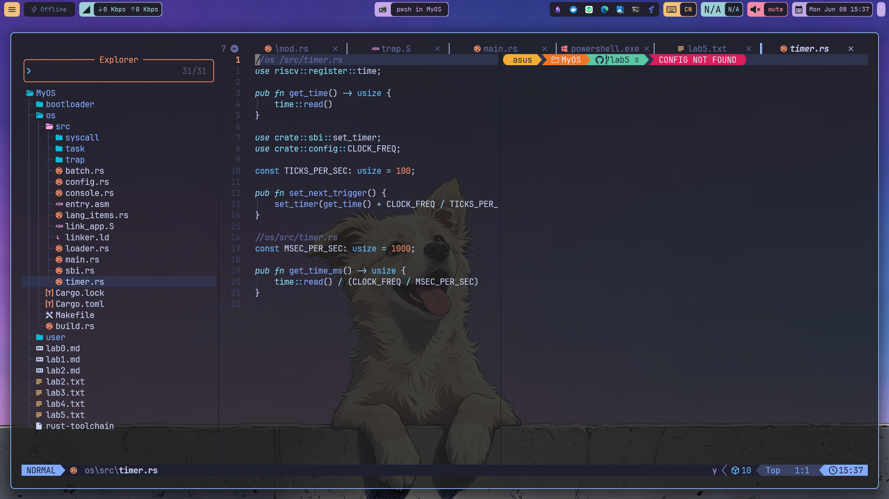

接着，在sbi子模块实现设置mtimecmp的值，并在timer子模块进行封装

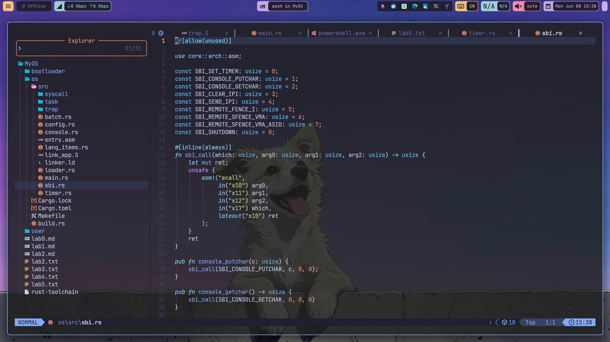


同时，为了后续的计时操作，还需要在timer子模块封装另外一个函数，实现以毫秒为单位返回当前计数器的值。

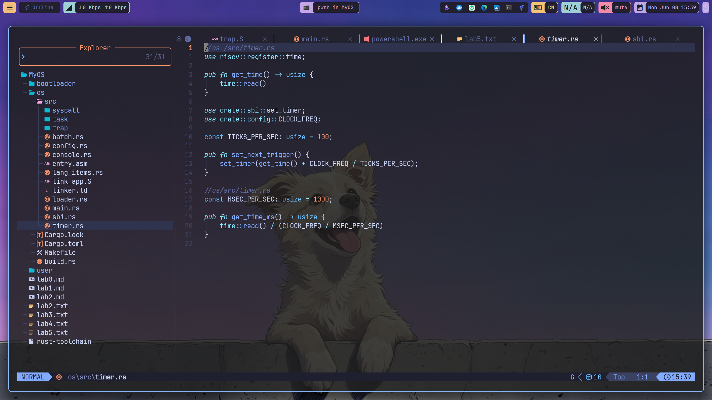


因为上述两个函数用到了config.rs中的常量，所以还需要修改os/src/config.rs，增加如下内容：

```rust
pub const CLOCK_FREQ: usize = 12500000;
```

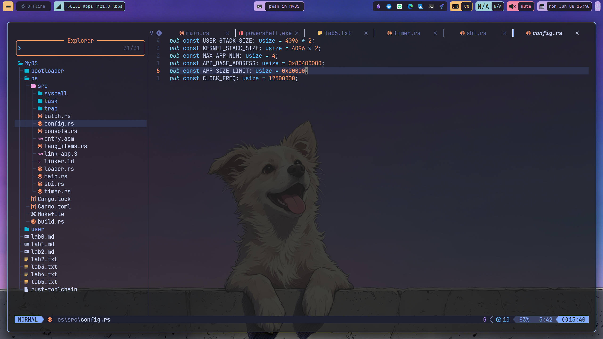

最后，还需要修改os/src/syscall子模块，增加get_time系统调用的实现。在os/src/syscall/process.rs增加如下代码：


同时，注意修改os/src/syscall/mod.rs增加get_time系统调用的处理。具体增加如下代码：

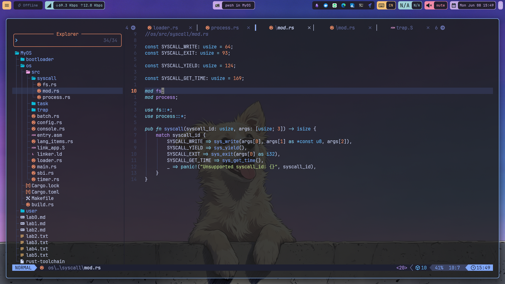

## 修改应用程序

### 增加get_time系统调用

首先，在user/src/syscall.rs增加get_time系统调用，具体增加如下代码：


### 实现新的测试应用

分别实现00power_3.rs，01power_5.rs，02power_7.rs以及03sleep.rs四个测试应用程序

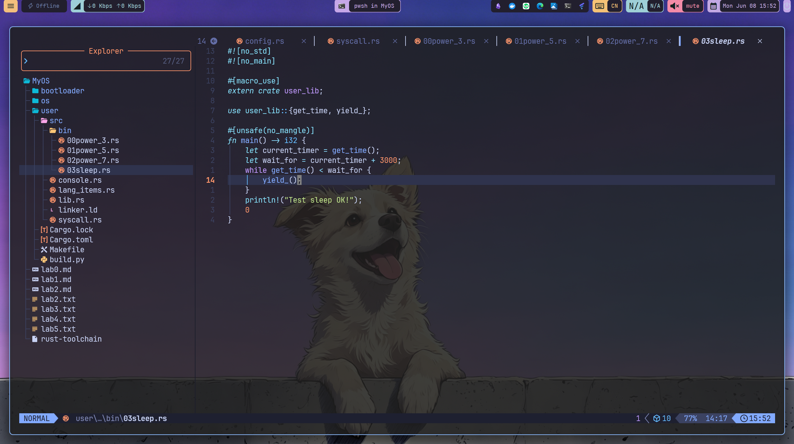


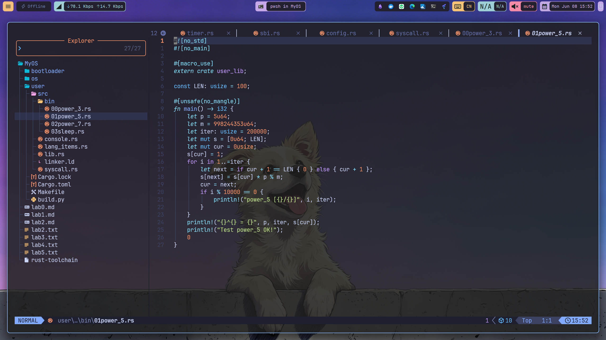

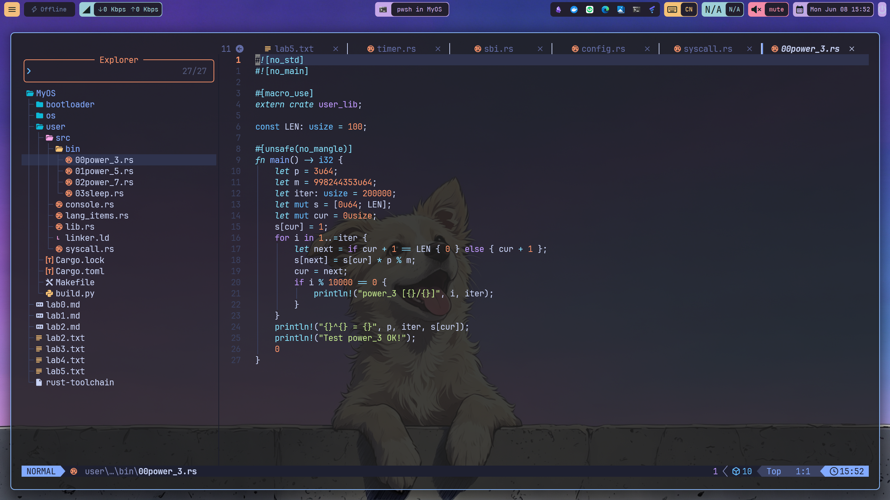

## 抢占式调度 
	
完成时钟中断和计时器后，就很容易实现抢占式调度了。具体修改os/src/trap/mod.rs代码，具体如下：

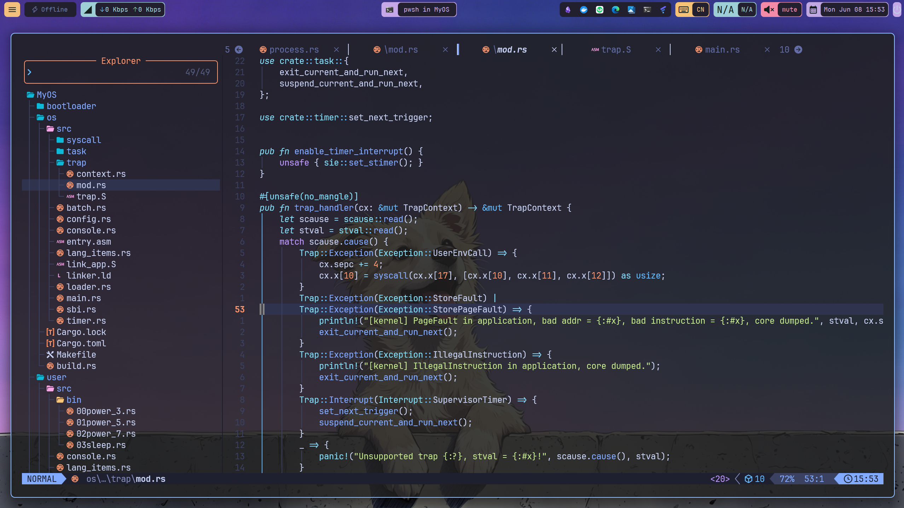

这里通过调用suspend_current_and_run_next实现应用的切换。注意这里部分代码是修改，并不是直接新增。

另外，我们还需要在第一个应用执行之前在main.rs中做一些初始化的工作。具体增加如下代码：

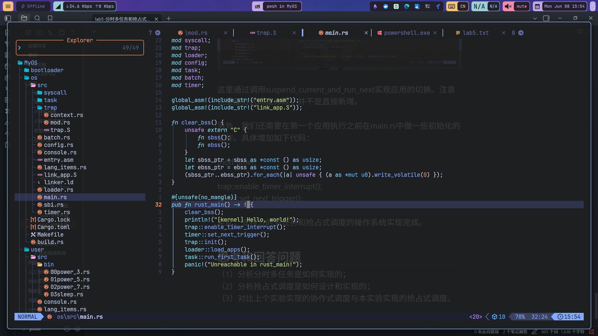

至此，支持分时多任务和抢占式调度的操作系统实现完成。

运行截图如下


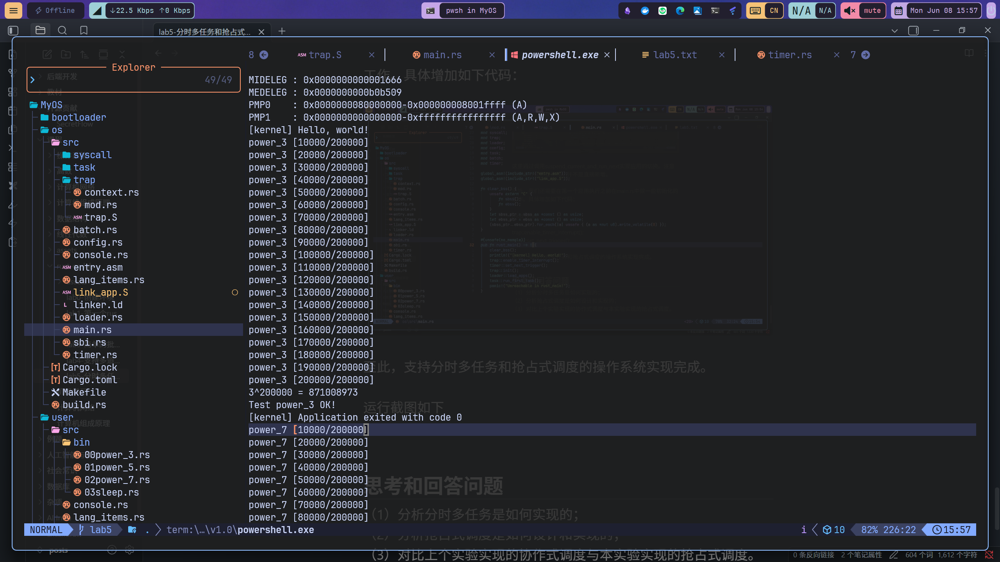
## 思考和回答问题
### （1）分时多任务的实现分析

分时多任务的实现依赖于 **RISC-V 64 架构的时钟中断机制** 和 **任务管理基础设施**，其核心思路是：通过定时器周期性地产生中断，操作系统在内核态的中断处理中强制切换任务，从而实现多个任务轮流使用 CPU。

#### 1.1 硬件基础：mtime 与 mtimecmp 寄存器

RISC-V 64 提供了两个关键的机器级寄存器：

- **`mtime`**：一个单调递增的计数器，统计自加电以来的时钟周期数。
- **`mtimecmp`**：比较寄存器，当 `mtime > mtimecmp` 时，硬件自动触发一次时钟中断。

操作系统只需不断设置"下一次闹钟时间"，就能周期性地收回 CPU 控制权

#### 1.2 定时器模块 (`timer.rs`) 的三层封装


%%[🖋 Edit in Excalidraw](lab5-%E5%88%86%E6%97%B6%E5%A4%9A%E4%BB%BB%E5%8A%A1%E5%92%8C%E6%8A%A2%E5%8D%A0%E5%BC%8F%E8%B0%83%E5%BA%A6%E7%9A%84%E6%93%8D%E4%BD%9C%E7%B3%BB%E7%BB%9F%202026-06-08%2017.20.37.excalidraw.md)%%


- **`get_time()`**：通过 `riscv::register::time::read()` 直接读取 `mtime`，获取当前的时钟周期计数值。
- **`set_next_trigger()`**：计算下一次触发时间 = `当前时间 + CLOCK_FREQ / TICKS_PER_SEC`，其中 `CLOCK_FREQ = 12,500,000`（12.5MHz），`TICKS_PER_SEC = 100`，即 **每秒 100 次时钟中断，每个时间片约 10ms**。然后通过 SBI 调用写入 `mtimecmp`。
- **`get_time_ms()`**：将时钟周期除以 `CLOCK_FREQ / 1000`，得到毫秒级的时间戳，供应用程序使用。

#### 1.3 SBI 层的支持 (`sbi.rs`)

`set_timer()` 函数通过 SBI 的 `ecall` 机制（SBI_SET_TIMER = 0）委托 M 态固件设置 `mtimecmp` 寄存器：

```rust
pub fn set_timer(timer: usize) {
    sbi_call(SBI_SET_TIMER, timer, 0, 0);
}
```

#### 1.4 中断启用与初始化 (`main.rs`)

在启动首个应用之前，操作系统必须完成两项关键初始化：

```rust
trap::enable_timer_interrupt();  // 通过 sie::set_stimer() 开启 S 态时钟中断
timer::set_next_trigger();       // 设置第一个时间片的到期时间
```

#### 1.5 中断处理中的任务切换 (`trap/mod.rs`)

这是分时多任务的核心调度点。当 `SupervisorTimer` 中断到达时：

```rust
Trap::Interrupt(Interrupt::SupervisorTimer) => {
    set_next_trigger();              // ① 设置下一次时钟中断（持续周期性触发）
    suspend_current_and_run_next();  // ② 挂起当前任务，切换到下一个就绪任务
}
```

**执行流程**：
1. 应用 A 正在运行 → 10ms 时间片耗尽 → 硬件触发时钟中断
2. CPU 陷入内核态 → `trap_handler` 匹配到 `SupervisorTimer`
3. 调用 `set_next_trigger()` 为下一个时间片设好"闹钟"
4. 调用 `suspend_current_and_run_next()` → `mark_current_suspended()` 将当前任务标为 Ready → `find_next_task()` 轮转查找下一个 Ready 任务 → `__switch()` 保存/恢复寄存器上下文 → 切换到应用 B
5. 应用 B 开始运行，10ms 后重复上述过程

### （2）抢占式调度的设计与实现分析

#### 2.1 设计思想

抢占式调度的核心设计原则是：**调度决策权完全掌握在操作系统内核手中，而非应用程序手中**。它不依赖应用程序的"自觉性"，而是通过硬件机制（时钟中断）强制剥夺当前任务的 CPU 使用权。

#### 2.2 实现架构


%%[🖋 Edit in Excalidraw](lab5-%E5%88%86%E6%97%B6%E5%A4%9A%E4%BB%BB%E5%8A%A1%E5%92%8C%E6%8A%A2%E5%8D%A0%E5%BC%8F%E8%B0%83%E5%BA%A6%E7%9A%84%E6%93%8D%E4%BD%9C%E7%B3%BB%E7%BB%9F%202026-06-08%2017.27.43.excalidraw.md)%%
#### 2.3 关键实现细节

**中断使能 (`enable_timer_interrupt`)**

```rust
pub fn enable_timer_interrupt() {
    unsafe { sie::set_stimer(); }
}
```

通过设置 S 态中断使能寄存器 `sie` 的 STIE 位，允许 Supervisor 定时器中断。这是抢占能够发生的 **总开关**——不开这个开关，即使 `mtime > mtimecmp`，CPU 也不会响应。

**周期性"发条"机制**

每次时钟中断处理中都会调用 `set_next_trigger()`，这形成了一个 **自我延续的循环**：
- 中断到达 → 设置下一次中断时间 → 处理调度 → 返回用户态 → 中断到达 → ...

这确保了只要系统在运行，时钟中断就不会停止，抢占就不会停止。

**强制任务切换**

`suspend_current_and_run_next()` 的调用不经过任何"征求应用同意"的步骤：
1. `mark_current_suspended()`：直接将当前任务状态从 `Running` 改为 `Ready`
2. `find_next_task()`：轮转查找下一个 `Ready` 状态的任务
3. `__switch()`：保存当前任务的寄存器上下文（ra、s0-s11），恢复下一个任务的上下文


### （3）lab4 协作式调度 vs lab5 抢占式调度 对比


| 对比维度 | lab4 协作式调度 | lab5 抢占式调度 |
|----------|----------------|-----------------|
| **调度触发者** | 应用程序（主动） | 操作系统（被动→主动） |
| **触发机制** | `sys_yield()` / `sys_exit()` 系统调用 | 硬件时钟中断 `SupervisorTimer` |
| **CPU 控制权** | 应用自愿放弃 | OS 强制剥夺 |
| **时间粒度** | 取决于应用何时调用 yield | 固定时间片（约 10ms） |
| **公平性** | 不公平，依赖应用行为 | 公平，轮转分配 |
| **饥饿风险** | 存在（恶意/缺陷应用可独占 CPU） | 不存在（每个应用都有机会） |
| **额外开销** | 低（无定时器中断） | 较高（每 10ms 一次中断+上下文切换） |

## git 提交截图

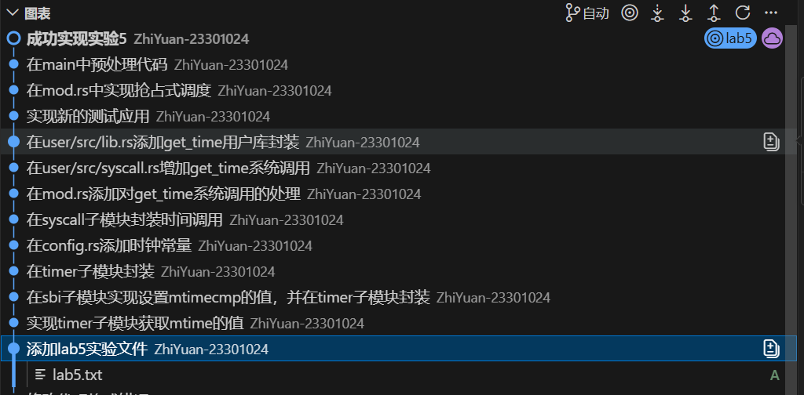
