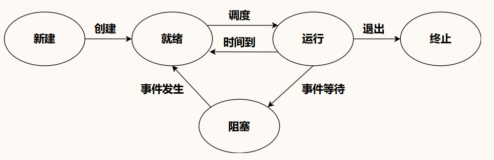

## 进程和线程（**有各自的用户态和内核态版本**）

### 进程

系统资源分配的独立基本单位

进程是程序的实例化

**进程控制块（PCB）**

存储进程的元信息，辅助操作系统对进程进行管理


| 进程描述信息 | 控制和管理信息  | 资源分配清单 | 处理机相关信息 |
| ------ | -------- | ------ | ------- |
| 进程标识符  | 进程状态     | 代码段指针  | 通用寄存器值  |
| 用户标识符  | 进程优先级    | 数据段指针  | 地址寄存器值  |
|        | 代码运行入口地址 | 堆栈段指针  | 控制寄存器值  |
|        | 程序外存地址   | 文件描述符  | 标志寄存器值  |
|        | 等待事件     |        |         |
|        | CPU占用时间  |        |         |
- 进程创建和终止时诞生和被删除
- 进程调度时，PCB要配合操作系统决策

![[Final+OS+Review.pdf#page=22&rect=40,55,913,425|Final+OS+Review, p.22]]

**父子进程**

mit章节已经解释 [[mit 6.1810]]

- **fork**：创建 **子进程**，复制 **资源**，不改变程序，**父子进程** 继续执行原代码。
- **exec**：在当前 **进程** 中加载并执行一个新的程序。替换当前 **进程** 的 **代码段**、**数据段** 和 **堆栈**，保留部分 **资源** 如 **进程 PID**，不涉及到并发。

```ad-info
title:僵尸进程和孤儿进程

**僵尸进程**：子进程已经完成，但其状态没有被父进程回收，仍占用PID

**孤儿进程**：子进程仍在运行但父进程已经结束了，子进程永远不可能被回收
```


### 进程和程序的区别

![[Final+OS+Review.pdf#page=20&rect=36,24,944,512|Final+OS+Review, p.20]]
- passive:消极的被动的
- permanent:永久的
## 线程

**线程是系统调度的基本单位**

进程间没有内存保护

![[Final+OS+Review.pdf#page=28&rect=35,125,933,440|Final+OS+Review, p.28]]


### 线程优势

![[Pasted image 20260627121957.png]]

- Responsiveness:响应性
- Utilization of multiprocessor architecture:利用多处理器架构

> [!PDF|] [[Final+OS+Review.pdf#page=31&selection=4,0,14,39|Final+OS+Review, p.31]]
> The process has a complete resource platform, while threads have only essential resources, such as registers and stacks

> [!PDF|] [[Final+OS+Review.pdf#page=31&selection=57,0,62,14|Final+OS+Review, p.31]]
>  Communication between the threads of the same process can be directly carried out **without kernel**

### 多线程模型 

![[Final+OS+Review.pdf#page=32&rect=41,74,884,321|Final+OS+Review, p.32]]

### 线程池优势

![[Final+OS+Review.pdf#page=33&rect=41,72,899,437|Final+OS+Review, p.33]]
## 进程的状态

>反映当前进程正在做什么，是否可以被CPU执行

### 状态种类

- 创建状态：进程被创建但是还没有被分配资源
- 就绪状态：已经被分配了资源但还没得到时间片
- 运行状态：正在执行指令、占用cpu
- 阻塞状态：进程在等待某些事件发生，被暂停执行
- 终止状态：进程执行完毕

### 状态转换



![[Final+OS+Review.pdf#page=21&rect=73,29,881,426|Final+OS+Review, p.21]]
## 进程内存空间

**用户空间**

- 代码区：指令和只读数据，通常仅可读
- 数据区：
	- 初始化数据区：略
	- 未初始化数据区：略
- 堆区：动态分配内存，存储运行时变量和数据结构，==在堆中分配的内存要手动释放==
- 栈区：存储函数调用和局部变量-栈帧
- 内存映射区：存储操作系统会哦运行时库的拓展，比如DLL

**内核空间**

位于进程虚拟空间中的高地址，对于用户空间不可见，即无法读写

### 函数调用时内存结构

![[Drawing 2026-05-05 17.00.17.excalidraw.png]]

## 进程间通信

### 管道

### 共享内存

### 消息队列


## 用户级线程和内核级线程

略