## 感知机和神经网络

略

## 支持向量机

### 概述

SVM
一种二分类模型
==定义在特征空间上间隔最大的线性分类器==
包含核技巧->实质上的非线性分类器

**软间隔，硬间隔，线性可分/不可分**
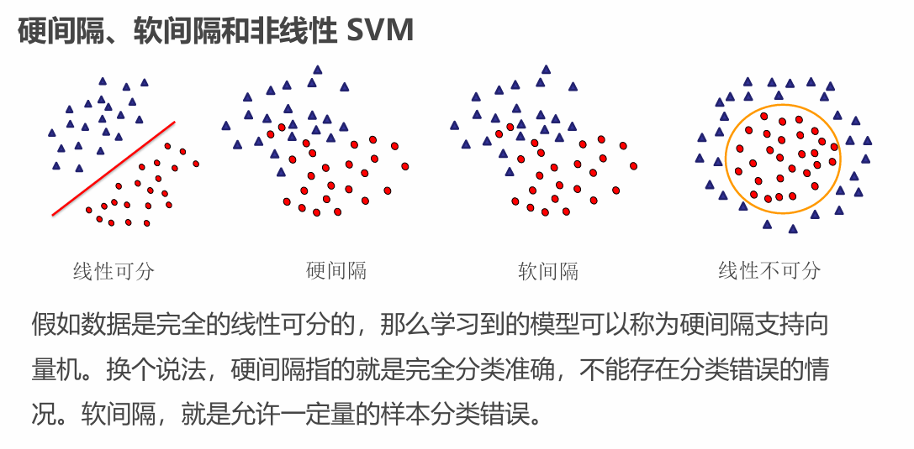

**支持向量机分类**
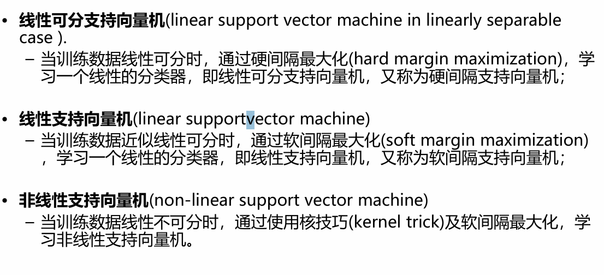

**优缺点**
- 优点：可解释，计算复杂度与维数相关度不大，可映射到高维后解决非线性分类和回归任务
- 缺点：训练时间长，==只适合小批量样本==

**核函数和核技巧(会考)**
当输入空间为欧式空间或离散集合、特征空间为希尔伯特空间(无限维空间)时，核函数（ kernel function）表示将输入从输入空间映射到特征空间得到的特征向量之间 的内积
==**内积是一种衡量高维空间中特征向量之间相似性的基本手段**==

>​**输入空间**是原始数据所在的空间，而**特征空间**是经过处理和提炼后、能够更好地被模型所使用的数据表示所在的空间

### 线性可分支持向量机和硬间隔最大化（掌握）

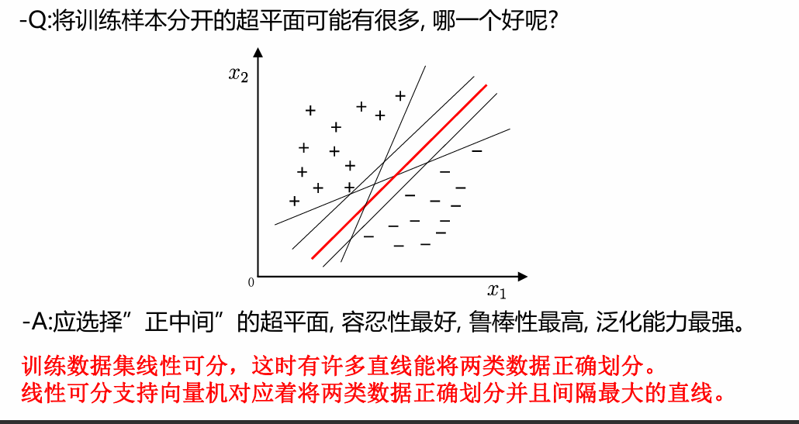
==提升鲁棒性，泛化能力==

**定义**
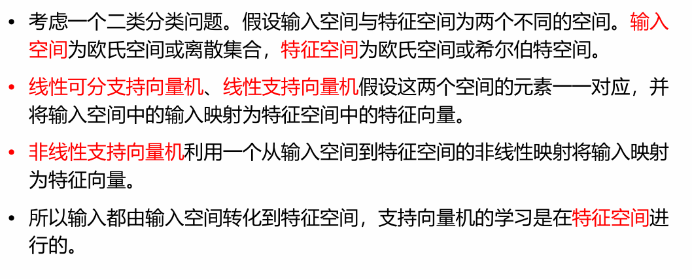
`线性映射`：`满足加法和数乘不变性：f(x+y) = f(x) + f(y), f(kx) = k f(x)`

学习一个超平面以将正负例隔开
$$
w\times x+b=0
$$
这个式子是矩阵乘法，`w`是法向量，`b`是截距，法向量指向的一侧为正类
线性可分支持向量机的解是唯一的-=="间隔最大化"==

对应的分类决策函数
$$
f(x)=sign(w^*\times x +b^*)
$$

**函数间隔**
用于表示分类的正确性和确信度
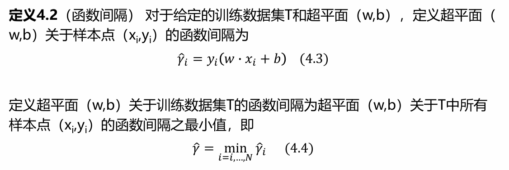

**几何间隔**

>选择分离超平面时，只有函数间隔还不够。因为只要成比例地改变w和b，例如 将它们改为2w和2b，超平面并没有改变。但函数间隔却成为原来的2倍。

可以对分离超平面的法向量w加某些约束，如规范化 ||w||=1，使得间隔是确定的。这时函数间隔成为几何间隔
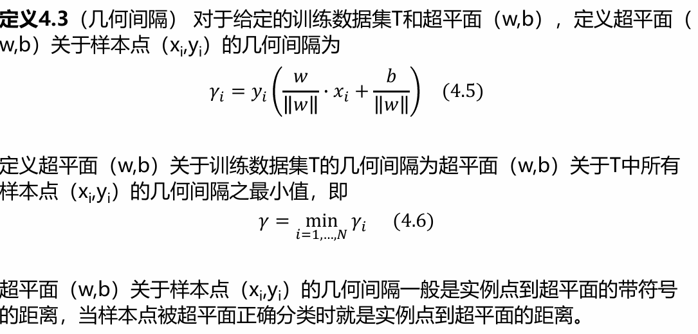

**间隔最大化**

>对线性可分的训练数据集而言，线性可分分离超平面有无穷多个（等价于感知机），但是几何间隔最大的分离超平面是唯一的。这里的间隔最大化又称为**硬间隔最大化**

**最大间隔分离超平面**

==戴帽子的是函数间隔==
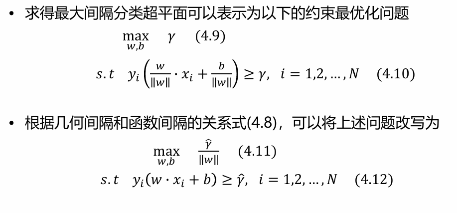

> ### 🔍 推导过程
> 
> 推导的核心是从直观的“间隔最大化”概念出发，通过数学变换得到上述可求解的形式。
> 
> 1. ​**从几何间隔最大化出发**​
>     
>     - 支持向量机的基本想法是找到一个能正确划分数据且几何间隔最大的超平面。几何间隔 γ表示超平面与最近样本点的最小距离。
>         
>     - 直接最大化几何间隔的原始问题可表述为：
>         
>         w,bmax​γ
>         
>         s.t.yi​(∥w∥w​⋅xi​+∥w∥b​)≥γ,i=1,2,…,N
>         
>         这个约束条件保证了超平面关于所有样本点的几何间隔至少为 γ。
>         
>     
> 2. ​**引入函数间隔并建立关联**​
>     
>     - 函数间隔定义为 γ^​i​=yi​(w⋅xi​+b)。几何间隔与函数间隔的关系为 γi​=∥w∥γ^​i​​，
>         
>         数据集整体的几何间隔为 γ=∥w∥γ^​​，其中 γ^​=mini​γ^​i​是数据集的最小函数间隔。
>         
>     - 利用此关系，可将最大化几何间隔的问题改写为：
>         
>         w,bmax​∥w∥γ^​​
>         
>         s.t.yi​(w⋅xi​+b)≥γ^​,i=1,2,…,N
>         
>     
> 1. ​**标准化函数间隔以简化问题**​
>     
>     - 函数间隔 γ^​的值会随着 w和 b的等比例缩放而改变，但这不影响超平面的位置。因此，我们可以固定 γ^​为一个常数，最常用的选择是令 γ^​=1。
>         
>     - 将 γ^​=1代入，问题转化为：
>         
>         w,bmax​∥w∥1​
>         
>         s.t.yi​(w⋅xi​+b)≥1,i=1,2,…,N
>         
>     - 注意到最大化 ∥w∥1​等价于最小化 ∥w∥。为了数学处理的便利（例如求导更简单），通常进一步转化为最小化 21​∥w∥2。这个二次形式保证了优化问题是凸的，具有很好的性质。
>         

**支持向量和间隔边界**
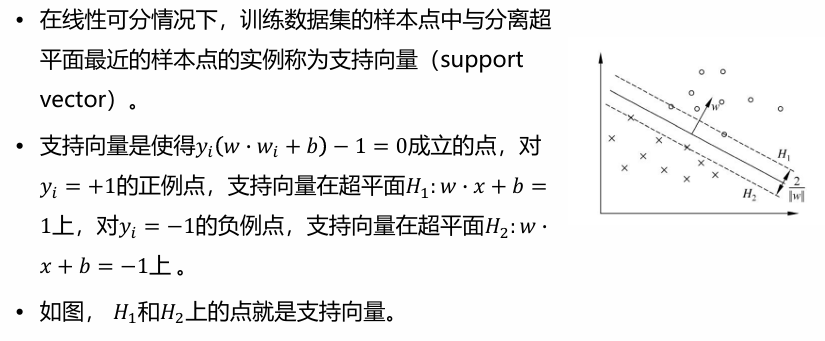
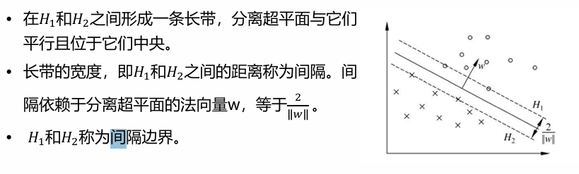

对偶学习算法...

### 线性支持向量机和软间隔最大化

### 非线性支持向量机和核函数

### 序列最小最优化算法

## 贝叶斯分类

### 贝叶斯决策论（了解）

>一个在概率框架下实施决策的基本方法

**举例**
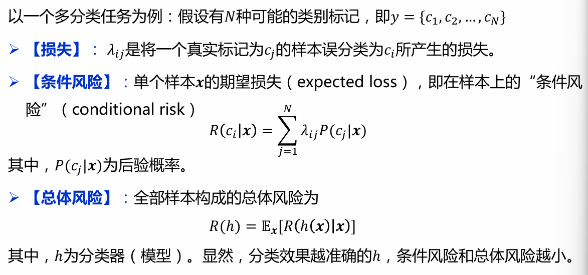
>**后验概率** ：指在获得新的证据或信息后，对某个事件发生的可能性（即概率）进行修正后得到的概率

**贝叶斯判定准则**
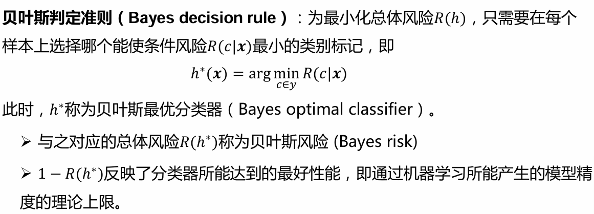
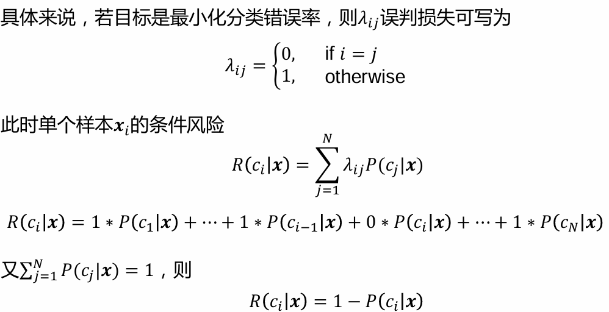
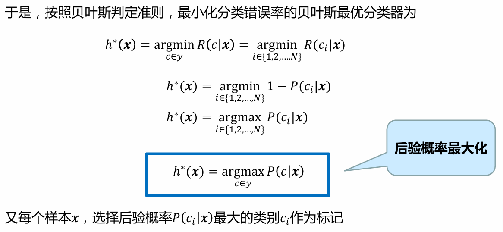
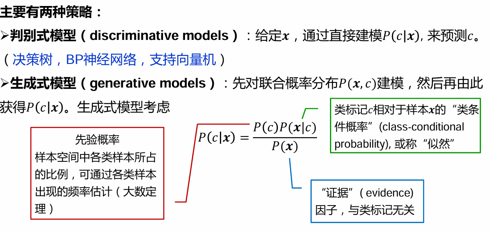
>联合概率分布？

### 极大似然估计（掌握）

### 朴素贝叶斯分类器 （掌握）

>分类器的作用是返回输入样本分类最有可能正确归属的那个分类
>即归属概率最大

$$
h^*(x)=\mathop{argmax}\limits_{c\in y}P(c|x)
$$
- `属性条件独立性假设`
		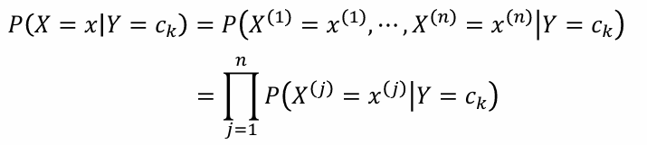

> [!NOTE] 举例
> P(青绿,蜷缩,浊响∣好瓜)可简化为 P(青绿∣好瓜)×P(蜷缩∣好瓜)×P(浊响∣好瓜)
> 先明确想要研究的问题是什么，才能定义什么是样本点

因此可推算得到
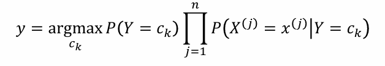
故而对于朴素贝叶斯来说
**学习**意味着对$P(Y=c_k)$和$P(X^{(j)}=x^{(j)}|Y=c_k)$进行估计
**可采用极大似然估计法进行估计**

> [!NOTE] 极大似然估计
> //TODO
- $P(Y=c_k)$的极大似然估计：==（重要）==
	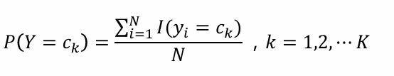
- $P(X^{(j)}=x^{(j)}|Y=c_k)$的极大似然估计==（重要）==
	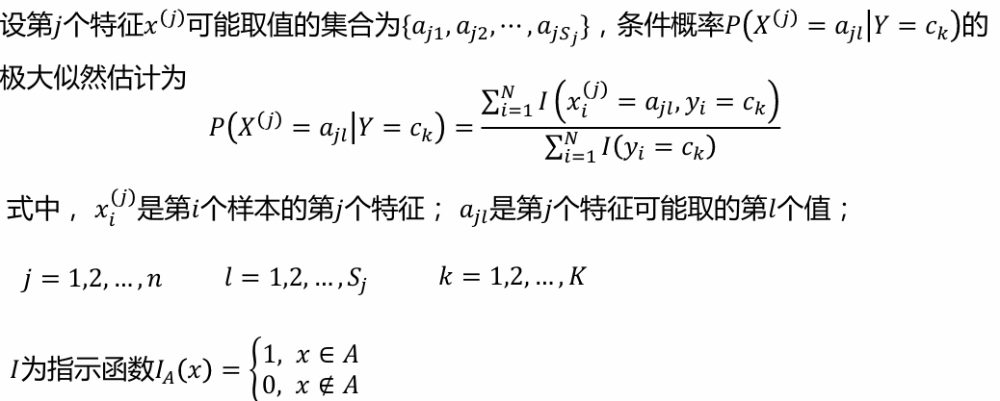
### EM算法 （了解）

>**应用场景**

## 决策树

>有的时候，越靠近根节点越重要，有的时候，节点重要性和深度无关

### ID3 （掌握）
### C4.5 （掌握）
## 集成学习

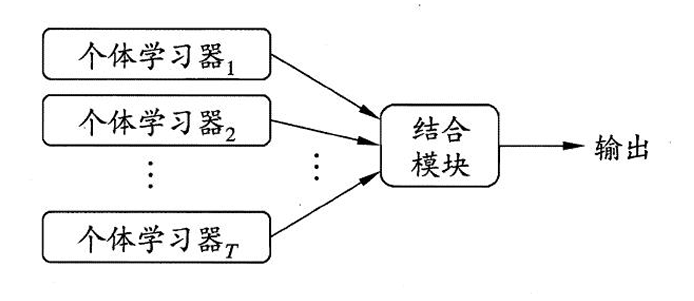

**个体与集成**
集成并不总是正向的作用，因为不同的个体的预测分布不一样
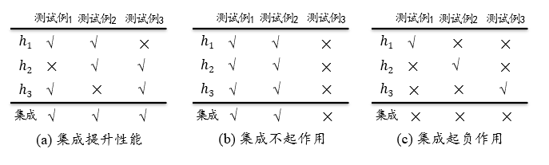
个体之间应该“好而不同”
然后把这个个体的量堆上来就可以实现错误率的下降

> [!NOTE] 如何证明个体的量堆上来可以实现错误率下降
> //TODO

### 集成学习方法概述

集成学习可大致分为两类
- Bagging和随机森林
- Boosting: Adaboost,GDBT,XGBoost

#### Bagging算法（自举汇聚算法）

从训练集进行子抽样完成每个模型的子训练集
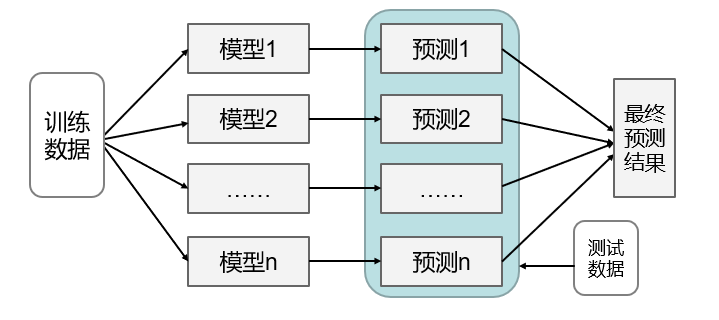$$
H(x)=\mathop{\arg\max}\limits_{y∈Y}\sum_{t=1}^{T} I(h_t(x)=y)
$$
I为指示函数，条件为真则1
>[!TIP]
>- 泛化能力强
>- **依赖基学习器的稳定性**
>	所谓稳定性指的是对于不同数据集的敏感度，Bagging需要的是一堆敏感度高的基学习器，提升他们的泛化能力，但是如果是支持向量机这种就没必要，因为它已经很稳定了
>- 时间复杂度低

## 聚类

有/无监督学习\==训练集有/无标签作为监督信号作用训练过程
==训练集有没有标答==

### 聚类任务概述
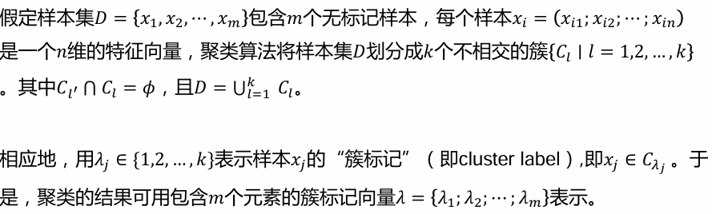
### 基本概念
//TODO
- 相似度
- 距离
- 类
- 簇

### 原型聚类

#### K-means聚类 （先画图再计算更方便）

> [!NOTE]
> 先把数据集预分类成若干个不重叠的聚类或子组，让其内部尽可能相似，然后把数据带你分配给簇，让其质心和数据点之间的平方距离之和最小

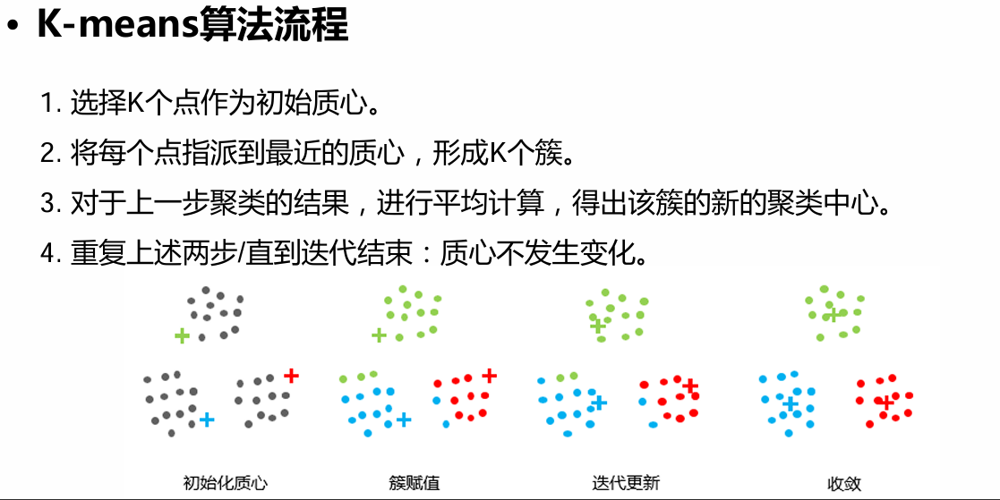

## 降维

去死

### 主成分分析（PCA）

去死