## 计算机的运算方法

### 无符号数和有符号数

- 无符号数：没有符号位
- **有符号数**：有符号位
	- **机器数和真值**：==都指的是二进制状态下==
		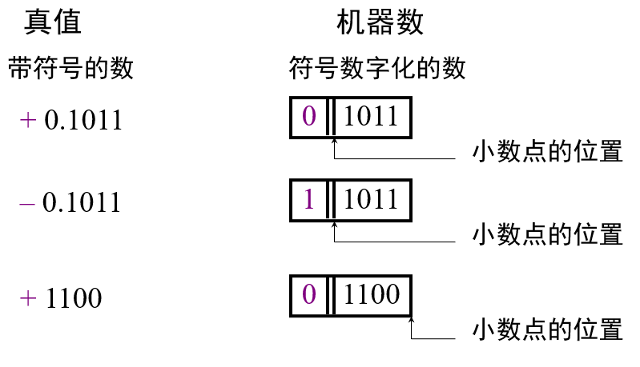
	- **原码表示法**
		略
	
	- **补码表示法**
	
		>补码的意义在于找到一个等效的机器数，将减法改造为加法

		一个负数加上模即得到其补数（模为2的n+1次方,若运算出结果为模数，其实等同于0，就像12点其实表示的是0点一样）
		一个整数和一个负数为补数时，其绝对值之和为模数
		负数的补码其实就是其补数的二进制形式
		
		- **整数表示法**
  
$$
	[x]_补=\begin{cases}
	0,x & 2^n>x\geq0 \\
	2^{n+1}+x & 0>x\geq -2^n ~~~(mod 2^{n+1})
	\end{cases}
$$

		- **小数表示法**0

$$
			[x]_补=\begin{cases}
			x & 1>x\geq0 \\
			2+x & 0>x\geq-1~~(mod~2)
			\end{cases}
$$

## 总线

## 存储器

### 总览

- 存储介质：半导体（易失），磁表面，磁芯存储器，光盘存储器
> [!TIP] 易失性指的是断电后无法存储数据

- 存取方式
	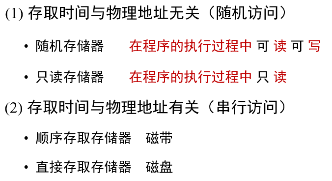
- 作用
	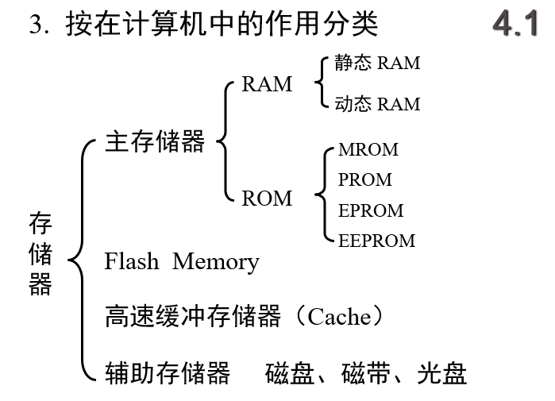

**层次结构**
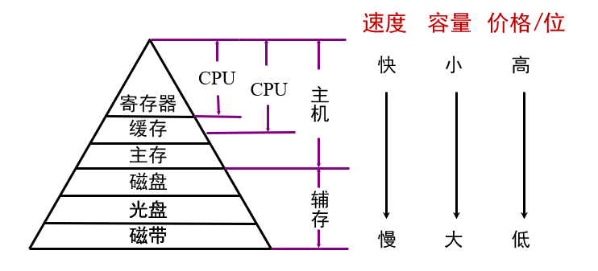
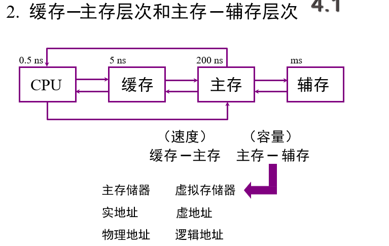
### 主存储器（内存）

机器指令直接操作的存储器，基于**主存地址**直接访问
- MAR：存储器地址寄存器
- MDR：存储器数据寄存器
==存储器-存储体-存储单元-存储元件==

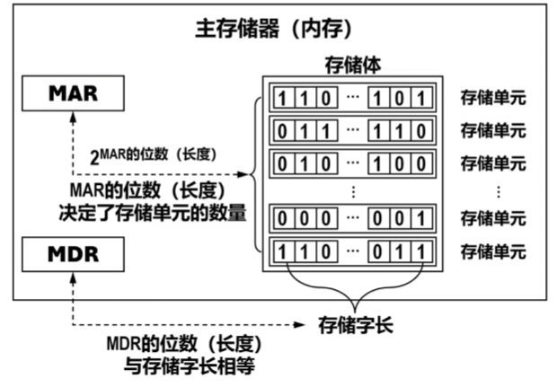
> [!ABSTRACT] 主存如何工作
>

#### 译码器工作原理
- 单译码结构
	译码输 出/输入线开销大，适合容量小的芯片
	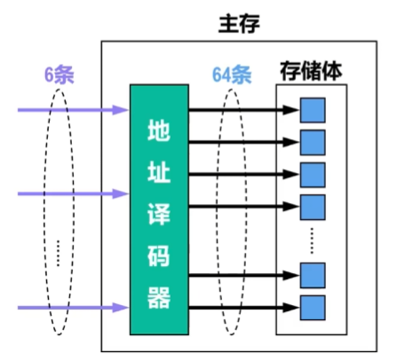
- 双译码结构
	适合容量大的芯片
	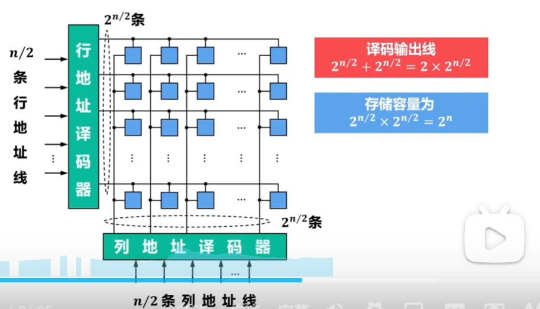

#### 主存中数据的存放

##### 访问模式

>[!DANGER] 机器字长vs存储字长
>- **机器字长**：CPU一次能处理的二进制数据位数
>- **存储字长**：主存中一个存储单元所存储的二进制位数
>**二者不一定相同**
>

| 设计考量           | 机器字长 (CPU处理能力)                     | 存储字长 (内存传输能力)             | 需要遵循的设计规范                                                                                                |
| ------------------ | ------------------------------------------ | ----------------------------------- | ----------------------------------------------------------------------------------------------------------------- |
| ​**基本关系**​     | 计算机一次整数运算能处理的二进制位数       | 一个存储单元存储的二进制代码长度    | ​**存储字长最好大于或等于机器字长**​。如果机器字长更大，CPU单次处理的数据可能需要多次内存访问才能凑齐，效率低下。 |
| ​**倍数关系**​     | 通常是8位（1字节）的整数倍                 | 必须是8位（1字节）的整数倍          | 机器字长通常设计为**存储字长的整数倍**​。这保证了CPU和内存之间能以规整、高效的方式传输数据。                      |
| ​**对指令的影响**​ | 指令字长（单条指令的位数）可与机器字长不同 | 指令字长通常取**存储字长的整数倍**​ | 如果一条指令的长度超过存储字长（例如是2倍），则需要多次访问内存才能取完整条指令，这会增加取指时间  。       |
==通常按照字节进行编址，存储字长是字节的2的整数次幂倍==
不同的主存访问格式对应了**不同的编址**
但是论起本质都是**字节地址**，其余的是基于字节地址的封装,用于更高效地访问
你与其一个个地翻阅字节地址，不如快速找到对应字地址再找对应的字节地址
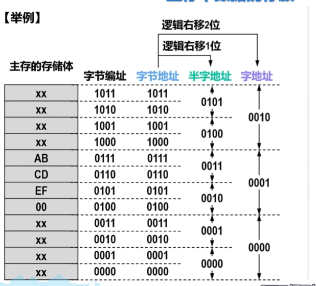

##### 大端和小端方式（存储数据高低位和主存地址之间的关系）

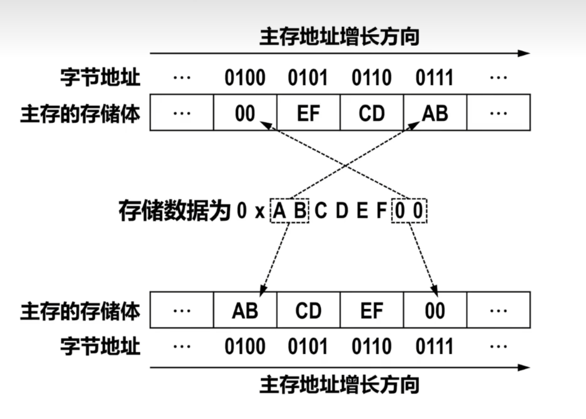
##### 数据边界对齐

*多字节变量被编译器分布在不同的字存储空间时，==访问变量需要多个存取周期*==
数据变量、数据结构在主存空间进行边界对齐可提高数据访问效率
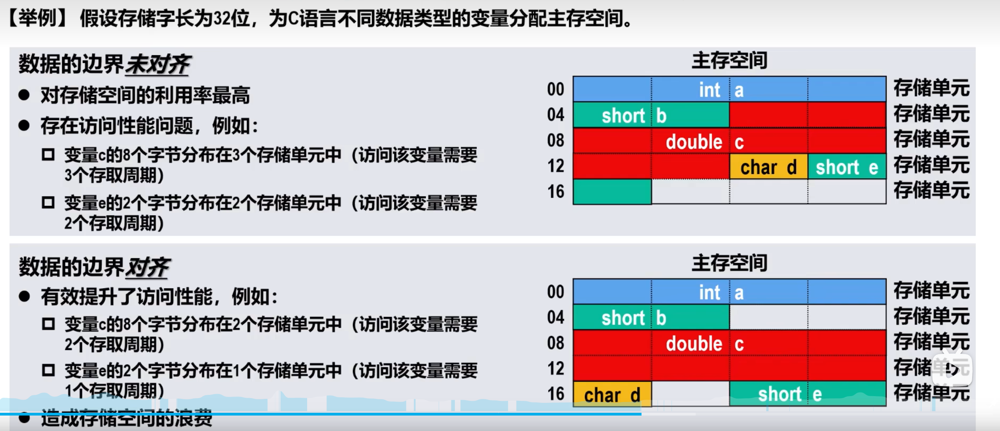
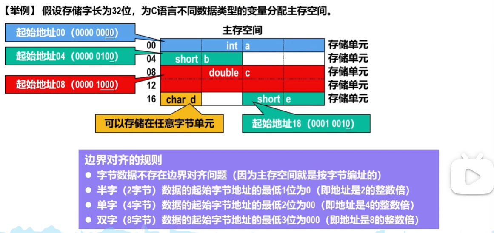

### 静态随机存取存储器SRAM
>[!TIP] 何为静态随机存取
>- **静态**：RAM只需要保持通电，内部数据就可以保持不变，不需要周期性刷新
>- **随机存取**：程序执行时可读可写
>- 用作用户程序区5 
#### 存储元

SRAM 的存储元一般采用多个**MOS管**（图里有颜色的那个结构）构建
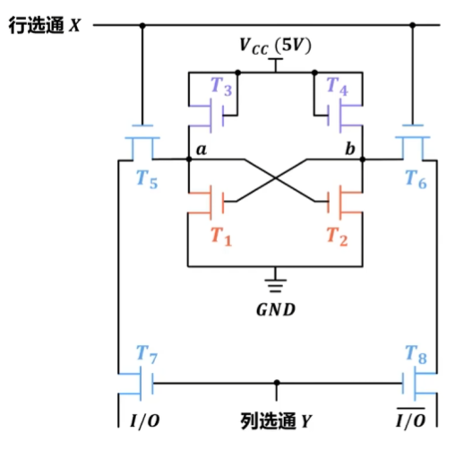

#### 存储元拓展和存储阵列拓展

### 主存的拓展与其和CPU的连接

#### 位拓展
- ==存储芯片的数据总线位宽小于CPU数据总线位宽时==，用**位拓展**的方式进行拓展
- 即多叠几个芯片，各芯片数据总线位宽之和达到CPU总线位宽

> [!NOTE] 关于芯片图讲了什么
> 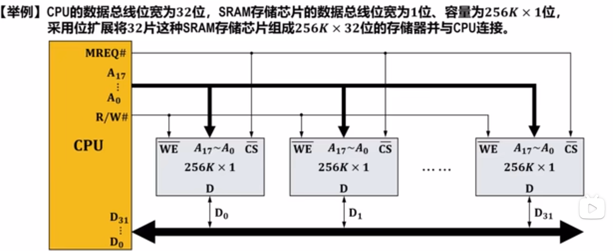
> 上划线和#代表低电平有效，#写在W那边代表低电平的时候写入
> 地址引脚的电平高低组合构成了地址编码
> - 地址引脚A：
> - 片选引脚CS：判断是否在工作状态
> - 数据引脚D：

#### 字拓展
- ==存储芯片的存储容量不能满足存储器对存储容量的需求时==，用字拓展
- 就是地址引脚 A对不上了
- **字拓展以后最后仅仅从其中一个芯片获取数据**
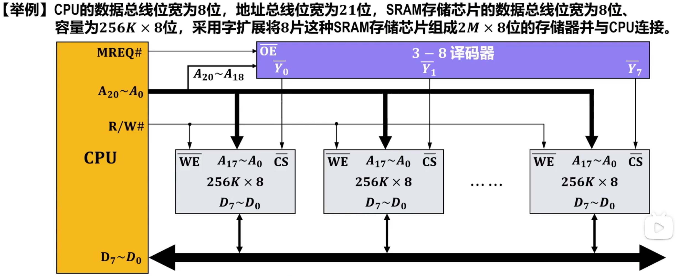
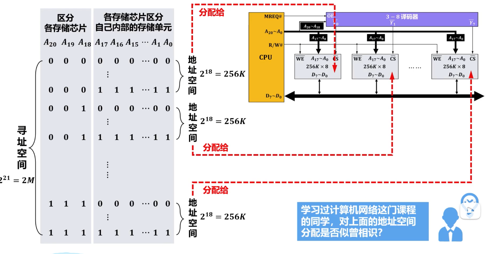
#### 字位同时拓展
- 当存储芯片的**数据位宽和存储容量**均不能满足存储器的数据位宽和存储总容量要求时
- ==先位拓展再字拓展==
	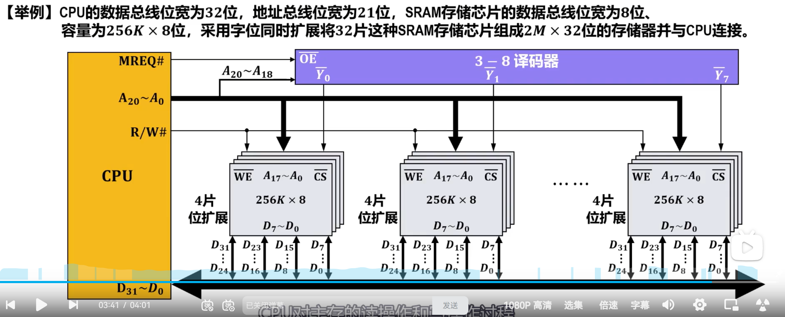

### 存储器的校验

海明码之核心思路：在数据位中插入若干校验位
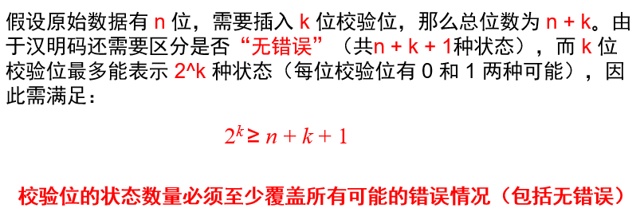
==局限性是只能检测单比特错误==

**编码效率**
$$
\frac{n}{n+k}
$$

汉明码的校验位必须在“2的幂次”位置上
第$2^i$位的校验位负责所有二进制表示中第i位为1的位置
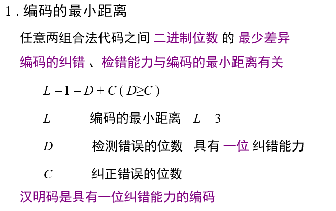
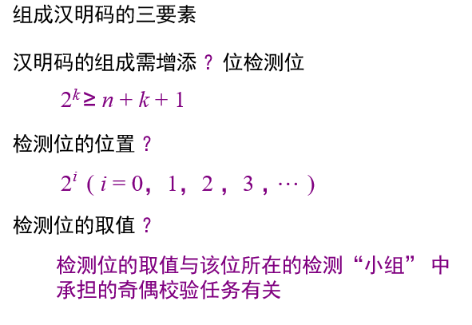

### 高速缓冲存储区 Cache

>[!FAQ] 什么是CPU的空等现象
>
- **主存**：容量大、工号小、成本低的SDRAM
- SRAM容量小功耗大成本高，但是访问速度远高于SDRAM  
==为提升CPU访问主存的性能，通常在CPU和主存中添加一个SRAM作为Cache==

**CPU具有程序局限性**
因此用Cache存放那些经常访问或即将访问的
>[!TIP] 程序局限性
>

- **命中访问时间**：在缓存里找然后找到了
- **缺失补偿**：在缓存里没找到，去主存里找花费的时间
	- **预读策略**：初次存入缓存时把附近的数据块也存进去
#### cache系统性能评价
- **命中率** 
	$n_c$为命中cache的次数
	$n_m$为从主存中访问信息的次数
	$$
	h(Hit Ratio)=\frac{n_c}{n_c+n_m}
	$$
- **缺失率**
	$$1-h
	$$
- **cache/主存系统的平均访问时间**
	$$
	t_{\alpha}=ht_c+(1-h)t_m
	$$
- **访问效率**
	$$ e=\frac{t_c}{t_{\alpha}} $$

#### cache读写流程

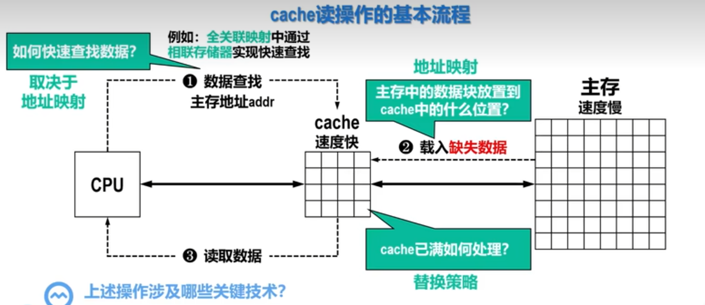

写穿和写回（缓存命中时）：是否写入缓存后也写入主存，是否有脏数据
非写分配策略：直接写入慢速主存就返回
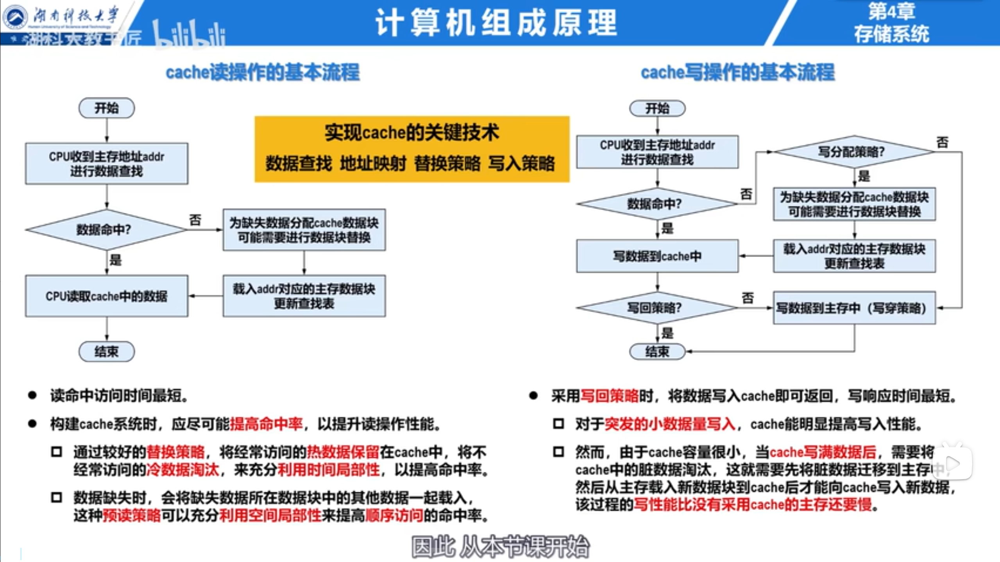

#### 地址映射

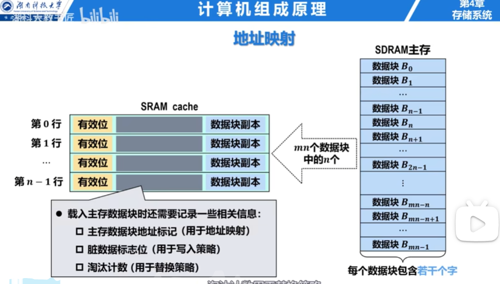

- **直接映射**
	 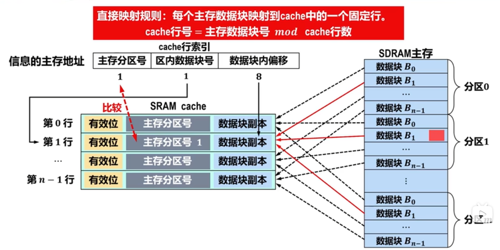
- **全相联映射规则**
	任意数据块可以映射到任意数据行
	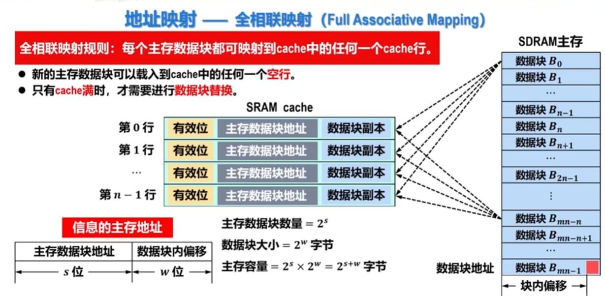
- **组相联映射规则**
	   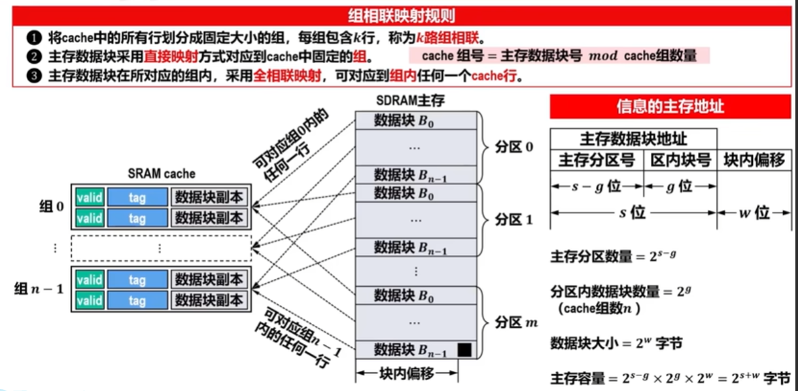

## 指令系统

> 程序被“翻译”成相应的指令告诉计算机如何执行特定的任务
> 编译？汇编？解释？

指令：基本命令-算数运算、逻辑运算、数据传输...
==**指令组成**==：
- 执行的操作
- 操作数来源。
- 操作结果的存放处
- 下一个指令的地址
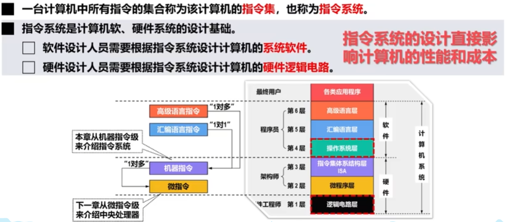

### 指令格式

#### 指令一般格式和指令字长

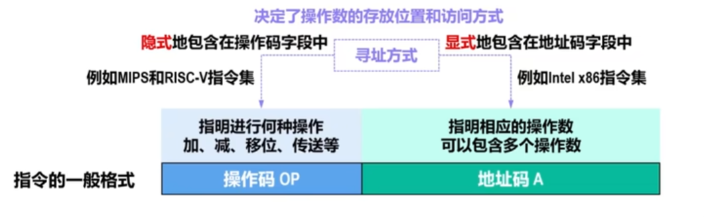
根据指令字长划分指令系统：**定长指令系统**？**变长指令系统**？
**指令字长必须是8位（1字节）的整数倍**

> 存储器基本编址单位是字节

根据指令字长和机器字长的关系分类指令：
- 半字长指令：CPU一次访存读2条
- 单字长指令：CPU一次访存读1条
- 多字长指令：CPU一次访存读多条

#### 地址码字段

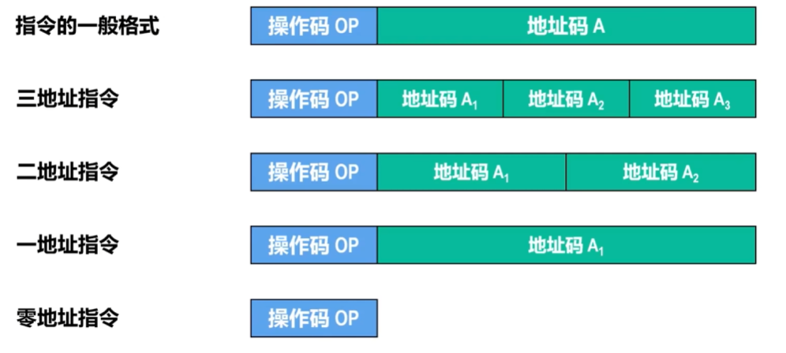

**三地址和二地址逻辑**
$$
\begin{aligned}
& (A_1)op(A_2)=(A_3)  \\
& (A_1)op(A_2)=(A_1)  \\
&
\end{aligned}
$$
**一地址逻辑**
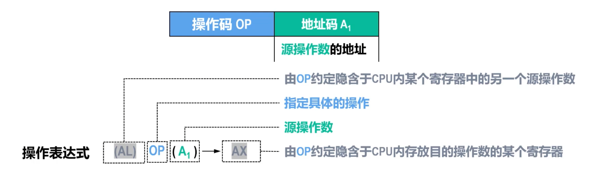
**零地址逻辑**

#### 操作码字段

**定长操作码**：
- $log_2x\leq n，x是指令集的指令数量，n是操作码的位数$
- 可以完全使用除了地址码以外的所有位，不用考虑“前缀问题”
**变长操作码**：
- ==实现方法：拓展操作码技术==
	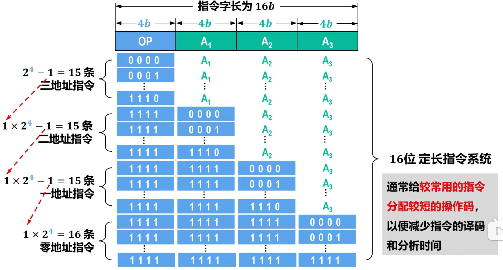
	**短操作码不能是长操作码的前缀**
	

### 寻址方式

> 寻址方式是指寻找**指令或指令中操作数的有效地址**的方式

主存地址？虚拟地址？

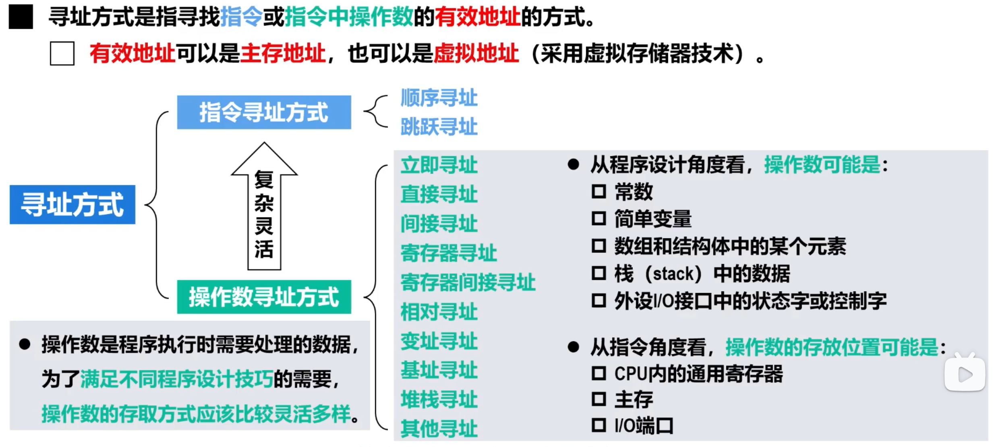

==取指、译码、执行==
#### 指令寻址方式（用于PC寻找指令地址）

- **顺序寻址**
- **跳跃寻址**：构成程序的指令序列中有**分支指令**或**跳转指令**，会改变执行顺序，采用**跳跃寻址**

#### 操作数寻址方式（用于寻找操作数地址）

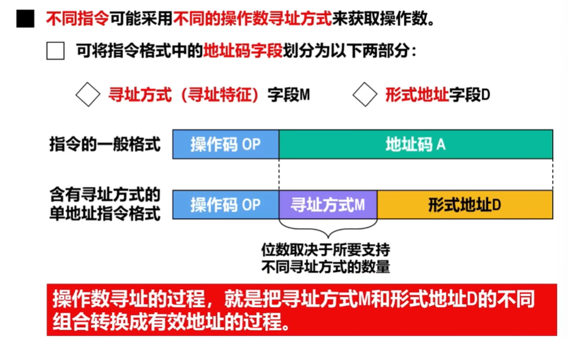

- **立即寻址**：
	
-  **直接寻址**：
	
- **寄存器寻址**：
	
- **间接寻址**：
	
- **寄存器间接寻址**：
	
- **相对寻址**：$当前指令地址+相邻指令地址步长+D=操作数主存地址$
	
- **变址寻址**：
	
- **基址寻址**：（**变化与否是在程序执行过程中而言的**）   
- **堆栈寻址**：对存放在堆栈中的操作数进行寻址
	- 寄存器堆栈
	- 存储器堆栈（普遍采用）：主存中划定堆栈区，有个称之为堆栈指针的特定寄存器记录堆栈中存储单元的地址
		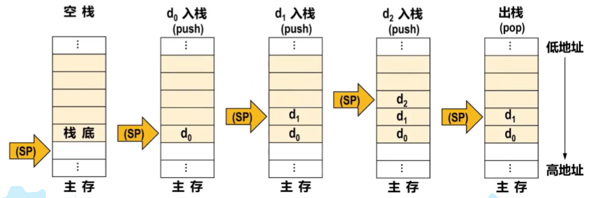
- **复合寻址**
	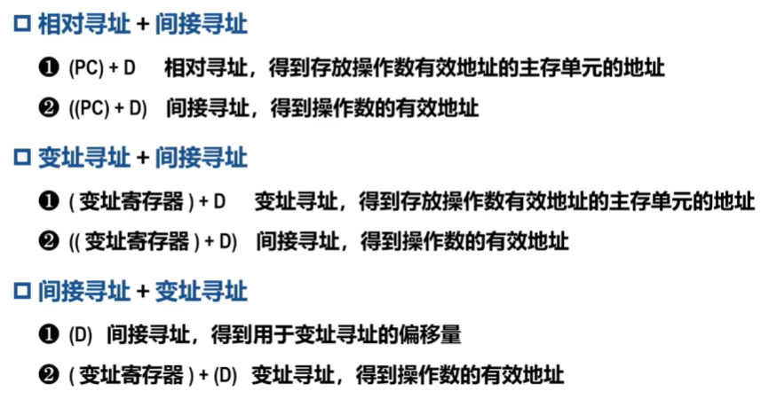

### 指令操作类型

- 数据传送指令
- 算数和逻辑运算指令
- 移位操作指令
	- 逻辑？算术？循环？
- 程序控制指令
- 输入输出指令
- 其它指令

## 中央处理器（CPU）

  > 取指-译码-执行
  
  **程序控制/操作控制/时序控制/异常和中断处理**
 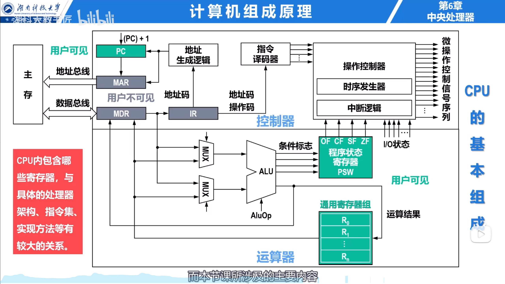

==一个奇奇怪怪的题目==
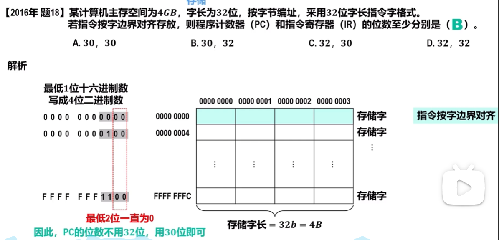
  
**本题目应该站在设计者的角度思考问题**：用最少的位数做到在某种规则下的全方位映射
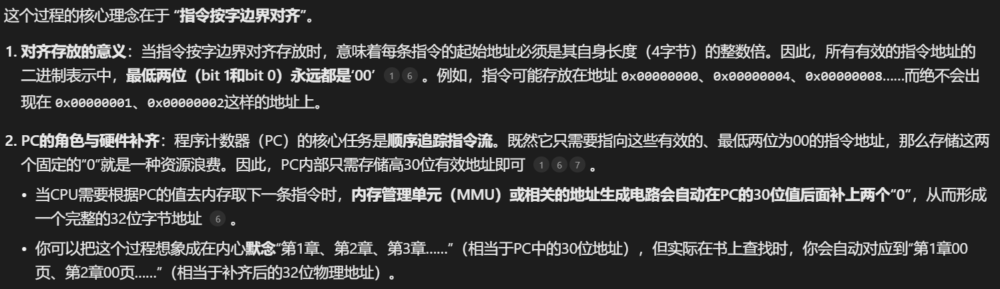

### 指令执行过程

#### 一般流程

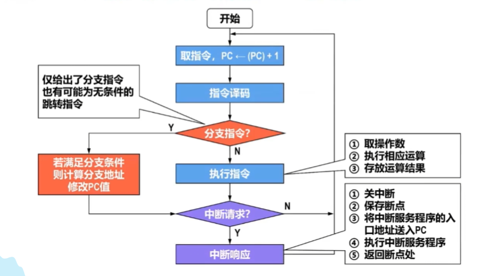

#### 指令周期

> CPU从主存取出并执行一条指令的时间

**一种典型的架构**：取指周期+间址周期+执行周期+中断周期

**量化指令周期的方法**：

指令周期-机器周期-时钟周期
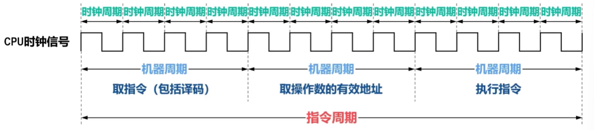
- **定长指令周期**：指令周期-机器周期-时钟周期固定
- **变长指令周期**：时钟周期按需分配
==**CPU区分指令和周期的方式：指令周期的不同阶段**==

#### 各阶段数据流

- **取指周期**
	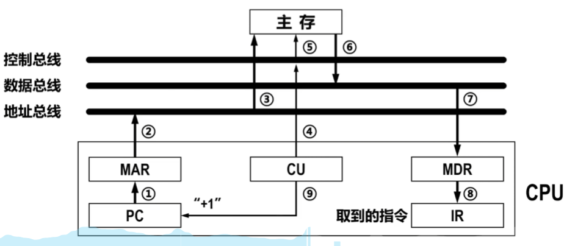
- **间址周期**
	略
- **执行周期**
	名目杂多，无法统一表示
- **中断周期**：==关中断，保存断点，将中断服务程序的入口地址送入PC==
	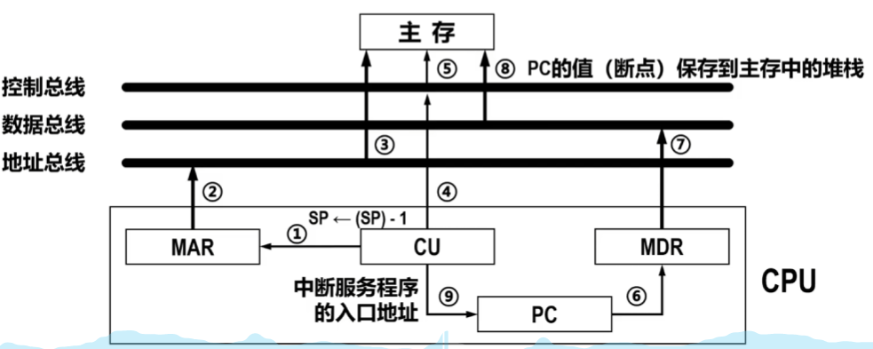

### 数据通路
==运算器和各寄存器之间的数据传送路径==
- 总线
- 专用通路

## IO系统

略

