 >[!WARNING] 这个还是多做题才有用

## 体系结构概述

### 分层结构
ISO/OSI：物理-数据链路-网络-传输-会话-表示-应用
教学模型：略
TCP/IP：网络接口层-网际层-传输层-应用层

`会话层`：
`表示层`：

## 基操

存储-转发
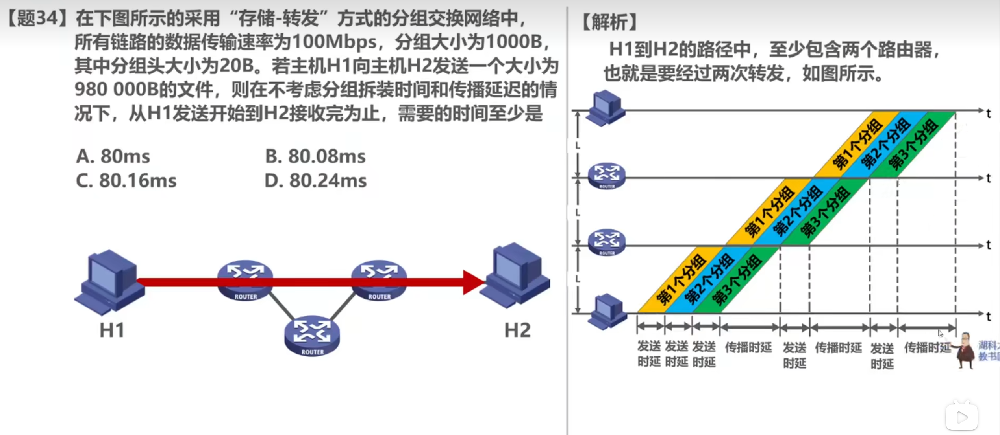
## 物理层

### 概述

>[!WARNING] 了解即可
- 传输透明比特流，为数据链路层封装好服务
- 物理接口特性：
	- 机械特性
	- 电气特性
	- 功能特性：数据线？控制线？时钟线？地线？
	- 过程特性：各信号之间的时序关系
- 导向型传输媒体：
	- 同轴电缆
	- 双绞线
	- 光纤
- 非导向型传输媒体：
	- 无线电波
	- 微波
	- 红外线激光可见光

### 传输方式

#### 串行/并行传输

- **串行传输**：
	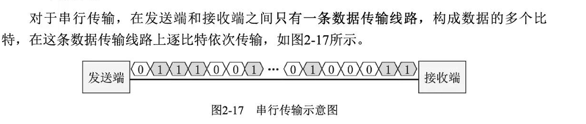
- **并行传输**：速度快，多用于计算机内部数据传输
	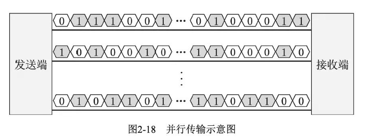
#### 同步/异步传输

==同步异步指的是时间间隔是否固定==
- 同步传输方式：无字节间隔，无起始和中止位，要求双方对齐时间长度。
	- **外同步**：利用外部时间线发送时钟信号，实现同步
	- **内同步**：将时钟信息编码到发送数据中，如曼彻斯特编码和差分曼彻斯特编码
- 异步传输方式：
	以字节为处理单位，但字节之间的时间间隔不固定，但是字节里的比特是同步的

#### 单项通信/双向交替通信和双向同时通信

- 单向通信
- 双向交替通信：双端都可以收发信息，但是不能同时收发
- 双向同时通信：双端都可以收发信息，可以同时收发
	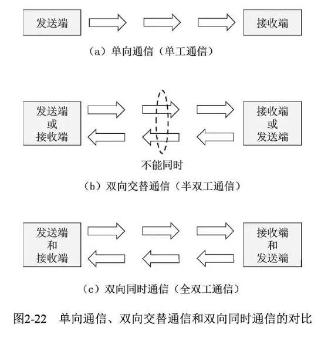

### 编码和调制

#### 基本概念

- 消息、数据和信号
- 基带信号：由信源发出的原始信号，需要进行调制才能在信道上进行传播
- 调制和编码：
	- 基带调制（编码）：变换波形，即用什么样的信号表示0和1，离散的物理状态
	- 带通调制：转换频段，连续的正弦波
	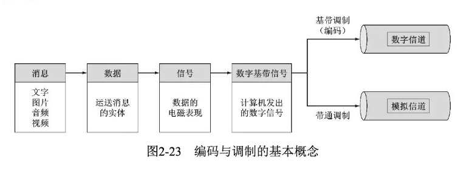
>[!FAQ]
>### 什么是低频
>“可不可以解释一下什么叫做频率较低的信号，我的理解中信号只有呈周期变化的时候才有所谓的频率一说吧，但是基带信号并不是呈周期性变化的啊”
>这里的核心思想是：​**任何一个信号，无论它多复杂，是否周期变化，都可以被看作是由许多个不同频率、不同幅度的基本正弦波“叠加”而成的**​。而分析一个信号中包含哪些频率的正弦波成分（即“频率成分”），以及每个成分的“强度”是多少，就是**傅里叶分析**所做的事情
>​**概念的扩展**​：通过傅里叶分析，​**​“频率”的概念被扩展为描述任何信号能量在频域上的分布情况**。我们说的“低频信号”，通常指的是其主要频率成分分布在低频段

- 码元：信号的编码单位，在使用时间域的波形表示信号的时候，代表不同离散数值的基本波形被称为码元
	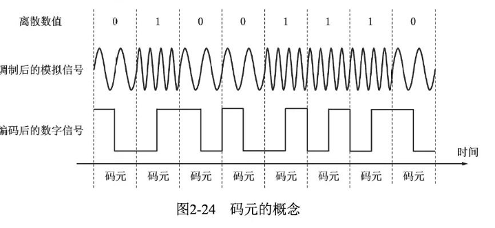

#### 常用编码方式

- 不归零制
	信号在每个码元期间不会回到零电平，==效率最高，存在同步问题==
- 归零制
	信号在每个码元期间都会回到零电平，将时钟信号参与编码，==自同步信号，效率低==
- 曼彻斯特编码
	在每个码元的中间时刻电平发生跳变，该跳变既表示时钟信号也表示数据，==自同步信号，效率更高==
- 差分曼彻斯特编码                                    
	基于曼彻斯特编码，==但是中间时刻电平变化仅表示时钟信号==，抗干扰
	
	
	
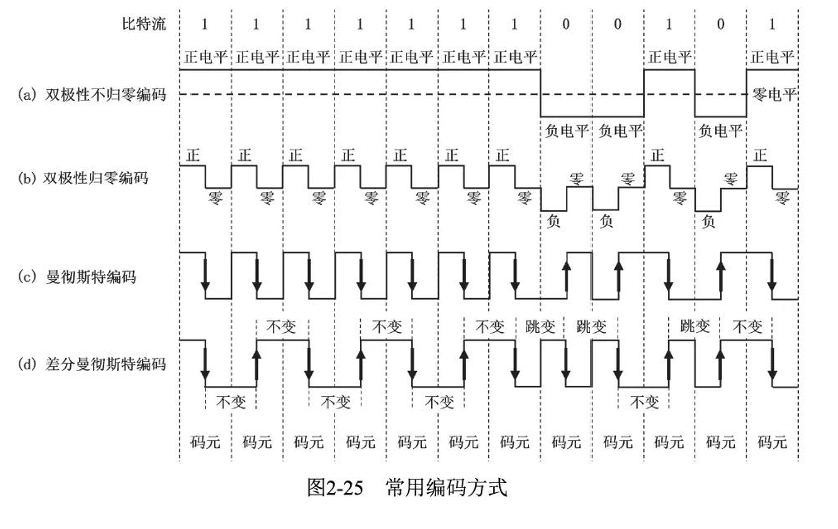
#### 基本带通调制和混合调制方法

- 调幅：载波的幅度随基带数字信号的变化而变化
- 调频：频率
- 调相：初相位
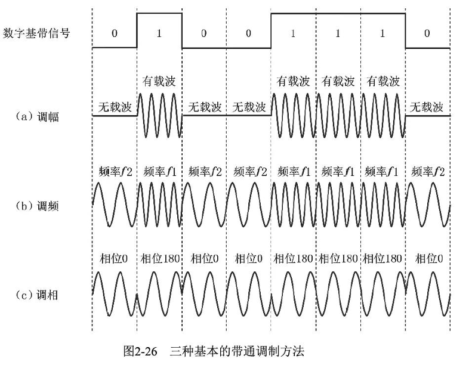

- 混合调制方法：
	`使用技术上更为复杂的混合调制方法，让一个码元可以表示多个比特的信息量`
	- 正交振幅调制：
		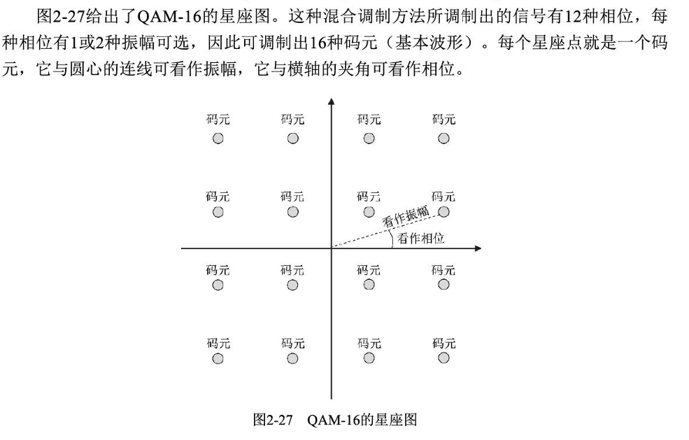
		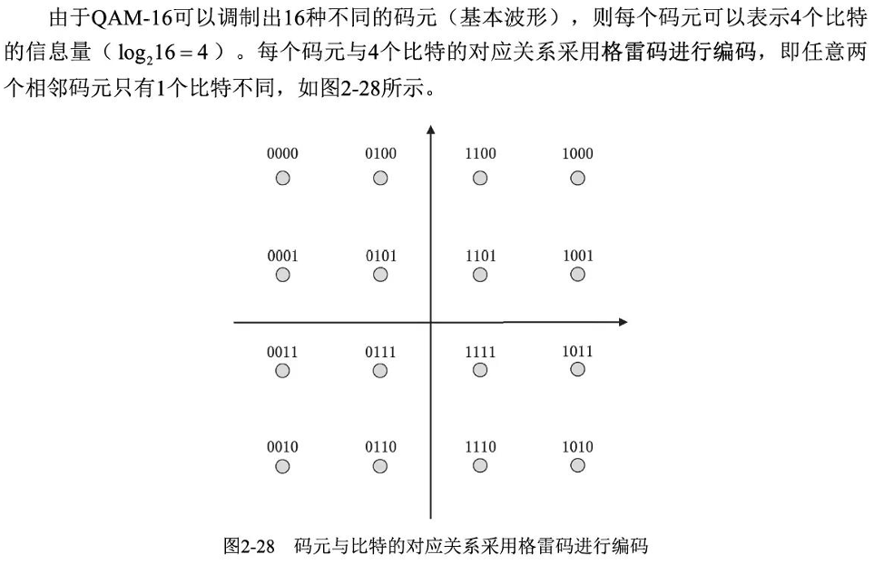
### 信道的极限容量

*坦克是没有后视镜的，信号是会失真的*

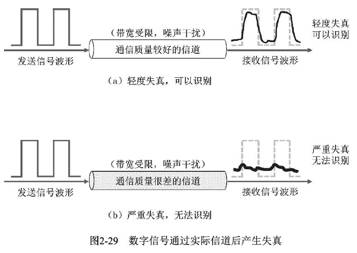

#### 奈氏准则

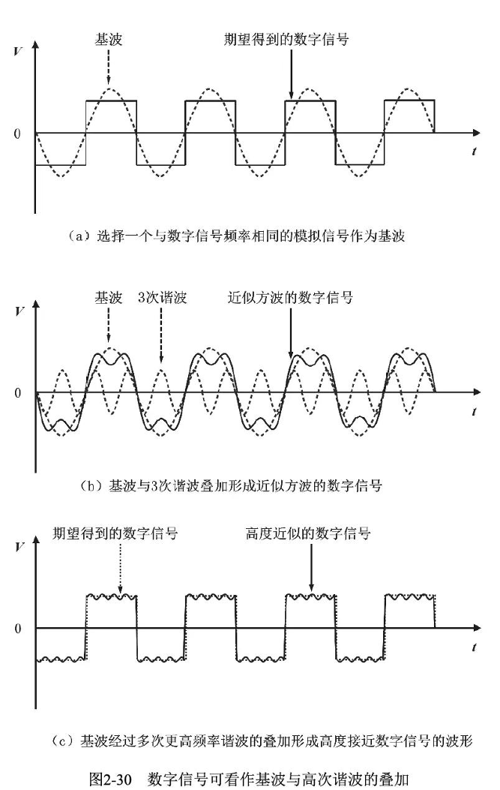

$$
理想低通信道的最高码元传输速率=2WBaud
$$
#### 香农公式

### 信道复用技术
## 数据链路层

### 概述

==该层主要实现的是帧在一段链路或一个网络中进行传输的问题==

- 链路：一个节点到相邻节点的一段物理线路（中间没有其他节点）
- 数据链路：链路本身+通信协议下的软硬件，链路的具象化
- 帧：数据链路层的PDU
![[Pasted image 20251014143127.png]]

数据链路层不必考虑物理层如何实现比特流传输
### 三个重要问题

#### 封装成帧和透明传输
- 封装成帧
		给网络层交付下来的分组添加一个首部和一个尾部，帧定界
		![[Pasted image 20251014143348.png]]
- 透明传输
		初衷是为了防止数据在和部分出现了帧定界符
		![[Pasted image 20251014145242.png]]
		==解决帧中出现定界符的方法==
		**字节填充** ：发送方在帧定界符前面插入转义字符ESC，接收方收取以后删除ESC再交给网络层
		**比特填充** ：
		- 一种实现方法
			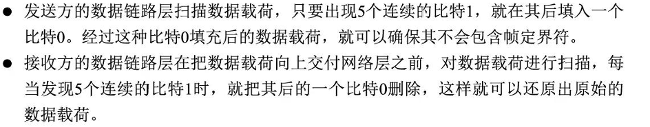
	MTU：最大传送单元
	==以太网帧不需要帧定界符号==
#### 差错检测

> [!NOTE]
> 误码率：某段时间内传输错误的比特数量占这段时间传输比特总量的比例
> 帧尾部插入FPS（帧检测序列），根据FPS查错

	
- **奇偶校验**==（掌握）==
		
- **循环冗余校验** ==（掌握）==
		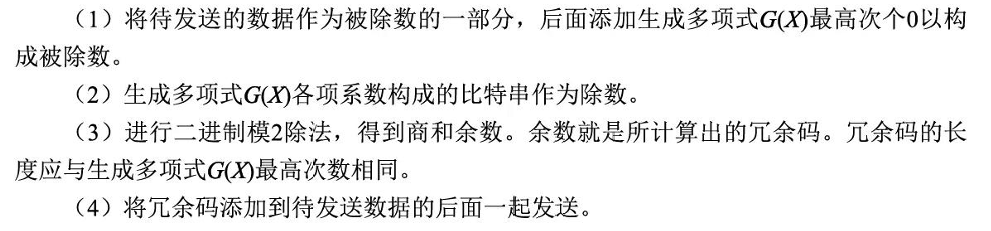
		==冗余码在待发送数据的后面==
		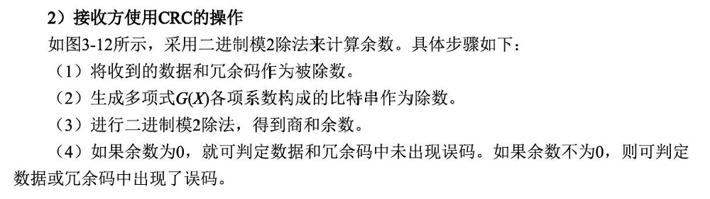
#### 可靠传输

发送方发送什么就要接收到什么，也就是说要对传输错误做修正

分组丢失，分组失序，分组重复，误码。。。
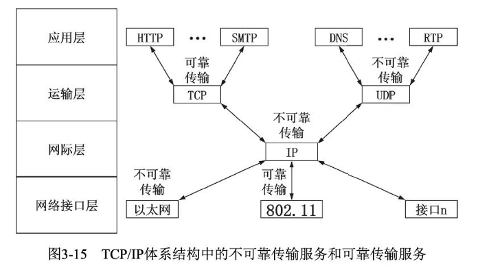
- ==**停止-等待协议**（掌握）==
	发送方每发送完一个护具分组就要停下来接收对方的ACK或NAK
	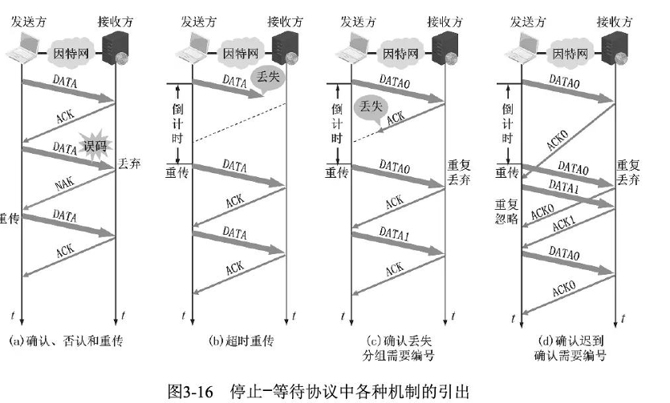
	超时计时器-超时重传时间（RTO）
	给分组进行编号所使用的比特应尽量少
	对数据链路层而言
	- 数据分组：1位编号
	- 确认分组：无编号
	
	**信道利用率**
	- $T_D$：数据分组发送时延
	- $T_A$：确认分组的发送时延
	- $RTT$：收发往返时间
	$$
	U=\frac{T_D}{T_D+RTT+T_A}
	$$
	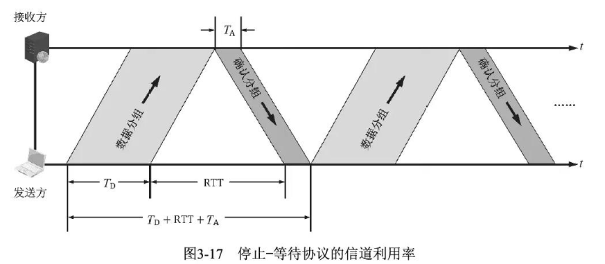
- ==**回退N帧协议（GBN）**（掌握）==
	流水线传输
	用发送窗口限制发送方连续发送分组的数量——>连续ARQ协议
	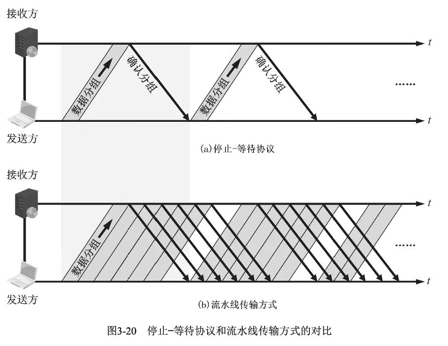
	**维护滑动窗口**
	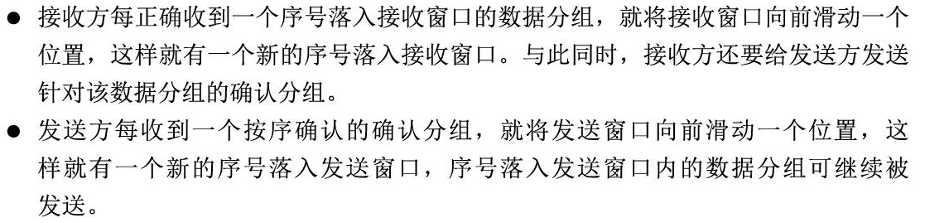
	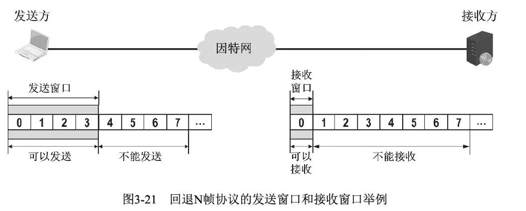
	可能面临的奇怪的场景：
	- 超时重传，回退N帧
	- 累积确认
	- 发送窗口尺寸超出上界-ACK丢失时无法判断时序新旧分组
	
	**发送窗口尺寸**  $W_T$ 和**接收窗口尺寸** $W_R$
	$$
	W_R=1,1<W_T\leq2^n-1
	$$
	n是给数据分组编号的比特数量
- ==**选择重传协议**（掌握）==
	设法只重传出现差错的分组
	让接收窗口尺寸大于1，先收下失序但正确到达接收方且序号落入接收窗口的数据分组
	所缺数据分组收齐以后转交给上层
	**此时不可使用累积确认，必须逐一确认**
	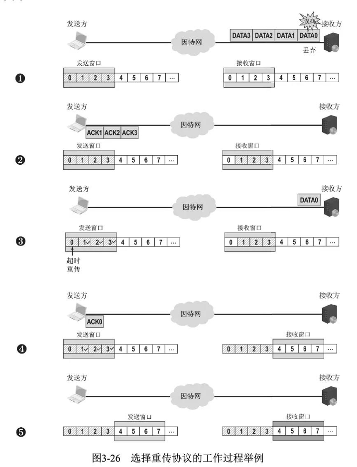

>[!FAQ] 滑动窗口里的编号是什么？如何确认这些编号的起始位置
>数据链路层只关心一种场景的实现方法，那就是我如何把一段信息从这头弄到那头，我也只做这么一件事情，我假设在我的理想条件下，只有一段信息需要传递
>这段信息的语义我不在乎，我只负责完整传输这个数据，这个数据可能是不同应用进程的数据分组组成的，也可能只是一个应用进程的数据，who cares?

### 点对点协议（PPP）

*Point-to-Point Protocol*

==PPP=链路控制协议LCP+网络层PDU封装到串行链路的方法+网络控制协议NCP==（**掌握**）

**帧格式**(了解下饭)
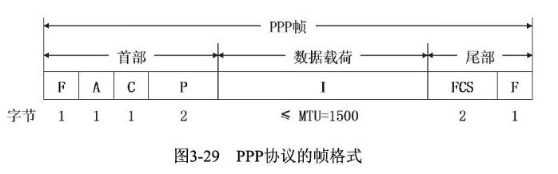
**PPP协议工作状态**(了解下饭)
### 共享式以太网

#### 网络适配器和MAC地址

适配器（了解）

**==MAC地址(掌握)==**：
- 对于广播信道而言，要通过数据链路层地址实现两个站点之间的通信（**当代已经不用广播了，用的是交换机制，不知道这个傻逼课本为什么要讲广播**）在帧中携带MAC地址方便校验**网络接口而非网络设备的唯一标识**

- **IEEE 802局域网的MAC地址**
	48个比特构成的MAC地址
	OUI-唯一标识符
	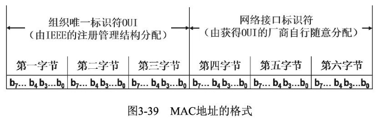
	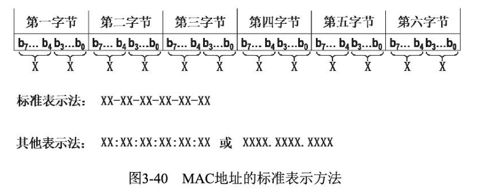
	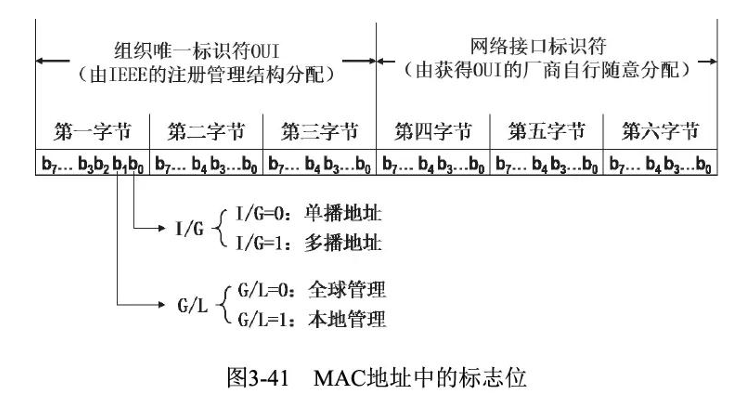
>[!FAQ] 什么是多播/单播，全球管理/本地管理
>//TODO

##### ==CSMA/CD协议（了解）==
共享以太网广播特性->信号碰撞
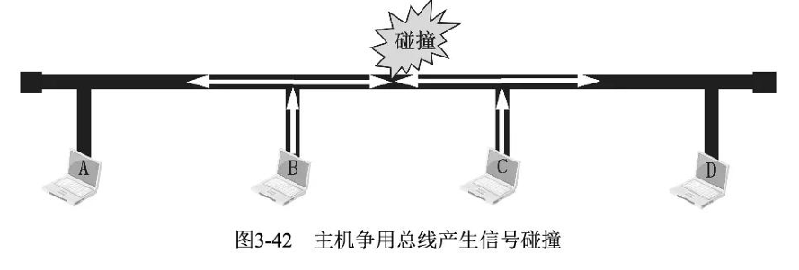
如何协调总线上各点争用总线？
- ==多址接入+载波监听+碰撞检测（了解）==  吗的简直是老奶奶过马路的人机
- ==**争用期（掌握）**==
	最迟需要多少时间才能检测出自己发的帧撞车了
	共享式以太网的端到端往返时间$2\tau$被称为争用期
>[!TIP]
>**共享总线以太网的某个站点在开始发送帧后经过$2\tau$这段时间后仍然没检测到碰撞，则一定不会发生碰撞**
>10Mb/s共享总线以太网规定争用期为512比特发送时间，算上了人为干扰信号时间
- **最小/最大帧长**
	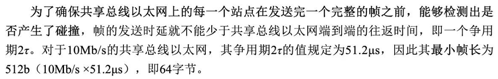
- **退避算法**
	截断二进制指数退避
	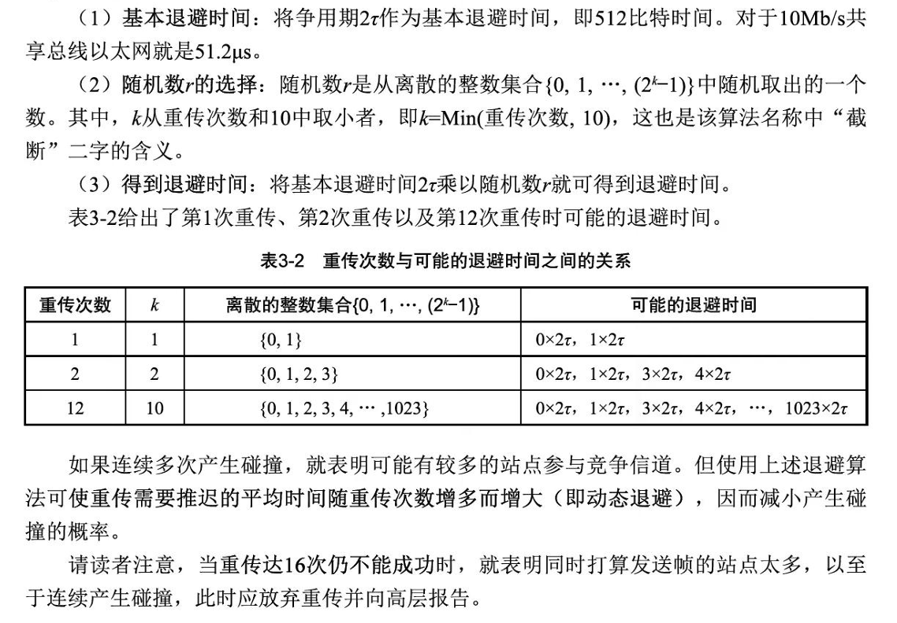
- **信道利用率**
	$$
	S_{max}=\frac{T_0}{T_0+\tau}=\frac{1}{1+a}, ~~a=\frac{\tau}{T_0}
	$$
##### 集线器
- 物理上是星型的，逻辑上是总线网，使用CSMA/CD
- 只工作在物理层
- 有少量容错和网络管理能力
##### 物理层拓展以太网
- 拓展站点和集线器之间的距离
	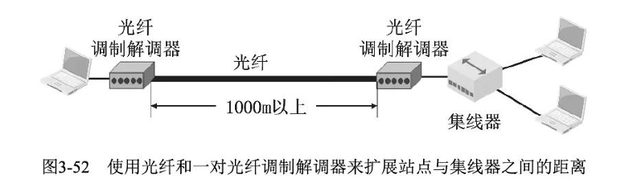
- 拓展覆盖范围和站点数量

	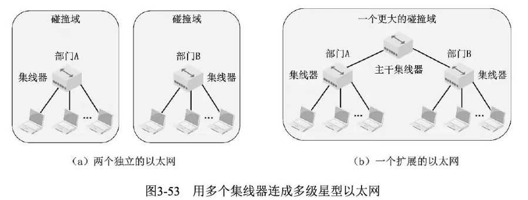
##### 数据链路层拓展以太网

为避免形成更大碰撞域，使用网桥
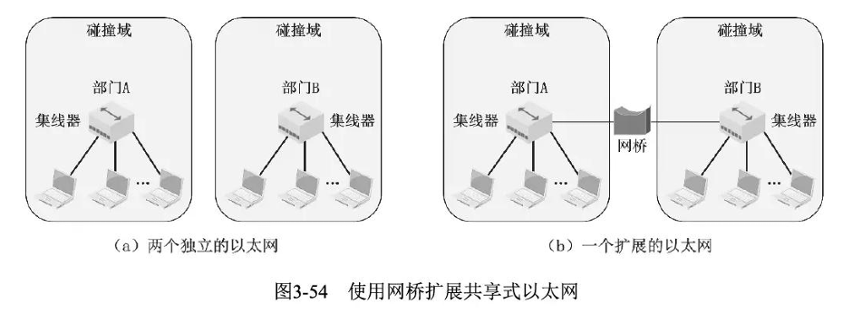
### 交换式以太网
### 以太网的MAC帧格式
### 虚拟局域网
### 802.11无线局域网
## 网络层

将分组从源主机经过多个网络和多段链路传输到目标主机
**分组转发和路由选择**
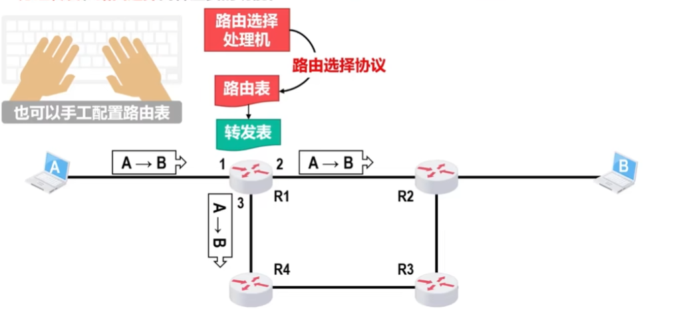

**网络层向上提供两种服务**
- 面向连接的虚电路服务：
	两个主机需要通信时要先简历网络层连接，**逻辑连接**
	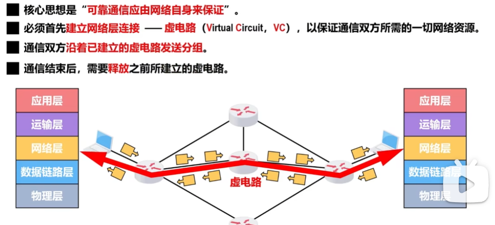
	 
- 无连接的数据报服务
	不用预设连接，灵活到达目标主机
	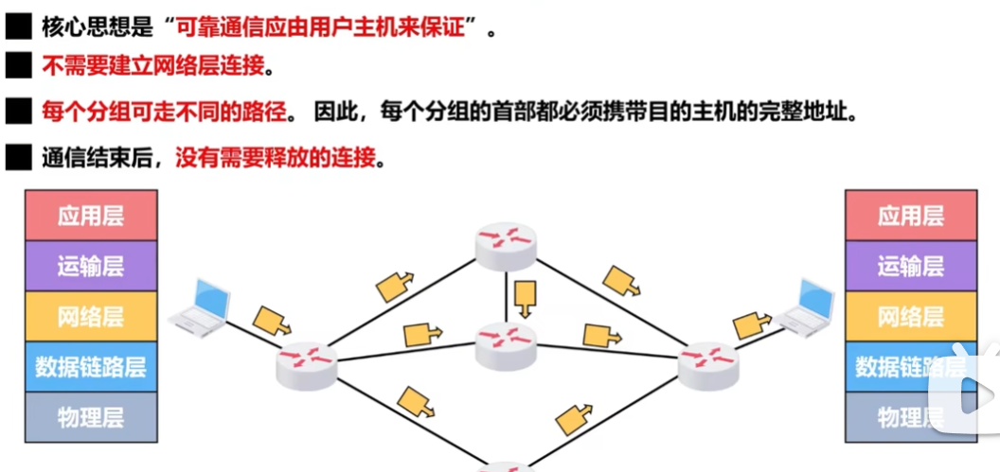
>[!FAQ] 网际层如何传输IP数据报？

### 网际协议IP

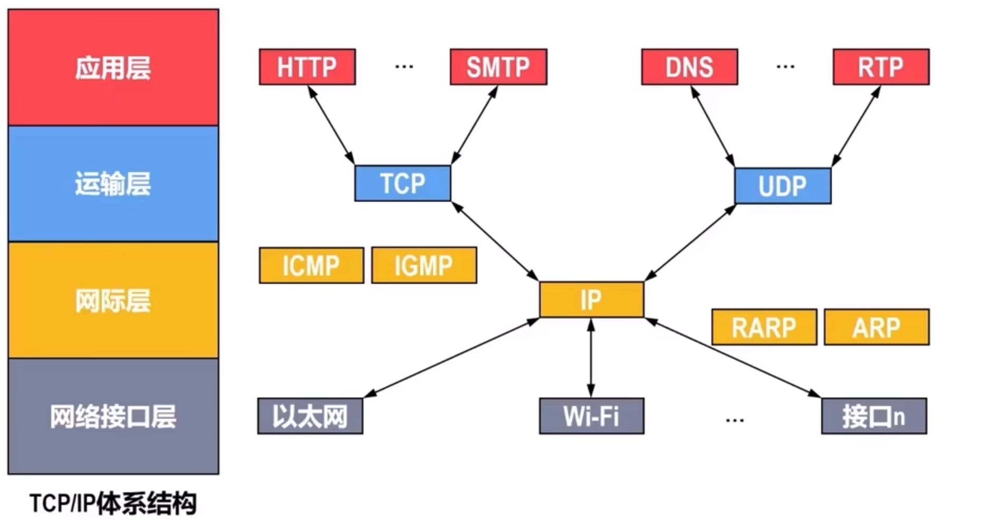

#### 异构网络互联

IP协议把从数据链路层看不一样的网络连接起来

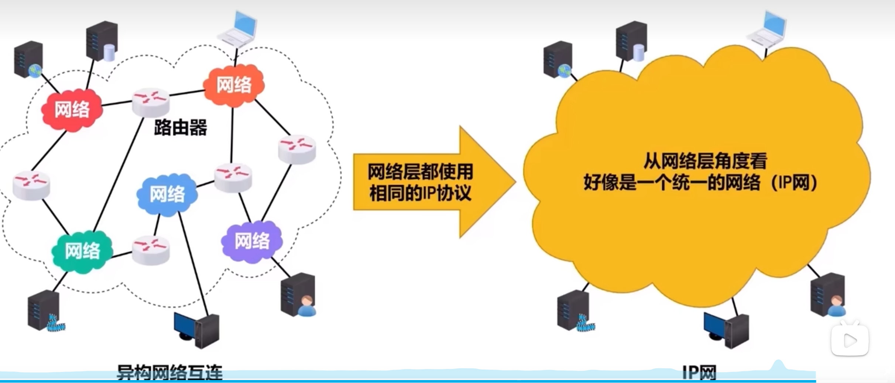

### IPV4地址

因特网给每一个主机的每一个接口分配的一个在全 世界范围内唯一的32比特的标识符
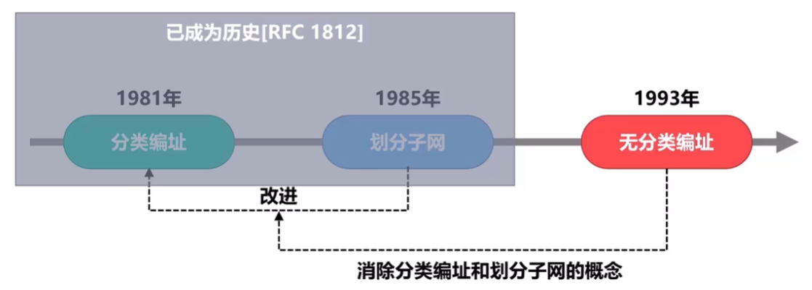
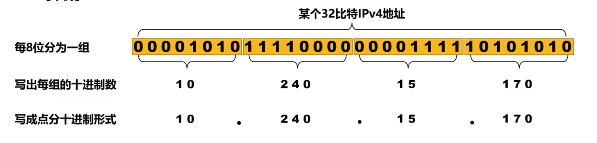
#### 分类编址方法
- 网络号 主机号
- 主机号全0网络本身，全1代表广播地址
- 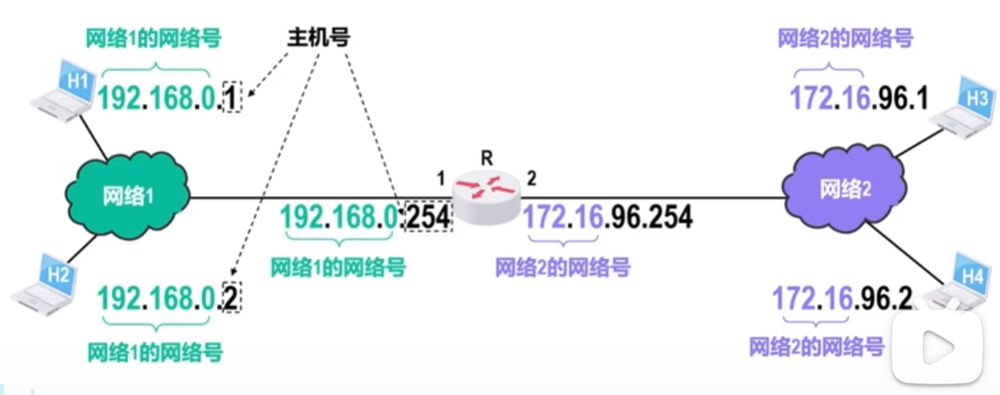
- 分类指的是网络号和主机号位数分配的方案类别
	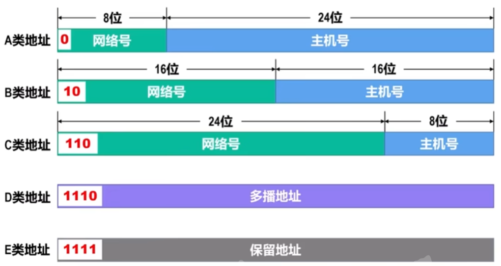
- ABC都是单播地址
- 主机号全0的是网络地址，用于逻辑决策，不能分配给主机各接口
- 主机号全1的是广播地址，用于逻辑决策，也不能分配给主机各接口

> [!NOTE] 多播如何工作
> 1. 1.**主机加入组播组**​：当一个应用程序（如视频会议客户端）想要接收某个多播组的数据时，它会通过操作系统**加入**一个特定的多播组（也就是监听一个特定的多播地址，例如 `224.0.1.1`）。这相当于告诉本地网络：“我对发往这个组的数据感兴趣”。
>     
> 2. 2.**数据发送**​：发送方只需将数据包的目标地址设置为这个多播组地址，然后发送**一次**即可。发送方自己并不需要加入这个多播组。
> 3. 3.​**网络智能转发**​：支持多播的路由器会通过特定的多播路由协议（如PIM）来交换信息，了解网络中有哪些主机加入了哪些多播组。当收到多播数据包后，路由器会只向**有组成员存在的网络分支**进行转发和必要的复制，而不会将数据包泛滥到所有网络。这是多播相比广播更加高效和智能的地方。
> 4. 4.**本地接收与过滤**​：在局域网内，主机的网络接口卡（NIC）和IP层会进行过滤。它们会检查数据包的目的地址，只接收那些目标地址是自己已加入的多播组的数据包，而忽略其他多播流量

#### 划分子网编址方法

改进**分类编址**造成的大量地址浪费问题
==从分类子网的主机号部分划出子网编号区域，实现划分子网==

>[!faq] 如何知晓子网空间分配情况？
>子网掩码可以表明主机号被借走多少个比特作为子网号

- **子网掩码**：
	- 32bit
	- 1位对应网络位，0位对应主机号位
	- 
	- 默认子网掩码：
		未划分子网的情况下使用的子网掩码
		主机号部分全0就好了
#### 无分类编址方法（必考）

> 网络前缀+主机号，使用地址掩码

背景：C类编址每个网络的地址数量太小，**没有被充分利用**
- **网络前缀**：不定长，搭配**地址掩码**才可确定
- **地址掩码**：32位
	- 左起1表示前缀位
	- 接着0表示主机号位
- CIDR可根据需要分配适当大小的CIDR地址块
- **路由聚合**
	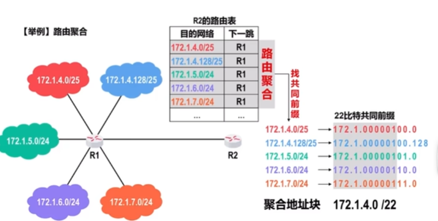

>[!faq] 路由聚合是是否有局限性
>**两条目标网络相同、但下一跳不同的聚合路由**

==当使用路由聚合时默认没有相同的聚合路由==

| 数据包的目的地址       | 可选的路由条目                                                                        | ​**被选中的路由**​                    | 说明                                                                     |
| -------------- | ------------------------------------------------------------------------------ | ------------------------------- | ---------------------------------------------------------------------- |
| `172.16.5.10`  | `172.16.0.0/16`(来自 R1)   `172.16.0.0/16`(来自 R2)   `172.16.5.0/24`(来自 R2) | ​**`172.16.5.0/24`(下一跳是 R2)​**​ | `/24`的掩码长度（24位）大于 `/16`（16位），因此这条最具体的路由胜出  。                     |
| `172.16.6.20`  | `172.16.0.0/16`(来自 R1)   `172.16.0.0/16`(来自 R2)   `172.16.6.0/24`(来自 R2) | ​**`172.16.6.0/24`(下一跳是 R2)​**​ | 同理，选择更具体的 `/24`路由。                                                     |
| `172.16.10.50` | `172.16.0.0/16`(来自 R1)   `172.16.0.0/16`(来自 R2)                             | 任意一条 `172.16.0.0/16`            | 因为没有更具体的 `/24`路由，路由器会在两条相同的聚合路由中选择一条（具体选哪条取决于路由协议的成本、管理距离等参数  ）。 |
**==路由器（重要）==**
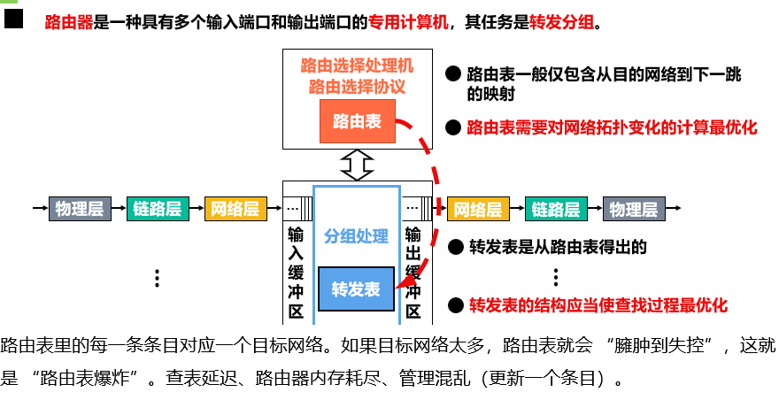

> [!tip]
> 路由表不用存世界上每一个IP地址对应的路由器，只需要记录一部分就行，没有记录到的去找ISP，这就是分层可拓展的意义

#### IPV4地址应用规划

定义：划分地址块的艺术（划分子网）
**定长/变长子网掩码**：划分出来的这些子网它们用的子网掩码是不是相同的，**如果是相同的可能造成浪费**，变长的会比较灵活一些
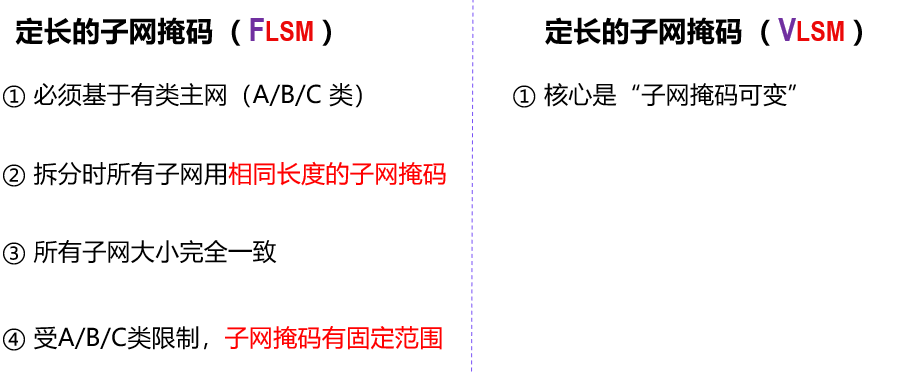
>[!tip] **对变长子网掩码划分子网而言每个子网的网络地址必须是其块大小的整数倍，建议优先为大块的分配**

#### IPV4地址和MAC地址

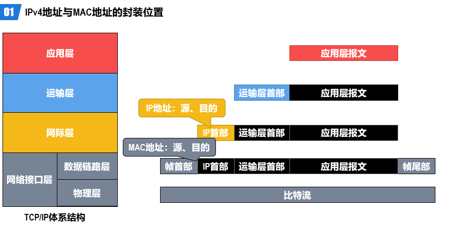
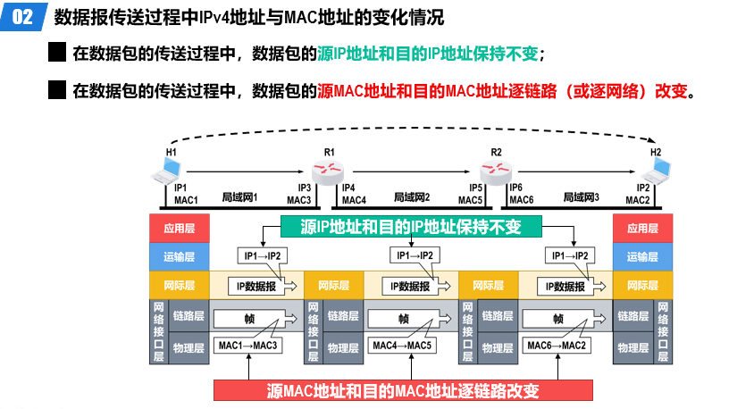
这些设备只知道下一个拓扑节点的IP，但是不知道MAC地址
**如果用MAC地址进行通信会有灾难性的后果**
那么如何通过IP地址找出其对应的MAC地址（知道MAC才能用数据链路层）？===>==地址解析协议ARP==

#### 地址解析协议ARP

查表-广播-应答-存表（默认生命周期两分钟，也可以手动配置）
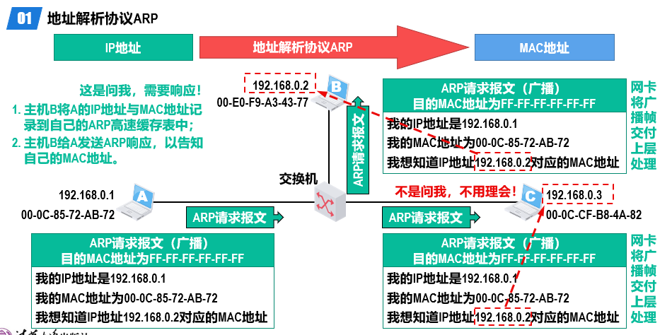
转发表、ARP高收益缓存表里的数据要周期性删除，因为MAC和IP的对应关系不是一成不变的

#### IP数据报发送和转发

- **主机**发IP数据报
- **路由器**转发IP数据报
路由器默认隔离广播域

#### IPV4首部格式

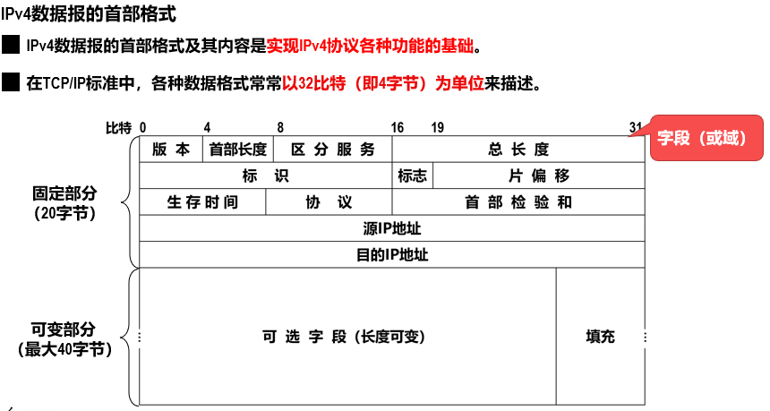
- **版本**：4b
- **首部长度**：4B为单位，20->60
- **可选字段**：1->40B
- **总长度**：以1B为单位，表示数据报整体长度
- **标识/标志/片偏移**：共同用于数据报分片
	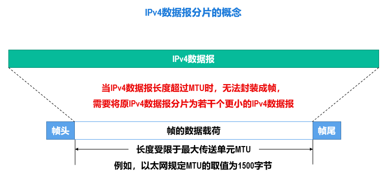
	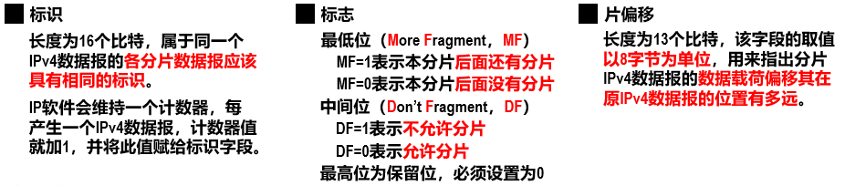
- **生存时间**：TTL，路由器收到待转发的IPv4数据报时，将其首部中的该字段的值减1，若结果不为0就转发，否则就丢弃。
- **协议**：8b，说明数据载荷是哪种协议数据单元PDU
- **首部检验和**：16b
	- ==如何计算首部检验和==
		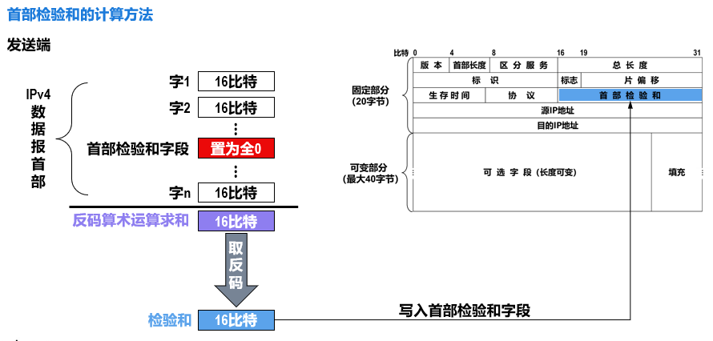
		
- **源/目的IP地址**：32个bit
### 静态路由配置

人工配置路由表
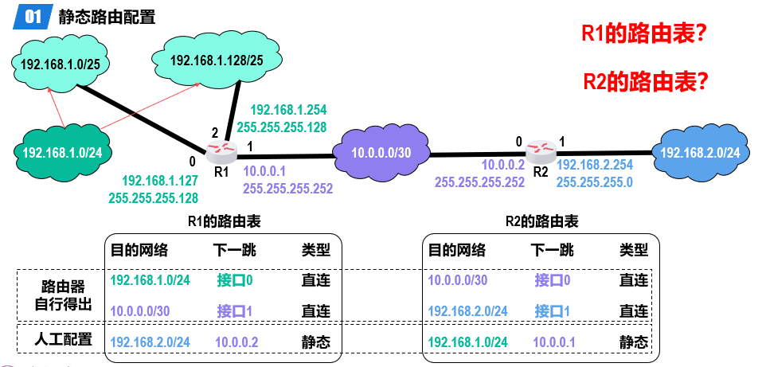

>[!NOTICE] 人工配置方式简单、开销小、但不能及时适应网络状态（流量、拓扑等）的变化，一般只在小规模网络中采用。

### 因特网路由选择协议

- **静态路由选择**：人工配置，小规模网络
- **动态路由选择**：路由器自动获取路由信息，开销大，适用大规模网络
	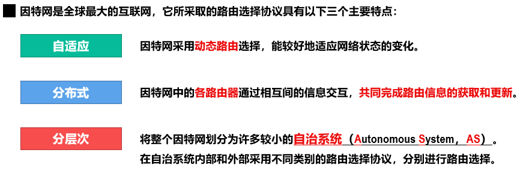
### 路由器基本工作原理

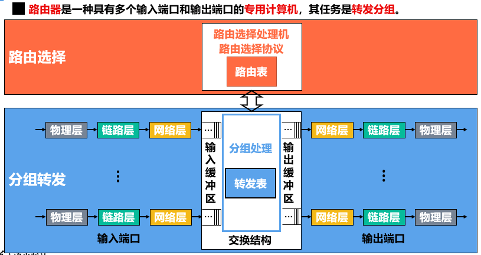

### 路由信息协议（RIP）

>[!TIP] RIP要求自治系统AS内的每一个路由器，都要维护从它自己到AS内其他每一个网络的距离记录。这是一组距离，称为距离向量（Distance-Vector，D-V）。

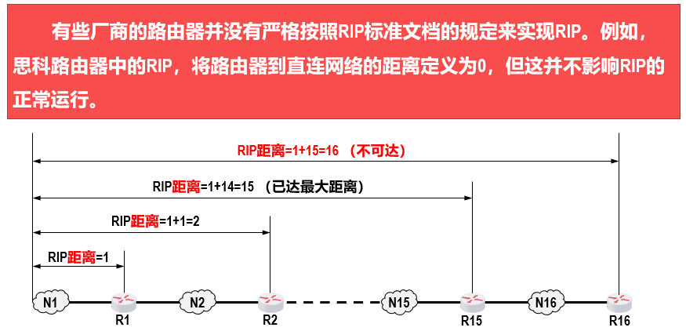
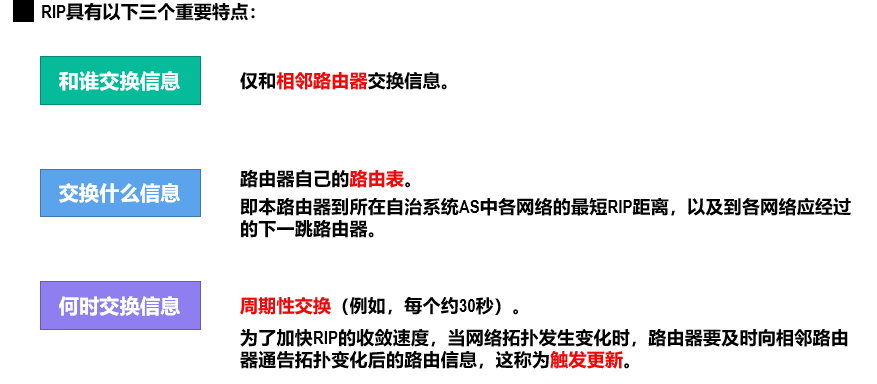
==路由器一开始只知道到直连网络的RIP距离为1，若干次交换结束后达到全知状态称为收敛==
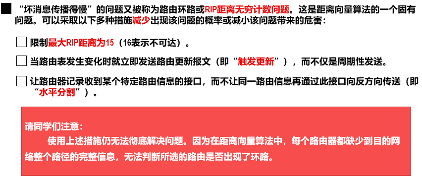
### 开放最短路径优先协议（OSPF）

- 基于链路状态
- 算法保障不会产生路由环绕
- 不限制网络规模，更新效率高，收敛速度快
#### 基本概念

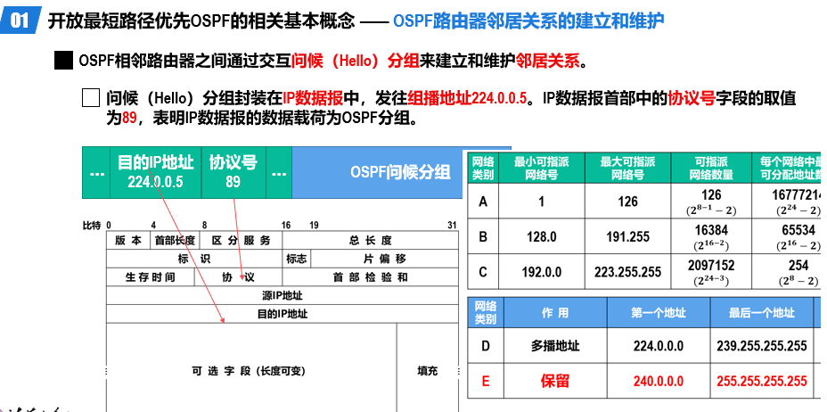
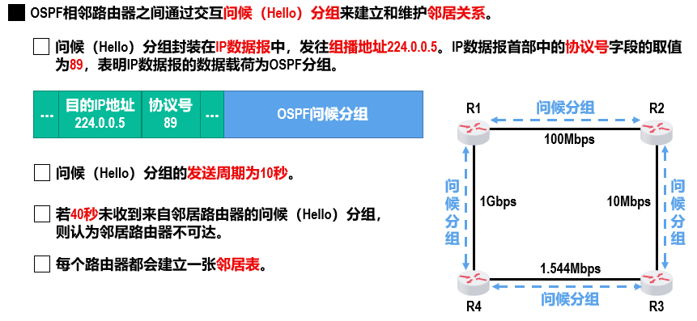
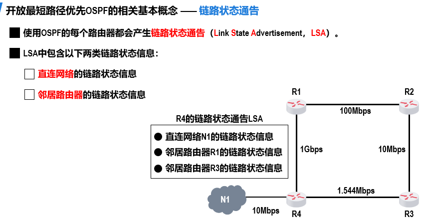
## 运输层

应用进程间基于网络的通信？
端口？

### 运输层概述

为运行在不同主机上的应用进程提供直接的逻辑通信服务，端到端协议
- 面向连接的TCP
- 无连接的UDP
==端口号用于区分不同应用进程==
进程标识符PID-根据不同操作系统有不同的格式
- 服务端端口号（熟知端口号？0-1023/登记端口号？1024-49151）
- 客户端端口号（短暂端口号）
==不同计算机之间的端口号/不同协议之间的端口号没有任何关联==
**发送方复用&接收方分用**
不同协议使用同一个IP发出来，将同一个IP数据报中的数据按照不同的协议区分开
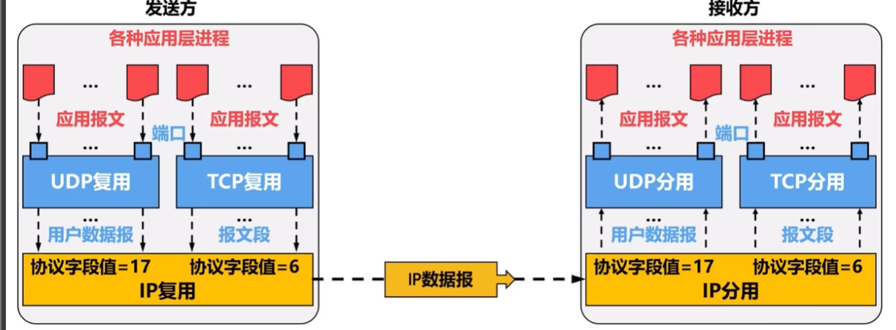
### UDP & TCP

**对发送时间的限制**
 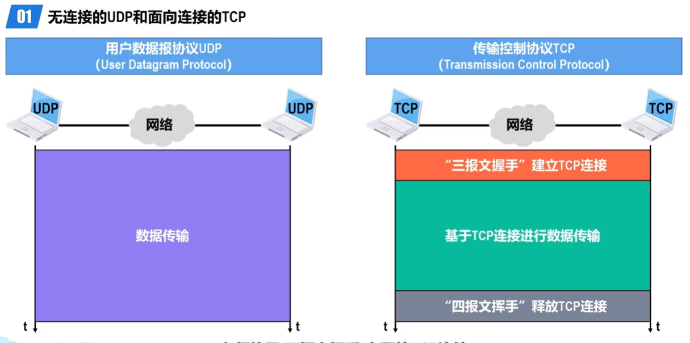
UDP支持单薄，多播和广播
TCP只支持单播
**对应用层报文处理**
  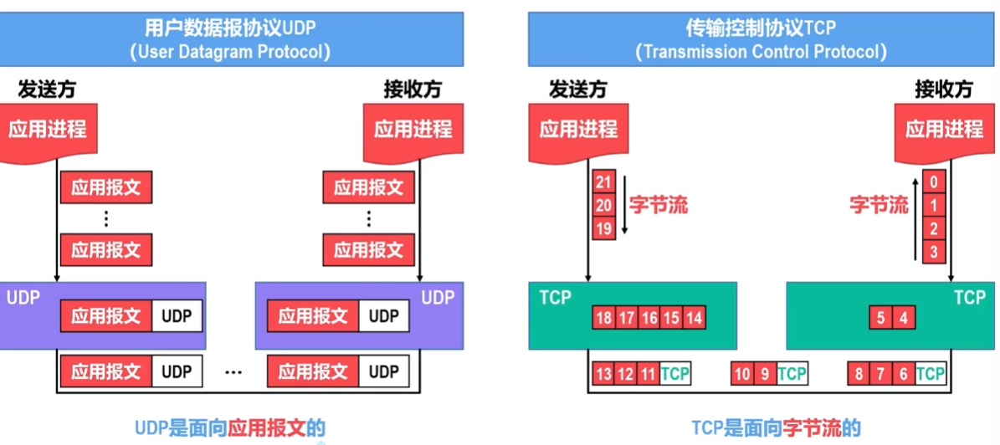
**数据传输可靠性**
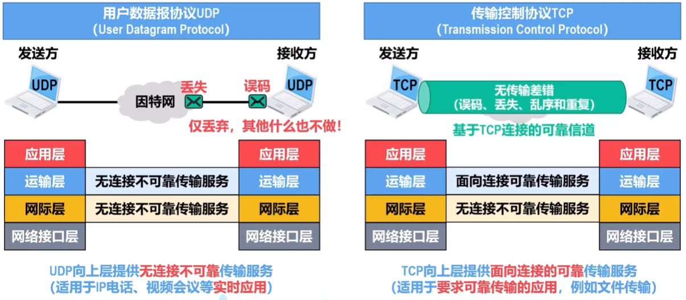
**首部结构对比（UDP固定8B）**
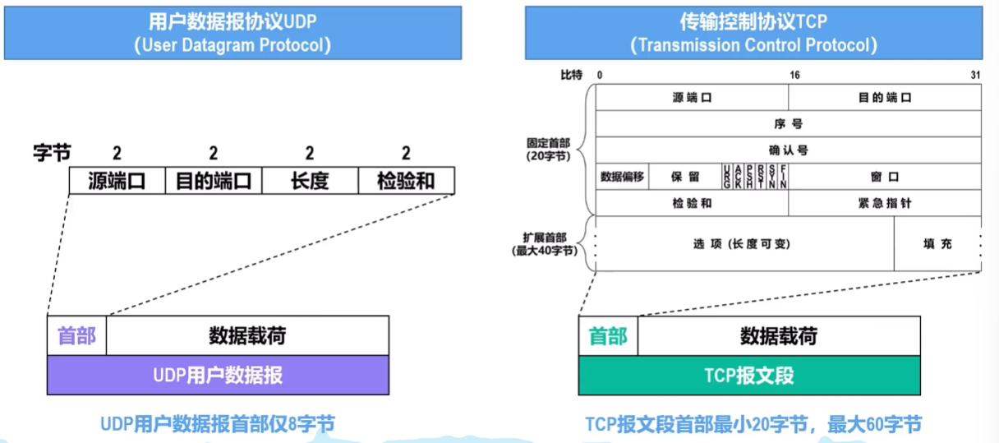

### TCP报文首部格式
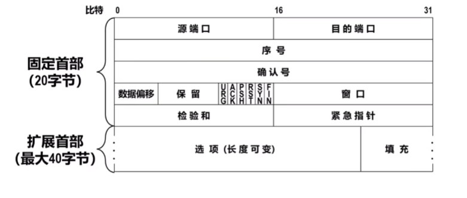
- **源端口**
- **目的端口**
- **序号**：32bit，用于指出本TCP报文段数据载荷的第一个字节的序号（TCP把要发送的整个数据看作一个**连续的字节流**。TCP为这个字节流里的**每个字节**都按顺序编上号。）
- **确认号**：对之前受到数据的确认，可指出下一个TCP报文段序号的期望值
- **ACK**：取值为1时，确认号字段才有效
- **数据偏移**：4bit，取值以4Byte为单位，指出TCP报文段数据载荷部分起始处到TCP报文段起始处有多远，实际上指的是TCP报文段的首部长度
- **保留**：6bit 
- **窗口**：16bit，取值以1Byte为单位，指出报文发送方的接收窗口大小（流量控制）
- ==**检验和**==：16bit，检查整个TCP报文段在传输过程中是否出现误码
	- 计算检验和
		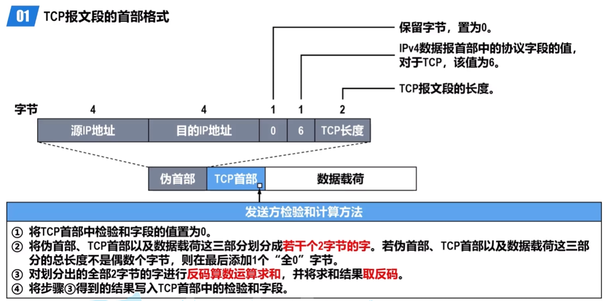
		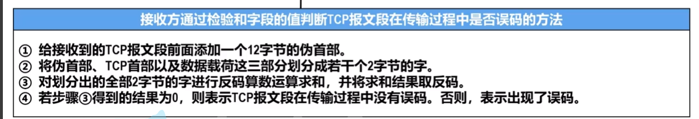

### 三报文握手建立连接

> [!NOTICE] 解决的痛点
> - 让TCP双方感知对方的存在
> - 让双方能够协商一些参数
> - 让双方能对运输实体资源进行分配和初始化

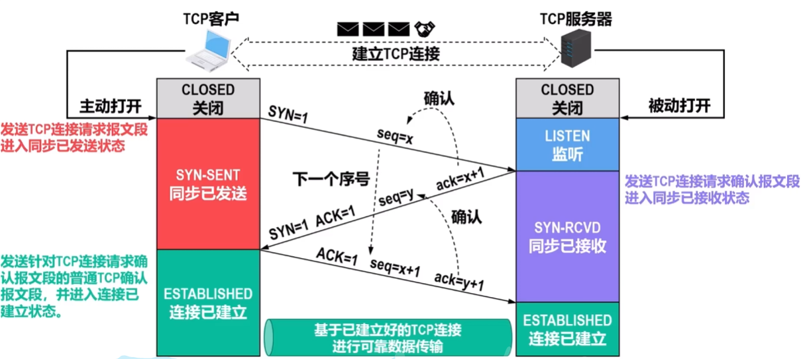

### 四报文挥手释放TCP连接